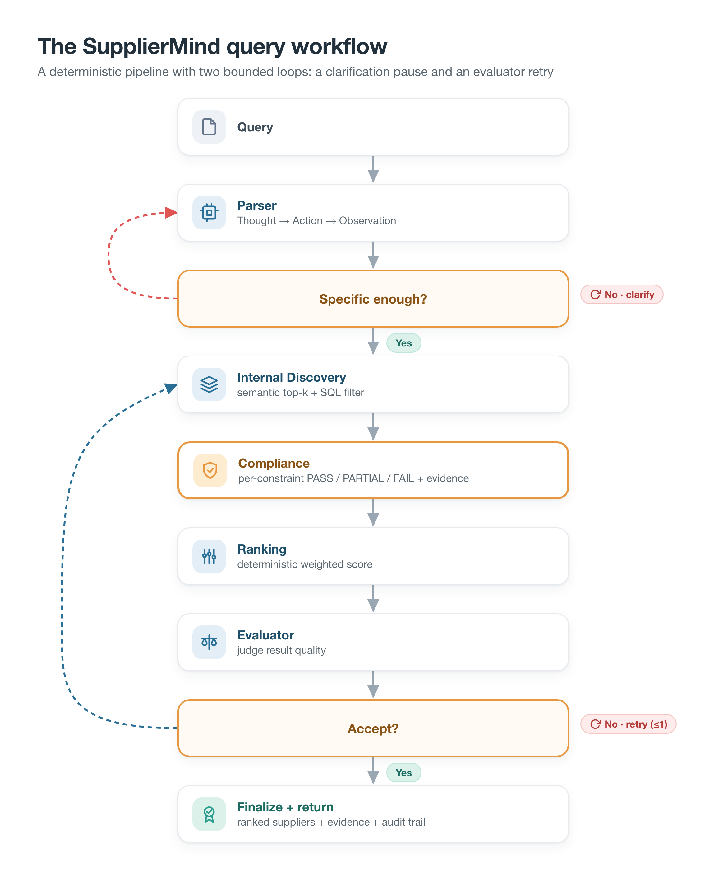
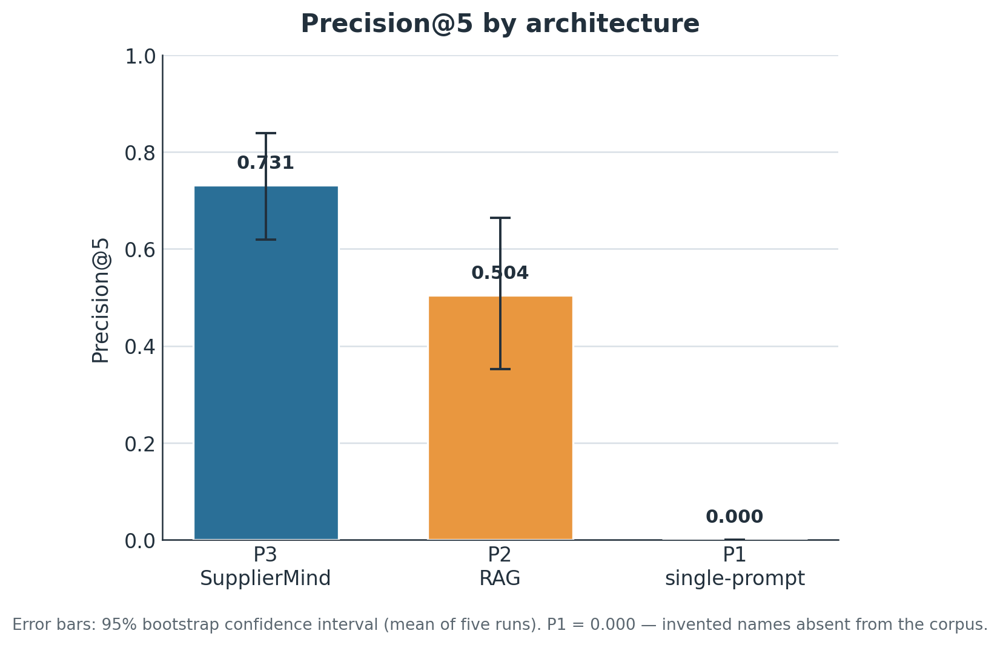
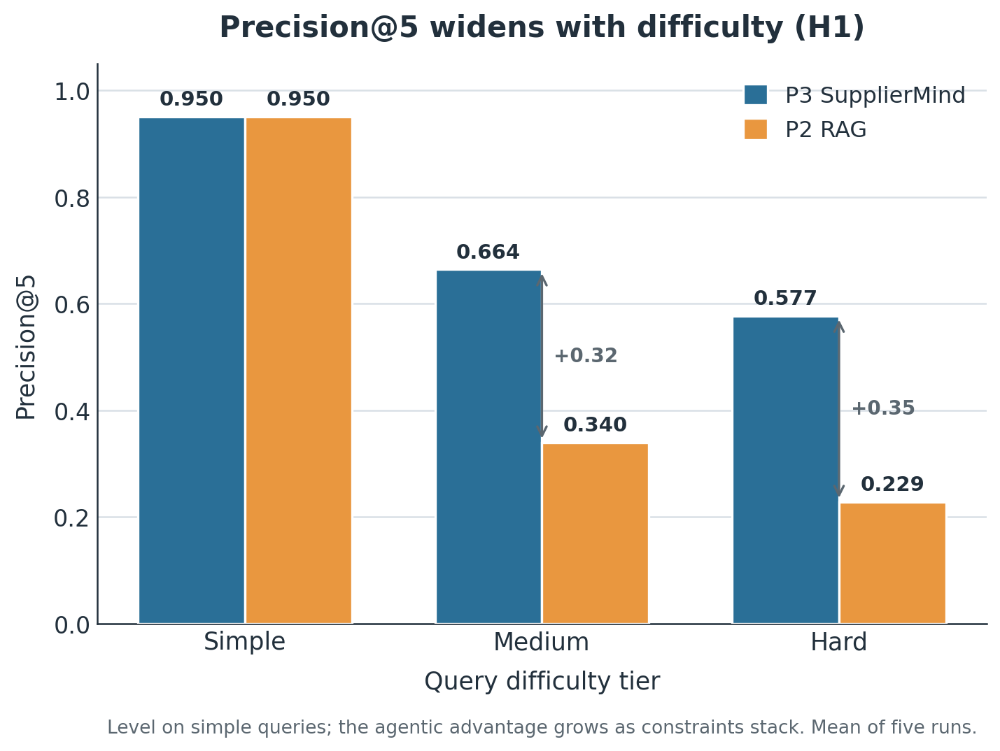
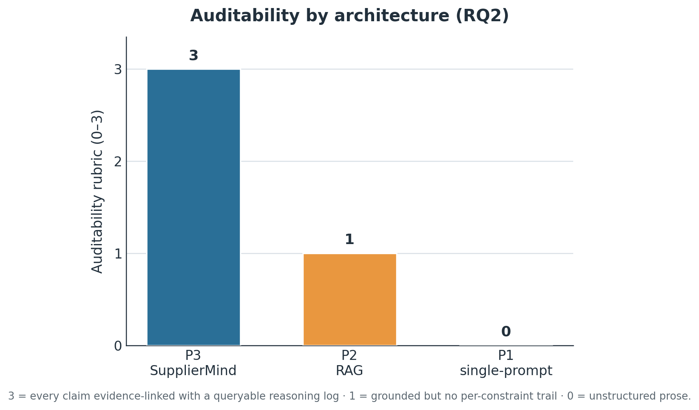
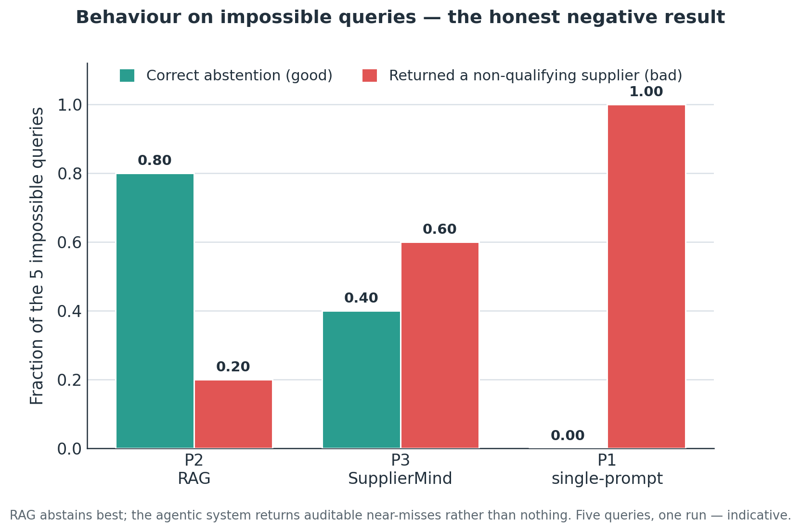
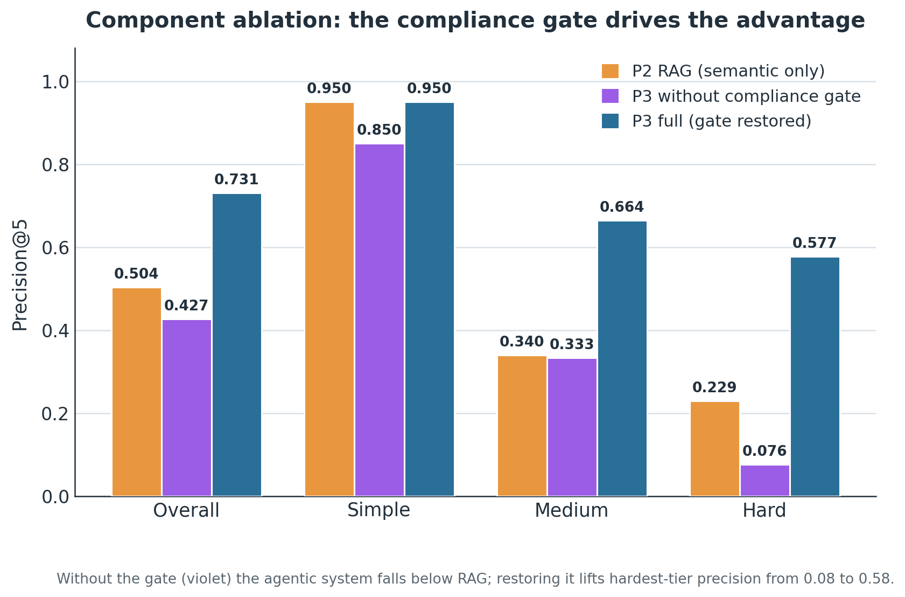
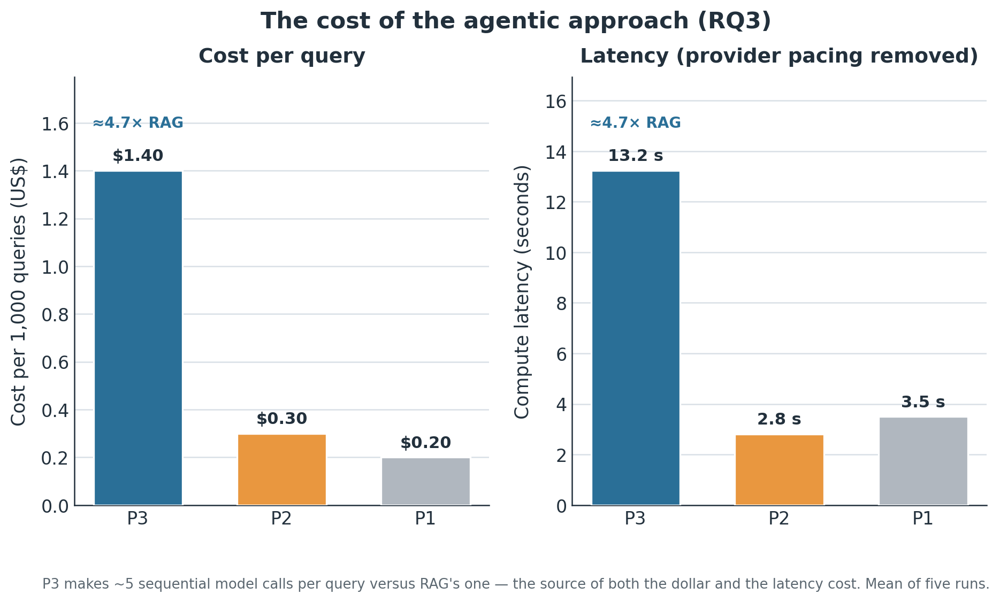
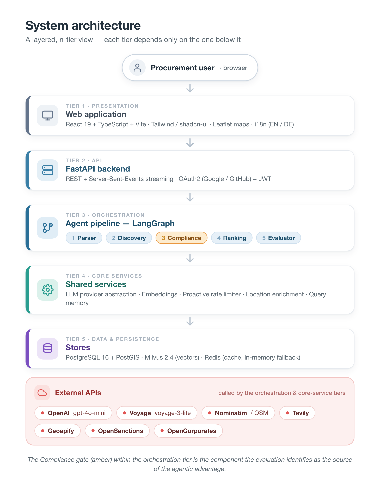

# SupplierMind 🧠

> **Multi-Agent LLM-Based Supplier Discovery for Procurement Under Multi-Constraint Requirements**

**Master's Thesis** | Gisma University of Applied Sciences | Mercanis (Cdc3 GmbH)  
**Author:** Nitish Kumar Pandey | Student ID: GH1039520

[](https://python.org)
[](https://fastapi.tiangolo.com)
[](https://react.dev)
[](https://github.com/langchain-ai/langgraph)

---

## What is SupplierMind?

SupplierMind is an AI-assisted supplier discovery system for procurement teams
that need auditable results under constraints such as certifications, capacity,
lead time, and geography. It searches approved suppliers first, can discover new
web suppliers when requested, and holds those web suppliers for human approval
without hiding them from the originating result list.

**Example query:**
> *"ISO 9001 certified bronze supplier within 25km of Bremen, capacity above 5000 kg/month, lead time under 21 days"*

---

## This repository has two builds

The same codebase is maintained for two related but separate goals. Jump to the
segment you need:

| Segment | For | Read |
|---|---|---|
| 📖 **[Thesis](#-thesis)** | The reproducible P1/P2/P3 evaluation, its results, and how to rebuild every number | Researchers, examiners |
| 🚀 **[Production](#-production)** | Running the product: setup, the AI policy/budget gateway, release verification, operations, and deployment | Engineers, operators |

| Mode | Supplier corpus |
|---|---|
| **Thesis** — reproducible evaluation | Frozen curated SupplierBench-25 IDs from `apps/backend/data/suppliers_synthetic.json` (fixed seed 42) |
| **Production** — active product | All active suppliers in PostgreSQL, including the 10k synthetic scale set and eligible web-discovered pending-review rows |

The evaluation runner enforces the curated thesis corpus explicitly, so loading
the 10k product corpus does not silently contaminate benchmark metrics.

---

# 📖 Thesis

The thesis asks a single question: **for multi-constraint procurement supplier
discovery, does an agentic architecture actually beat simpler retrieval — and if
so, which component is responsible, and at what cost?** It compares three
paradigms head-to-head under an identical model, corpus, ground truth, and
scoring code, so any difference is attributable to the architecture alone.

The full dissertation chapters live in [`thesis/`](thesis/); the working results
notes are in [`thesis/findings.md`](thesis/findings.md) and
[`thesis/findings_diagnostics.md`](thesis/findings_diagnostics.md).

## The three paradigms

| Paradigm | Method | Code |
|---|---|---|
| **P1** | Single-prompt LLM, parametric knowledge only — no corpus, no tools | `apps/backend/experiments/paradigm1_singleprompt.py` |
| **P2** | Minimal RAG: Voyage + Milvus top-10 retrieval, one prompt, pick 5 | `apps/backend/experiments/paradigm2_rag.py` |
| **P3** | SupplierMind: five-agent LangGraph system with ReAct tool use, semantic memory, multi-turn clarification, compliance gating, and auditable ranking | `apps/backend/app/` |



*The P3 (SupplierMind) query workflow. The Compliance / quote-or-fail gate (amber)
is the component the evaluation identifies as the source of the agentic advantage.*

## Evaluation summary

All numbers are the mean of **five runs** of the full benchmark
(SupplierBench-25 over a 10,000-supplier synthetic corpus), reported with 95%
bootstrap confidence intervals and a paired significance test.

| Metric | P3 SupplierMind | P2 RAG | P1 single-prompt |
|---|---|---|---|
| **Precision@5** | **0.731** [0.619, 0.838] | 0.504 [0.352, 0.664] | 0.000 |
| **MRR** | **0.984** | 0.793 | 0.000 |
| **nDCG@5** | **0.795** | 0.559 | 0.000 |
| **Success@1** | **0.984** | 0.760 | 0.000 |
| **Auditability rubric (0–3)** | **3** | 1 | 0 |
| **Entity-hallucination rate** | ~0 | ~0 | 1.000 |
| **Cost / query** | $0.00140 | $0.00030 | $0.00020 |

**What the results show:**

- **The agentic system is significantly more precise than RAG** — Precision@5 of
  0.731 vs 0.504, a paired difference of **+0.227** (95% CI [0.126, 0.330],
  p ≈ 0.000).
- **The advantage widens as constraints stack.** The two systems are level on
  simple queries; on hard queries the agentic system reaches ~2.5× RAG's
  precision.
- **A component ablation localises the cause to one part — the compliance /
  quote-or-fail gate.** Without it the agentic pipeline (0.427) scores *below*
  plain RAG (0.504); restoring it adds **+0.305**, almost entirely on the hardest
  queries.
- **The single-prompt baseline hallucinates a non-existent supplier on every
  query** — a structural failure of having no corpus, not a prompting problem.
- **Honest negative result:** on impossible queries the agentic system abstains
  *less* reliably than RAG (0.40 vs 0.80), returning auditable near-misses rather
  than nothing.
- **These gains are not free:** the agentic system costs ~**4.7×** RAG in both
  language-model spend and compute latency.

### Figures

| | |
|---|---|
|  |  |
| **Precision@5 by architecture** — the headline result. | **Precision@5 by difficulty tier** — the gap widens with difficulty (H1). |
|  |  |
| **Auditability rubric (0–3)** — the RQ2 result. | **Abstention** — the honest negative result. |
|  |  |
| **Component ablation** — the compliance gate drives the advantage. | **Cost of the agentic approach** — ~4.7× RAG on cost and latency. |

## Reproduce the results

### For an examiner — see every result in one command (no API keys, no Docker, no cost)

All five benchmark runs are committed to this repository, and the analysis is
deterministic, so the entire results table can be recomputed from the archived
outputs with nothing more than Python:

```bash
git clone https://github.com/nitishkpandey/SupplierMind.git
cd SupplierMind
pip install numpy

python thesis/scripts/compute_all_metrics.py     # headline P1/P2/P3 table: P@5, MRR, nDCG, CSR, cost, latency, significance test
python thesis/scripts/analyze_ablation.py        # the component-ablation ladder
python thesis/scripts/analyze_abstention.py      # abstention scoring
python thesis/scripts/analyze_diagnostics.py     # intent resolution, error taxonomy, tool use, latency
python thesis/scripts/build_benchmark_10k.py     # rebuild and verify the benchmark from the fixed seed
```

`compute_all_metrics.py` prints the single-prompt (P1), RAG (P2), and SupplierMind
(P3) comparison exactly as reported in Chapter 5, and writes `thesis/results/10k/METRICS.json`.

### A note on P1 and P2 — there is no separate UI

P1 (single-prompt LLM) and P2 (RAG) are **command-line baselines**, not interactive
apps; the web interface is the P3 product (SupplierMind). Their numbers are what the
analysis scripts above reproduce. To watch a baseline answer a single query live
(this needs provider keys), run it from `apps/backend`:

```bash
cd apps/backend
cp .env.example .env                   # add OPENAI_API_KEY  (P2 also needs VOYAGE_API_KEY + the vector store)

# P1 — single-prompt, needs only OPENAI_API_KEY:
uv run python -m experiments.paradigm1_singleprompt "ISO 9001 certified packaging supplier in Germany"

# P2 — RAG, also needs the vector store up (docker compose ... up -d) and VOYAGE_API_KEY:
uv run python -m experiments.paradigm2_rag "ISO 9001 certified packaging supplier in Germany"
```

### Regenerate the figures

```bash
python thesis/scripts/make_figures.py            # Chapter 5 charts (5.1-5.6) from METRICS.json / ABLATION.txt / DIAGNOSTICS.txt
python thesis/scripts/render_infographics.py     # HTML/CSS diagrams (Figs 1.1, 2.1-2.3, 4.1-4.2) to PNG (needs Google Chrome)
```

### Run the full pipeline live (requires Docker + provider keys)

This executes the full benchmark five times, then the ablation, then the abstention
set:

```bash
docker compose -f infra/docker/docker-compose.yml up -d
cd apps/backend
uv run python ../../thesis/scripts/run_10k_benchmark.py --p1 --p2 --p3 --runs 5
uv run python ../../thesis/scripts/run_10k_benchmark.py --p3 --ablation no_compliance --runs 3
uv run python ../../thesis/scripts/run_10k_benchmark.py --p1 --p2 --p3 --abstention
```

The embedding provider's free tier is auto-paced to 3 requests/minute by the rate
limiter, so runs are stable but slow (~15–25 min each). No payment method is required.

### State-of-the-art baselines (Chapter 5, §5.9)

The two additional RAG baselines are reproducible too. The off-the-shelf one is
self-contained (only an OpenAI key; it builds its own index):

```bash
python -m pip install "llama-index-core>=0.11" llama-index-embeddings-openai
OPENAI_API_KEY=... python thesis/scripts/run_offtheshelf_rag.py        # standard LlamaIndex RAG → Precision@5
# RAG++ (dense pool + cross-encoder rerank) needs the live stack + keys; see thesis/scripts/run_rag_rerank.py
```

## Thesis documents

- Dissertation chapters: [`thesis/`](thesis/) — `00-abstract.md`,
  `01-introduction.md`, `02-foundations.md`, `03-related-work.md`,
  `04-approach.md`, `05-evaluation-and-results.md`, `06-conclusion.md`,
  `07-references.md`, `08-appendices.md`
- [BENCHMARK.md](BENCHMARK.md) — SupplierBench-25, metrics, end-to-end reproduction
- [ARCHITECTURE.md](ARCHITECTURE.md) — the five agents, data flow, governance, audit log

---

# 🚀 Production

The production build runs SupplierMind as a company-ready product: the same
five-agent pipeline, plus a data-egress policy gateway, a budget gateway,
release-verification gates, content-free AI usage accounting, and container /
Kubernetes deployment. The hardened build lives on the
[`production/agentic-suppliermind`](https://github.com/nitishkpandey/SupplierMind/tree/production/agentic-suppliermind)
branch; this segment documents its operational surface.

## Architecture



## Tech stack

| Layer | Technology | Purpose |
|---|---|---|
| LLM | OpenAI (gpt-4o-mini-2024-07-18, pinned) | Agent reasoning, JSON extraction |
| Embeddings | Voyage AI (voyage-3-lite) | 512-dim semantic vectors |
| Vector DB | Milvus 2.4 | Semantic similarity search |
| Database | PostgreSQL 16 + PostGIS | Supplier data, queries, audit logs |
| Location | Geoapify Geocoding + Places | Mandatory city/country validation for web suppliers |
| Cache | Redis 7 with in-memory fallback | Shared async cache abstraction and runtime support |
| Agents | LangGraph 0.2 | Stateful agent graph with cycles |
| Backend | FastAPI + Python 3.11 | REST API + SSE streaming |
| Frontend | React 19 + TypeScript + Vite | Production UI |
| Styling | Tailwind CSS + shadcn/ui | Component library |
| Maps | Leaflet + OpenStreetMap | Geospatial visualization |
| Auth | OAuth2 (Google/GitHub) + JWT | Stateless authentication |
| i18n | react-i18next | English and German UI; backend parser accepts multilingual input |
| Infra | Docker Compose + Kubernetes | Local and production deployment |

## Setup

### Prerequisites
- Python 3.11+, Node.js 20+, Docker Desktop, Git
- API keys: OpenAI, Voyage AI, Tavily, Geoapify Geocoding, Geoapify Places, and OpenSanctions as configured in `.env.example`

### AI policy configuration

All model and embedding calls pass through a policy and budget gateway. These
variables are required in every environment; the values shown are the safe
defaults in `.env.example`:

| Variable | Default | Purpose |
|---|---:|---|
| `AI_EXTERNAL_ALLOWED_CLASSIFICATIONS` | `public,internal` | Data classes that OpenAI and Voyage may receive |
| `AI_MAX_CALL_TOKENS` | `32000` | Maximum estimated units for one text or embedding call |
| `AI_MAX_CALL_COST_USD` | `0.10` | Maximum estimated cost for one text call |
| `AI_MAX_QUERY_COST_USD` | `0.50` | Shared known-cost ceiling for a query, including resumed turns |

Unbound calls are classified `restricted` and denied. Confidential processing
must not be added to the allow list without documented Mercanis Security and
Legal approval. See
[ADR-003](https://github.com/nitishkpandey/SupplierMind/blob/production/agentic-suppliermind/docs/adr/ADR-003-ai-data-egress-and-usage.md)
(on the production branch).

### Quick start

```bash
# 1. Clone
git clone https://github.com/nitishkpandey/SupplierMind.git
cd SupplierMind

# 2. Configure
cp .env.example .env
# Edit .env with your API keys

# 3. Start infrastructure
docker compose -f infra/docker/docker-compose.yml up -d

# 4. Backend setup
cd apps/backend
pip install uv
uv sync
uv run alembic upgrade head
# Load the small SupplierBench-25 demo corpus:
uv run python scripts/ingest_suppliers.py

# Load the full synthetic 10k corpus into the active Postgres database.
# This is fast and idempotent. The dashboard count comes from this database.
uv run python scripts/bulk_ingest_synthetic.py --force-pg --skip-milvus

# Optional: build/rebuild the full semantic Milvus index.
# This calls the embedding provider and can take a long time on free tiers.
uv run python scripts/bulk_ingest_synthetic.py --skip-pg --resume
# If the checkpoint says complete but Milvus has fewer entities than Postgres,
# rebuild the supplier collection from scratch:
uv run python scripts/bulk_ingest_synthetic.py --skip-pg --reset-milvus
uv run uvicorn app.main:app --reload --port 8000

# 5. Frontend (separate terminal)
cd apps/frontend
npm install
npm run dev

# 6. Open
# Frontend: http://localhost:5173
# API docs: http://localhost:8000/docs
```

## Release verification

Run every deterministic backend and frontend quality gate from the repository
root:

```bash
./scripts/verify_release.sh
```

With the backend and its external services running, include the live
country-scope clarification, resume, supplier-result, and audit-trail checks:

```bash
./scripts/verify_release.sh --live
```

The live check uses the development login endpoint and does not print tokens or
credentials. The verification script ships on the
[`production/agentic-suppliermind`](https://github.com/nitishkpandey/SupplierMind/blob/production/agentic-suppliermind/scripts/verify_release.sh)
branch.

## AI provider and usage operations

An admin can open `/admin/metrics` to inspect provider/model call counts,
latency, known cost, unknown-cost calls, policy or budget denials, failures, and
the highest-cost query links. The source of truth is PostgreSQL
`ai_usage_events`; prompts, responses, document bodies, and credentials are not
stored in that table.

Run the credentialed provider smoke check without printing the API key or the
model response:

```bash
cd apps/backend
uv run python -c "from scripts.provider_integration_check import check_provider; check_provider()"
```

The check requires the current Alembic schema and writes one
`public/provider.smoke_check` usage event. Keep credentials in `.env` or the
deployment secret store; never pass them on the command line.

For an incident, inspect the content-free rows and application logs using the
event's `correlation_id`:

```sql
SELECT created_at, correlation_id, purpose, classification, operation,
       provider, model, input_units, output_units, cost_usd, latency_ms,
       outcome, error_code
FROM ai_usage_events
WHERE outcome <> 'success'
ORDER BY created_at DESC
LIMIT 100;
```

- `classification_not_allowed`: confirm the call has the intended purpose and
  classification. Do not broaden the allow list to bypass a missing or wrong
  context; confidential external processing requires Security and Legal
  approval.
- `budget_exceeded`: inspect the call estimate and the query's accumulated known
  spend. A resumed query is seeded from persisted spend, so retrying or
  answering a clarification does not reset its budget. Raise a configured limit
  only after validating the workload and cost impact.
- `AI usage persistence failed`: treat the provider result as unaccounted usage.
  Check database connectivity, run `uv run alembic current`, and restore writes
  before relying on dashboard totals. The error log contains only provider,
  operation, outcome, correlation ID, and exception type.

## Deployment

| Target | File |
|---|---|
| Local / dev | [`infra/docker/docker-compose.yml`](infra/docker/docker-compose.yml) |
| Production overlay | [`infra/docker/docker-compose.prod.yml`](infra/docker/docker-compose.prod.yml) + [`infra/docker/nginx.conf`](infra/docker/nginx.conf) |
| Kubernetes | [`infra/k8s/`](infra/k8s/) — namespace, backend/postgres/redis deployments, `secrets.yaml.example` |
| Container images | `apps/backend/Dockerfile`, `apps/frontend/Dockerfile` |

---

## Repository map

```
SupplierMind/
|- apps/
|  |- backend/              FastAPI app (P3 five-agent system), P1/P2 experiments, data, scripts, tests
|  |  |- app/                  FastAPI application (P3: the five-agent system)
|  |  |  |- agents/            Parser (ReAct), Discovery, Compliance, Ranking, Evaluator
|  |  |  |- agents/tools/      Tool registry + the 5 Parser tools
|  |  |  |- api/v1/            REST + SSE endpoints (queries, clarifications, admin)
|  |  |  |- core/              LLM providers, embeddings, vector store, rate limiter
|  |  |  |- db/                SQLAlchemy models, repositories, Alembic migrations
|  |  |  |- evaluation/        SupplierBench-25 harness, metrics, report
|  |  |  '- services/          Geoapify location enrichment, ingestion, query memory
|  |  |- experiments/          P1 + P2 baseline paradigms
|  |  |- data/                 Synthetic corpus generators (fixed seed 42) + benchmark queries
|  |  |- scripts/              Drivers: evaluation, smoke tests, demos, diagnostics
|  |  '- tests/unit/           Deterministic unit tests (no live LLM needed)
|  '- frontend/             React + TypeScript + Tailwind UI
|- thesis/                  Dissertation chapters, figures, results, and reproduction scripts
|- infra/
|  |- docker/               docker-compose.yml (+ prod overlay) and nginx.conf
|  '- k8s/                  Kubernetes manifests (namespace, deployments, secrets example)
|- docs/
|  |- adr/                  Architecture decision records
|  |- supervisor/           Thesis materials for the supervisor
|  '- verification/         Verification record (provider, traces, benchmark lock)
|- results/                 Current benchmark archives + diagnostics
'- root files               README, ARCHITECTURE, BENCHMARK, CONTRIBUTING, LICENSE, package.json
```

## Documentation

- [ARCHITECTURE.md](ARCHITECTURE.md) — the five agents, data flow, three-tier governance, audit log
- [BENCHMARK.md](BENCHMARK.md) — SupplierBench-25, metrics, end-to-end reproduction
- [docs/agentic-e2e-test-plan.md](docs/agentic-e2e-test-plan.md) — 25-query acceptance matrix for agentic behavior, retrieval, web discovery, compliance, and index health checks
- [CONTRIBUTING.md](CONTRIBUTING.md) — code style, tests, commit conventions
- [LICENSE](LICENSE) — MIT
