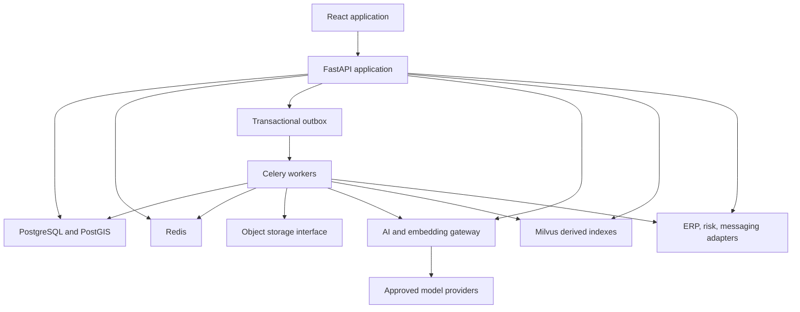
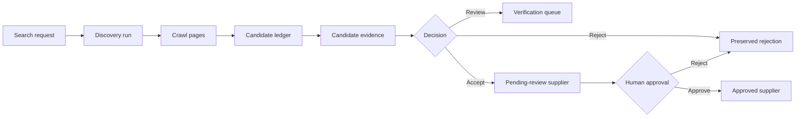

# SupplierMind Production Roadmap Design

**Date:** 2026-07-29
**Status:** Approved design baseline
**Product owner:** Mercanis
**Target:** Production-grade, single-organization supplier intelligence and procurement platform

## 1. Context

SupplierMind already provides a working supplier-discovery product built with
FastAPI, React, PostgreSQL/PostGIS, Milvus, Redis, LangGraph, OpenAI, Voyage,
Tavily, Geoapify, and OpenSanctions. Its current strengths include:

- Natural-language procurement queries.
- Structured constraint extraction and clarification.
- Internal and web supplier discovery.
- Evidence-aware compliance checks.
- Deterministic ranking and explanations.
- Pending-review supplier governance.
- Role-based access control and audit logs.
- Reproducible P1/P2/P3 evaluation.

The interview preparation guide describes a broader product roadmap. This
design turns the valuable roadmap items into a production program for Mercanis.
It is not an interview-only enhancement and it does not attempt to install
every competing technology mentioned as an alternative in the guide.

SupplierMind will serve Mercanis as one organization with multiple internal
users and roles. Multi-customer tenant isolation is outside the current scope.
The deployment platform has not been selected, so the system must remain
portable across cloud and Mercanis-managed infrastructure.

## 2. Goals

1. Complete every valuable product capability from the roadmap through
   releasable vertical slices.
2. Preserve the working supplier-discovery pipeline while improving its
   production boundaries.
3. Make supplier data, evidence, documents, risk, procurement decisions, and
   AI actions auditable.
4. Protect confidential procurement data through a privacy-aware AI gateway.
5. Support secure documents, background processing, supplier verification,
   procurement workflows, feedback learning, and integration adapters.
6. Keep external providers replaceable and cloud deployment portable.
7. Require human approval before supplier outreach or other consequential
   procurement actions.

## 3. Non-Goals

- Supporting multiple isolated customer tenants in this implementation.
- Replacing every current technology with every alternative named in the
  interview guide.
- Rewriting the application as microservices before operational evidence
  justifies that complexity.
- Claiming live SAP Ariba, Coupa, risk-data, email, or messaging integration
  without provider selection, credentials, and contract testing.
- Allowing the system to contact suppliers autonomously.
- Training production ranking models on invented outcomes and presenting them
  as real Mercanis behavior.
- Selecting AWS, Azure, GCP, or on-premises deployment in this design.

## 4. Design Principles

- **Modular monolith first:** retain FastAPI and React boundaries while
  separating domains through explicit services and interfaces.
- **PostgreSQL owns truth:** Milvus and Redis are derived runtime systems.
- **Evidence before claims:** every supplier, certification, risk signal, and
  recommendation exposes provenance and freshness.
- **Privacy by default:** unclassified or restricted data does not leave the
  system.
- **Durable asynchronous work:** long-running tasks are observable,
  idempotent, retryable, and recoverable.
- **Adapters at external boundaries:** business logic does not depend directly
  on one ERP, risk, messaging, storage, model, or embedding provider.
- **Human control:** consequential actions require explicit permissions and
  approval.
- **Backward-compatible delivery:** schema and APIs evolve without breaking the
  existing discovery workflow.
- **Measured intelligence:** learned ranking is introduced only after feedback
  data, offline evaluation, versioning, and rollback exist.

## 5. Delivery Approach

The work will use risk-first vertical slices. Each slice includes its database
migration, backend domain logic, API contract, UI workflow, permissions, audit
events, tests, operational metrics, documentation, and rollback behavior.

Breadth-first scaffolding was rejected because it would leave many partially
working screens and endpoints. A platform rewrite was rejected because it
would delay value and destabilize the working discovery pipeline.

## 6. Target Architecture

SupplierMind remains a modular monolith with separate web and worker
processes.



### 6.1 Runtime Components

- **FastAPI:** synchronous request contracts, authorization, orchestration, and
  job submission.
- **React:** role-aware procurement, verification, analytics, and
  administration workflows.
- **PostgreSQL/PostGIS:** authoritative transactional records.
- **Milvus:** supplier and document-chunk embeddings. Every vector references
  an authoritative PostgreSQL record.
- **Redis:** cache, rate limiting, Celery transport, and ephemeral runtime
  coordination.
- **Celery workers:** crawling, document extraction, certificate analysis,
  risk refresh, notification delivery, integration synchronization, and model
  training.
- **Object-storage interface:** local filesystem driver for development and an
  S3-compatible driver for production deployment.
- **Malware-scanning interface:** a local ClamAV reference adapter plus
  provider-neutral scan results and quarantine behavior.
- **AI gateway:** policy-controlled access to LLM and embedding providers.
- **Integration adapters:** provider-neutral ERP, supplier-master, risk,
  messaging, and storage boundaries.
- **Feature flags:** controlled enablement and rollback of sensitive features.

### 6.2 Backend Domains

```text
platform/       AI gateway, storage, jobs, outbox, feature flags
discovery/      search, crawling, extraction, candidate ledger
suppliers/      profiles, certificates, verification, risk
procurement/    comparisons, saved searches, RFQs, quotes, outreach
documents/      uploads, parsing, chunks, document retrieval
intelligence/   feedback, evaluation, explainability, ranking models
integrations/   ERP, supplier-master, risk, messaging adapters
observability/  usage, cost, latency, failures, operational analytics
```

Domains expose typed service interfaces. API routes call services rather than
repositories directly. Workers call the same services under job-specific
authorization and audit contexts.

## 7. Privacy-Aware AI Gateway

All model and embedding traffic must pass through one gateway. Direct provider
calls from agents, document services, or evaluation code will be removed or
wrapped.

### 7.1 Data Classifications

- `public`: published supplier websites and public certificates.
- `internal`: sourcing queries, derived rankings, and operational metadata.
- `confidential`: pricing, quotes, contracts, negotiation notes, and private
  supplier documents.
- `restricted`: personal or specially controlled data that must not leave
  Mercanis-controlled processing without an explicit approved policy.

### 7.2 Policy Evaluation

Each AI request declares:

- Purpose and calling domain.
- Data classification.
- Provider capability required.
- Whether redaction or excerpting was applied.
- Maximum token and cost budget.
- Request, job, user, and source-document identifiers.

The gateway selects an approved provider or rejects the call. Unknown
classification is treated as restricted. Embeddings follow the same policy as
prompts.

### 7.3 AI Audit Events

The system stores provider, model, purpose, classification, token counts,
estimated cost, latency, outcome, and correlation IDs. It does not store
credentials or raw confidential content in application logs.

Provider retention, regional processing, and contractual approval remain
deployment controls that Mercanis security and legal teams must validate
before enabling confidential external processing.

## 8. Data Model

New state will use explicit relational entities rather than unstructured
catch-all JSON.

### 8.1 Platform and Observability

- `BackgroundJob`: type, state, progress, attempt count, owner, timestamps,
  error code, and correlation ID.
- `OutboxEvent`: committed work awaiting publication.
- `FeatureFlag`: key, scope, state, and change audit metadata.
- `ExternalCallMetric`: external service, operation, latency, cost, outcome,
  and correlation identifiers.
- `AIUsageEvent`: AI gateway decision and metering information.

### 8.2 Discovery and Evidence

- `DiscoveryRun`: query, search scope, policy, status, and aggregate outcome.
- `Candidate`: one discovered entity before supplier promotion.
- `CandidateEvidence`: extracted field, value, source URL, quote, confidence,
  and freshness.
- `CrawlPage`: canonical URL, content hash, status, extraction metadata, and
  fetch time.
- `CandidateDecision`: accepted, rejected, duplicate, or review-required
  decision with reason and actor.

### 8.3 Documents and Certificates

- `SupplierDocument`: supplier, document type, classification, storage key,
  content hash, version, state, and ownership.
- `DocumentChunk`: derived chunk metadata and Milvus reference.
- `Certificate`: normalized standard, issuer, certificate number, validity
  dates, verification state, evidence, and linked document.
- `CertificateStatusEvent`: expiry, refresh, rejection, and human-review
  history.

### 8.4 Risk

- `RiskAssessment`: supplier, aggregate score, state, methodology version,
  assessed time, and next refresh.
- `RiskSignal`: sanctions, financial, ESG, cyber, adverse-media, or geographic
  signal with provider, evidence, severity, confidence, and freshness.

Unknown, unavailable, and pending-review are distinct from clear. Missing
signals never become implicitly safe.

### 8.5 Procurement

- `SavedSearch` and `NotificationRule`.
- `NotificationDelivery`: channel, state, attempts, and audit correlation.
- `SourcingProject`: procurement workspace and lifecycle.
- `RFQ`: versioned requirements, approval state, and deadline.
- `RFQSupplier`: invited supplier and delivery state.
- `Quote`: structured commercial response, currency, validity, attachments,
  and comparison fields.
- `OutreachDraft`: generated or manual content, approval state, reviewer, and
  send state.
- `NegotiationNote`: access-controlled project note.

### 8.6 Intelligence

- `SupplierRelationship`: typed directed relationship with provenance and
  validity.
- `RecommendationFeedback`: recommendation, decision, reason codes, actor,
  context, and timestamp.
- `TrainingRun`: dataset snapshot, feature schema, configuration, metrics, and
  artifact location.
- `RankingModel`: version, lifecycle state, artifact, validation results, and
  rollback predecessor.
- `ModelEvaluation`: offline and controlled online comparison results.
- `ActiveLearningItem`: review candidate, uncertainty, priority, state, and
  resolution.

### 8.7 Integrations

- `IntegrationConnection`: adapter type, configuration reference, state, and
  permissions. Secrets are stored by the deployment secret manager, not in
  this table.
- `ExternalMapping`: local entity to provider identifier mapping.
- `SyncRun`: direction, checkpoint, counts, errors, and reconciliation report.

## 9. Feature Phases

### Phase 0: Production Foundation

1. Introduce AI/embedding gateway and migrate current provider calls.
2. Add Celery, durable job records, transactional outbox, retry policy,
   cancellation, progress, and dead-letter review.
3. Add storage interface, validated uploads, content hashing, quarantine, and
   a working ClamAV reference adapter behind the malware-scanning interface.
4. Add feature flags and stable audit-event contracts.
5. Extend metrics to per query, agent, provider, and external API.
6. Enforce configurable cost budgets and policy outcomes.
7. Harden parser output validation and clarification confidence rules.
8. Extend health checks to workers, outbox lag, storage, and provider policy.

### Phase 1: Supplier Evidence and Trust

1. Persist every web candidate, extraction attempt, rejection, duplicate, and
   promotion decision.
2. Add canonical homepage detection, controlled page discovery, crawl budgets,
   provenance, and existing SSRF protections.
3. Add certificate and supplier-document upload, extraction, versioning, and
   expiry tracking.
4. Add supplier verification dashboard and review queues.
5. Add provider-neutral risk signals and aggregate risk methodology.
6. Schedule certificate, evidence, sanctions, and risk refresh work.

### Phase 2: Procurement Workspace

1. Add side-by-side supplier comparison.
2. Add saved searches and notification rules.
3. Add sourcing projects, RFQ/RFP drafts, approvals, supplier selection, and
   controlled outreach drafts.
4. Add quote ingestion, structured quote comparison, attachments, and
   negotiation notes.
5. Add CSV/Excel supplier and procurement import/export with row-level
   validation reports.
6. Add role-specific analyst, procurement-manager, compliance, and
   administrator surfaces.
7. Add sourcing-cycle, approval, category-gap, search-success, cost, and
   latency analytics.
8. Preserve English and German through queries, documents, drafts, and
   notifications.

### Phase 3: Intelligence Layer

1. Parse, chunk, embed, retrieve, and cite approved supplier documents.
2. Add supplier relationship graph APIs and visualization based on PostgreSQL
   relationship tables.
3. Capture structured human feedback from supplier and recommendation
   decisions.
4. Add evidence-completeness and uncertainty scores.
5. Add automatic failure classification across parser, retrieval, compliance,
   ranking, and external-data stages.
6. Add offline learning-to-rank training and evaluation using versioned
   feedback snapshots.
7. Add ranking model registry, controlled activation, monitoring, and rollback.
8. Add category-specific configuration and controlled user/team preferences.
9. Add active-learning review queue.
10. Add approved-provider and embedding-model comparison dashboard.

### Phase 4: Integrations and Controlled Automation

1. Implement ERP/procurement, supplier-master, risk, and messaging adapter
   interfaces.
2. Provide functional local/reference adapters and contract-test suites.
3. Add idempotent synchronization, checkpoints, external mappings, and
   reconciliation reports.
4. Enable live adapters only after provider selection, credentials, security
   approval, and sandbox verification.
5. Require explicit human approval before any supplier communication.

## 10. Primary Data Flows

### 10.1 Discovery to Supplier Promotion



### 10.2 Document Ingestion and RAG

1. Authorized user uploads a document and selects supplier, type, and
   classification.
2. API validates metadata and creates a pending document plus background job.
3. Worker validates content, runs malware hook, stores the object, extracts
   text, and records provenance.
4. AI gateway decides whether extraction or embedding may use an external
   provider.
5. Approved chunks are written to PostgreSQL and indexed in Milvus.
6. Retrieval applies user permissions, supplier/document filters, and
   classification policy before returning cited chunks.
7. Deletion or supersession removes derived vectors and retains the required
   immutable audit event.

### 10.3 Feedback to Learned Ranking

1. Human decisions create structured feedback records.
2. Training run freezes a versioned dataset snapshot and feature schema.
3. Candidate model is evaluated against deterministic ranking using offline
   relevance, constraint, calibration, fairness, and stability checks.
4. Approved model runs behind a feature flag in shadow or limited mode.
5. Monitoring compares outcomes and permits immediate rollback to the previous
   model or deterministic ranking.

### 10.4 Controlled Outreach

1. User creates or generates an RFQ/outreach draft.
2. AI gateway enforces classification and provider policy.
3. Authorized reviewer approves, rejects, or edits the immutable draft
   version.
4. Messaging adapter sends only the approved version.
5. Delivery outcome and provider identifier are audited and reconciled.

## 11. Authorization

Roles:

- `analyst`: search, compare, save, create projects, draft RFQs, and provide
  feedback.
- `procurement_manager`: analyst capabilities plus approve procurement
  workflow states and supplier outreach.
- `compliance_officer`: inspect documents, certificates, risk, and verification
  queues; approve compliance decisions.
- `admin`: manage users, feature flags, integrations, policies, and operational
  configuration.

Backend authorization dependencies enforce every action. The frontend mirrors
permissions for usability but is never the security boundary. Cross-user
private resources continue to use non-enumerating access behavior.

## 12. Reliability and Error Handling

- PostgreSQL commit and asynchronous publication use a transactional outbox.
- Workers are idempotent and use explicit idempotency keys.
- Retries apply only to classified transient failures with bounded backoff.
- Permanent failures move to a visible dead-letter state with safe replay.
- Provider calls use timeouts, rate limits, circuit breakers, and correlation
  IDs.
- Partial evidence produces `unknown` or `pending_review`, not false success.
- APIs return stable domain error codes and request IDs without internal
  details.
- Integration runs use checkpoints and reconciliation reports.
- Migrations are backward-compatible and applied before dependent code.
- Feature flags provide controlled rollout and rollback.

## 13. Security

- Production disables development authentication.
- An identity-provider interface permits later Mercanis SSO integration.
- Secrets remain in deployment-managed secret storage.
- Files receive allowlisted type and size checks, content hashes,
  authorization, quarantine, and scanning through the ClamAV reference
  adapter or another approved implementation.
- Download responses use safe content disposition and do not expose storage
  paths.
- Crawling retains SSRF, redirect, DNS/IP, size, timeout, and content-type
  controls.
- Sensitive values are redacted from logs, errors, metrics, and audit
  summaries.
- Consequential changes record actor, reason, timestamp, previous value, and
  new value.
- Retention and deletion services remove derived data while preserving legally
  required audit metadata.

## 14. Testing Strategy

### 14.1 Deterministic CI

- Backend unit and service tests.
- PostgreSQL repository, constraint, and migration integration tests.
- Redis/Celery idempotency, retry, cancellation, outbox, and dead-letter tests.
- Adapter contract suites with deterministic fakes.
- AI-gateway policy tests, including proof that restricted content cannot
  reach unauthorized providers.
- RBAC, object-access, upload, SSRF, and log-redaction security tests.
- React component tests for state and permission behavior.
- Playwright journeys for discovery, verification, comparison, documents,
  RFQs, feedback, and administration.
- Existing P1/P2/P3 regression benchmark checks.
- Product-scale tests against the existing 10k supplier corpus.

### 14.2 Optional Live Verification

Live provider checks run separately with explicit credentials. They do not
replace deterministic contract tests and do not run on untrusted pull
requests.

### 14.3 CI Gates

- Pytest, Ruff, and mypy.
- Frontend component tests, lint, type checking, and production build.
- Migration upgrade validation from the current production schema.
- Dependency, secret, and container vulnerability scanning.
- Container build and startup health verification.

## 15. Release Strategy

1. Merge backward-compatible schema and platform foundations first.
2. Keep incomplete user-visible behavior disabled by feature flags.
3. Enable features for administrators, then selected Mercanis users, then the
   wider organization.
4. Establish metrics and alerts before enabling recurring background work.
5. Preserve deterministic ranking and existing discovery behavior as rollback
   paths.
6. Do not enable live outreach until identity, provider, security, and audit
   checks pass.
7. Begin load testing with the existing 10k corpus. Deployment-specific
   concurrency, availability, backup, and recovery objectives are set during
   infrastructure selection rather than guessed in application code.

## 16. Definition of Done

A roadmap feature is complete only when it has:

- Validated migration and data constraints.
- Domain service and versioned API contract.
- Working user flow with loading, empty, error, and permission states.
- Backend RBAC and immutable audit events.
- Durable jobs and recovery behavior where applicable.
- Unit, integration, frontend, and end-to-end coverage.
- Cost, latency, usage, and failure metrics.
- Operator and user documentation.
- Feature-flag rollout and rollback behavior.
- No unresolved placeholders or silent degraded-success paths.

## 17. Roadmap Coverage

The design covers the twelve headline future features:

1. Supplier comparison: Phase 2.
2. Certificate expiry and document upload: Phases 0–1.
3. Candidate ledger: Phase 1.
4. Learning from approvals/rejections: Phase 3.
5. ERP/procurement integrations: Phase 4.
6. RFQ/RFP generation and controlled outreach: Phase 2, connected in Phase 4.
7. Advanced supplier risk scoring: Phase 1.
8. Better crawler and citations: Phase 1.
9. Per-query/agent/provider cost and latency: Phase 0.
10. Supplier relationship graph: Phase 3.
11. Multi-document RAG: Phase 3.
12. Learning-to-rank: Phase 3.

It also covers the valuable detailed additions: parser and clarification
hardening, verification dashboard, saved-search alerts, multi-language flows,
analytics, bulk import/export, role-specific dashboards, cost controls,
failure classification, model comparison, active learning, explainability
scoring, and bounded sourcing workflows.

## 18. Accepted Decisions

- Build for Mercanis as a single organization with multiple internal roles.
- Treat the system as a real production product.
- Keep deployment cloud-portable until infrastructure is selected.
- Use a privacy-first hybrid provider policy.
- Retain the current core stack and choose one appropriate implementation for
  each capability.
- Use risk-first vertical slices rather than scaffolding every feature or
  rewriting the platform.
- Keep the backend a modular monolith and introduce separate services only
  when measured operational needs justify them.
- Use PostgreSQL relationship tables before considering a dedicated graph
  database.
- Provide functional local/reference adapters until live vendors and access
  are selected.
