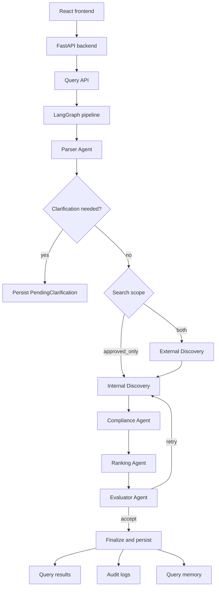

# SupplierMind Supplier Discovery System

Last updated: 2026-07-17

This document explains the current SupplierMind supplier discovery system as implemented in this repository. It is written for thesis, product, and engineering use. All implementation details here are grounded in the current codebase. When a behavior is not implemented yet, it is marked explicitly.

## Table Of Contents

1. [Purpose](#purpose)
2. [What The System Can Do](#what-the-system-can-do)
3. [What The System Does Not Yet Do](#what-the-system-does-not-yet-do)
4. [High-Level Architecture](#high-level-architecture)
5. [Main Runtime Components](#main-runtime-components)
6. [Core Data Model](#core-data-model)
7. [End-To-End Query Lifecycle](#end-to-end-query-lifecycle)
8. [Agent Pipeline](#agent-pipeline)
9. [Agent Details](#agent-details)
10. [External Discovery](#external-discovery)
11. [Internal Retrieval](#internal-retrieval)
12. [Compliance And Evidence](#compliance-and-evidence)
13. [Ranking And Explanations](#ranking-and-explanations)
14. [Human-In-The-Loop Governance](#human-in-the-loop-governance)
15. [Frontend Experience](#frontend-experience)
16. [History And Auditability](#history-and-auditability)
17. [Security, Roles, And Access Control](#security-roles-and-access-control)
18. [Benchmarking And Thesis Positioning](#benchmarking-and-thesis-positioning)
19. [Failure Modes And Graceful Degradation](#failure-modes-and-graceful-degradation)
20. [Configuration And External Services](#configuration-and-external-services)
21. [Current Known Limitations](#current-known-limitations)
22. [Important Source Files](#important-source-files)

## Purpose

SupplierMind is an AI-assisted supplier discovery system for procurement teams. Its purpose is to answer natural-language sourcing requests such as:

```text
Find AS9100 certified aerospace machining suppliers in Bavaria.
```

or:

```text
I want to buy 1000 wrench, socket wrench, torque tools and hand tools from reliable suppliers in Germany.
```

The system is designed for multi-constraint supplier discovery. It tries to understand product intent, location, certification, capacity, lead time, ranking preferences, and user scope. It then searches internal approved/saved suppliers and, when requested, discovers new suppliers from the web.

The thesis framing is:

```text
Multi-agent LLM-based supplier discovery for procurement under multi-constraint requirements.
```

The system being documented here is the P3 system in the thesis benchmark:

- P1: single-prompt LLM baseline.
- P2: minimal RAG baseline.
- P3: SupplierMind multi-agent system.

## What The System Can Do

SupplierMind currently supports these capabilities.

### Natural-Language Procurement Queries

Users can enter procurement-style text in the frontend. The parser extracts structured constraints from this text.

Examples of supported intent:

- Product type: bronze, packaging, electronics, office furniture, hand tools.
- Product keywords: wrench, socket wrench, torque tools, CNC milling, automotive stamping.
- Location: country, city, region, radius.
- Certifications: ISO 9001, AS9100, IATF 16949, TISAX, BIFMA/ANSI, DIN EN 6789, and other taxonomy entries.
- Capacity: numeric minimum and unit.
- Lead time: maximum days.
- Ranking preferences: faster lead time, more certifications, more capacity.
- Unsupported preferences: pricing and public support ratings are detected but not treated as verified facts.

### Agentic Clarification

The parser can pause the pipeline and ask a clarification question when the query is too vague or missing important information.

Implemented mechanics:

- The parser sets `needs_clarification`.
- The orchestrator persists a `pending_clarifications` row.
- The frontend shows a clarification card.
- The user answers.
- The backend resumes the pipeline with the original query plus the user answer.
- Clarification is capped at 3 turns by a database check constraint.

### Search Scope Control

The query page exposes two scopes:

- `approved_only`: search company-approved suppliers plus the current user's saved suppliers.
- `both`: search approved/saved suppliers and run web discovery for new candidates.

If an `approved_only` search finds no candidates, the orchestrator can auto-expand to `both` once.

### Web Discovery

When external discovery is enabled and the search scope allows it, the system can search the web for new suppliers.

It uses:

- Tavily for web search.
- LLM stage 1 classification to decide whether a result is likely a supplier website.
- Page fetch plus LLM stage 2 extraction for supplier fields.
- Regex and source-text verification for certifications, capacity, and lead time.
- Geoapify geocoding/places lookup for location validation.
- OpenSanctions screening for legal risk.
- PostgreSQL and Milvus ingestion for validated new suppliers.

New web suppliers are stored as `pending_review`, not silently trusted.

### Hybrid Internal Retrieval

Internal discovery combines:

- Milvus semantic vector search.
- PostgreSQL structured filters.
- Geospatial radius search.
- Freshly discovered supplier carry-forward.
- Reciprocal Rank Fusion to merge retrieval signals.

### Compliance Checking

The compliance agent validates candidates against extracted constraints.

It supports:

- Product fit.
- Category match.
- Country mismatch detection.
- Certification exact match.
- Certification canonicalization and taxonomy equivalence.
- LLM fallback for ambiguous certification relationships.
- Quote-or-fail verification for LLM positive claims.
- Capacity threshold checking.
- Lead-time checking.
- Radius-distance checking.

Known failures are excluded from final visible results by ranking.

### Ranking And Explanation

The ranking agent scores and ranks suppliers using:

- Compliance pass rate.
- Semantic similarity.
- Proximity.
- Profile completeness.
- User-stated ranking preferences.
- Tier boosts for approved and saved suppliers.
- Duplicate collapse by normalized supplier name and country.

It returns a top-5 shortlist. Explanations are deterministic and template-based from validated compliance verdicts and database fields. This avoids free-form LLM-generated result explanations.

### Human-In-The-Loop Governance

The system supports HITL governance:

- Web-discovered suppliers start as `pending_review`.
- Managers can approve or reject suppliers.
- Approval promotes a supplier to organization-wide `approved`.
- Rejection removes a supplier from future discovery results.
- Justifications are required and stored.
- Human decisions are recorded in `audit_logs` with `agent_name="human_admin"`.

### History And Auditing

The system stores:

- Query text.
- Parsed constraints.
- Query status.
- Execution time.
- Top ranked results.
- Compliance matrices.
- Explanations.
- Audit entries per agent.

The history page now opens saved results in read-only mode. It does not rerun the agent pipeline.

## What The System Does Not Yet Do

These are important boundaries.

### It Does Not Automatically Retrain Itself From HITL

HITL currently affects operational state:

- Approved suppliers become trusted for future searches.
- Rejected suppliers are removed from future discovery results.
- Saved suppliers influence user-specific retrieval.
- Human justifications are stored for audit.

But the parser, product-fit rules, certification taxonomy, and ranking weights do not automatically update themselves from approvals/rejections. That would require a separate feedback-learning pipeline.

### It Does Not Guarantee Correct Results For Any Arbitrary Query

It is built for procurement supplier discovery. Queries outside that domain may trigger clarification, weak results, or failure.

### It Does Not Fully Persist Every Extracted Candidate As A First-Class History View

The query result history stores the final ranked suppliers. The audit trail records external discovery counts and reasoning, but there is not yet a dedicated persisted candidate ledger showing every web search result, every extracted supplier, and every rejected candidate as first-class rows attached to the query.

### It Does Not Treat Pricing Or Public Ratings As Verified Ranking Signals

Pricing and support-rating preferences can be detected. Since the current database and extraction pipeline do not provide verified pricing/review evidence, those requests are surfaced as evidence gaps rather than trusted scores.

### OpenSanctions Requires Valid Credentials

If OpenSanctions returns 401/403 or the API key is missing, suppliers are marked with sanctions `pending_review`. The system does not claim they are clear.

## High-Level Architecture



The major architectural idea is that the system does not ask one LLM prompt to do everything. It decomposes the task into specialized steps:

1. Parse intent.
2. Discover or retrieve candidates.
3. Validate constraints.
4. Rank results.
5. Evaluate quality.
6. Persist traceable outputs.

## Main Runtime Components

### Frontend

Location: `apps/frontend/src`

Technologies:

- React 19.
- TypeScript.
- Vite.
- Tailwind CSS.
- shadcn-style UI components.
- React Query for data fetching.
- Server-Sent Events for live query progress.
- Leaflet for map visualization.
- i18next for frontend localization.

Main pages:

- `QueryPage.tsx`: submit new discovery queries.
- `ResultsPage.tsx`: live progress and result display.
- `HistoryPage.tsx`: read-only history view.
- `MySuppliersPage.tsx`: personal shortlist and pending-review queue.
- `DashboardPage.tsx`: stats and recent query access.
- `AdminMetricsPage.tsx`: operational metrics.

### Backend

Location: `apps/backend/app`

Technologies:

- FastAPI.
- SQLAlchemy.
- PostgreSQL.
- Milvus vector database.
- Redis-compatible cache abstraction for runtime support, with in-memory fallback.
- LangGraph for the agent state machine.
- OpenAI for LLM reasoning.
- Voyage AI for supplier/query embeddings.

### Data Stores

- PostgreSQL stores suppliers, users, queries, results, audit logs, clarifications, saves, geocode cache.
- Milvus stores supplier embeddings for semantic search.
- Redis is configured as the shared async cache backend when available.

### External Services

- OpenAI: LLM reasoning and JSON extraction.
- Voyage AI: default embeddings.
- Tavily: web search.
- Geoapify: location validation and enrichment.
- OpenSanctions: sanctions screening.

## Core Data Model

The core SQLAlchemy models live in `apps/backend/app/db/models.py`.

### Supplier

The central supplier record.

Key fields:

- `id`: UUID primary key.
- `name`: supplier name.
- `description`: embedded for semantic search.
- `category`: procurement category.
- `country`, `city`, `address`, `latitude`, `longitude`: location data.
- `certifications`: JSON array.
- `certification_details`: JSON object with source details.
- `capacity_value`, `capacity_unit`: structured capacity.
- `lead_time_days`: structured lead-time signal.
- `website`, `contact_email`: supplier contact/profile fields.
- `source`: supplier provenance such as `manual`, `web_discovery`, `imported`, or `synthetic_10k`.
- `status`: approved/saved/discovered/pending_review/rejected.
- `source_url`: provenance URL.
- `source_citations`: per-field citation metadata.
- `approval_justification`, `approval_action`, `approval_decided_at`: HITL decision metadata.
- `is_active`: soft-delete flag.

### Query

One procurement discovery request.

Key fields:

- `raw_query`: original user text.
- `detected_language`: parser language signal.
- `parsed_constraints`: structured parser output.
- `status`: pending, processing, completed, failed.
- `search_scope`: `approved_only` or `both`.
- `evaluator_retries`: retry count.
- `evaluator_verdict`: final evaluator decision.
- `execution_time_ms`: runtime.
- `error_message`: failure detail.
- `created_at`, `completed_at`.

### QueryResult

One result row for one query.

Key fields:

- `query_id`.
- `supplier_id`.
- `rank`.
- `total_score`.
- `constraint_score`.
- `semantic_score`.
- `proximity_score`.
- `completeness_score`.
- `compliance_matrix`.
- `explanation`.
- `distance_km`.

### AuditLog

Trace of agent and human decisions.

Key fields:

- `query_id`.
- `agent_name`.
- `action`.
- `input_snapshot`.
- `output_snapshot`.
- `reasoning`.
- `duration_ms`.
- `timestamp`.

Human approval/rejection decisions use `agent_name="human_admin"`.

### PendingClarification

Stores paused parser clarification state.

Key fields:

- `query_id`.
- `user_id`.
- `raw_query`.
- `clarification_question`.
- `partial_constraints`.
- `react_trace`.
- `turn_number`.
- `resolved_at`.
- `user_answer`.

The database enforces `turn_number <= 3`.

### UserSupplierSave

Stores personal shortlist records.

Key fields:

- `user_id`.
- `supplier_id`.
- `notes`.
- `saved_at`.

## End-To-End Query Lifecycle

### 1. User Submits A Query

Frontend page:

- `apps/frontend/src/pages/QueryPage.tsx`

API endpoint:

- `POST /api/v1/queries`

Backend handler:

- `submit_query()` in `apps/backend/app/api/v1/queries.py`

The frontend sends:

```json
{
  "raw_query": "Find IATF 16949 certified automotive stamping suppliers near Stuttgart",
  "search_scope": "approved_only"
}
```

The backend:

1. Checks query length.
2. Blocks simple prompt-injection phrases.
3. Creates a `Query` row.
4. Initializes an in-memory SSE event buffer.
5. Starts `_run_pipeline_background()`.
6. Returns the query ID immediately.

### 2. Frontend Opens Live Results Page

After submission, the frontend navigates to:

```text
/query/{query_id}/results
```

`ResultsPage.tsx` fetches the current query snapshot and opens an SSE stream only if the query is still pending/processing and this is not history mode.

SSE endpoint:

```text
GET /api/v1/queries/{query_id}/stream?token={jwt}
```

The stream sends:

- `connected`
- `agent_update`
- `needs_clarification`
- `complete`
- `error`

### 3. Backend Runs Agent Pipeline

The pipeline is built in:

```text
apps/backend/app/agents/orchestrator.py
```

It runs through LangGraph with shared `AgentState`.

### 4. Results Are Persisted

When the pipeline finishes, `_run_pipeline_background()` updates the query row and writes:

- `QueryResult` rows.
- `AuditLog` rows.
- Query status.
- Parsed constraints.
- Execution time.
- Error message if any.

### 5. Frontend Fetches Persisted Results

API endpoint:

```text
GET /api/v1/queries/{query_id}
```

The response includes:

- Query metadata.
- Parsed constraints.
- Results enriched with supplier fields.
- Compliance matrix.
- Structured explanation.
- Source citations.
- Sanctions pending status when present.
- Approval rationale when present.

## Agent Pipeline

The production pipeline is:

```text
Parser
  -> optional External Discovery
  -> Internal Discovery
  -> Compliance
  -> Ranking
  -> Evaluator
  -> Finalize
```

The graph has conditional edges:

- Parser can stop early for clarification.
- `approved_only` skips external discovery initially.
- If `approved_only` finds no candidates, it can expand once to `both`.
- Evaluator can retry internal discovery.
- Finalize writes query memory only when results are accepted.

## Agent Details

### Shared Agent State

The state schema is defined in:

```text
apps/backend/app/agents/state.py
```

Important fields:

- `raw_query`
- `query_id`
- `user_id`
- `search_scope`
- `parsed_constraints`
- `detected_language`
- `needs_clarification`
- `clarification_question`
- `newly_discovered_supplier_ids`
- `candidate_supplier_ids`
- `semantic_scores`
- `geo_distances`
- `tier_assignments`
- `compliance_results`
- `ranked_suppliers`
- `evaluator_verdict`
- `evaluator_should_retry`
- `audit_log`
- `error`
- `pipeline_status`

Every agent reads from and writes to this shared state.

### Parser Agent

File:

```text
apps/backend/app/agents/parser_agent.py
```

Role:

- Convert the raw natural-language procurement query into structured constraints.
- Decide whether clarification is needed.
- Use tools via a ReAct loop.

Core design:

- ReAct-style Thought/Action/Observation loop.
- Maximum 6 ReAct iterations.
- Maximum 2 calls per tool.
- Fallback extraction if the loop fails.
- Clarification thresholds for low confidence or insufficient constraints.

Structured output shape includes:

- `product_type`
- `product_keywords`
- `industry_context`
- `buyer_intent`
- `category_hint`
- `location_name`
- `location_city`
- `location_country`
- `location_region`
- `location_lat`
- `location_lng`
- `location_radius_km`
- `certifications`
- `industry_typical_certs`
- `capacity_min`
- `capacity_unit`
- `lead_time_max_days`
- `ranking_preferences`
- `unsupported_preferences`
- `query_type`
- `complexity`
- `original_language`

Important parser behaviors:

- Removes placeholder product values such as "supplier" or "materials for our project".
- Can recover product intent from constraint-heavy queries.
- Detects memory references such as "same as before".
- Detects ranking preferences.
- Detects unsupported preferences such as pricing and ratings.
- Can ask clarification when the query is contentless or too vague.

### Parser Tools

The parser uses a tool registry. Tool implementation is under:

```text
apps/backend/app/agents/tools/
```

Documented tool responsibilities include:

- Geocode a location.
- Infer industry/category context.
- Parse quantity and unit.
- Look up past query memory for this user.
- Use default/no-op memory fallback when memory infrastructure is unavailable.

### Finalize Node

The finalize node writes accepted queries to long-term query memory.

Important behavior:

- Only accepted/auto-accepted runs are written.
- Memory write failures never fail the user request.
- A memory audit entry is appended when memory write succeeds or fails.

## External Discovery

External discovery is implemented in:

```text
apps/backend/app/agents/external_discovery_agent.py
apps/backend/app/services/web_search.py
apps/backend/app/services/supplier_extraction.py
apps/backend/app/services/location_enrichment.py
apps/backend/app/services/sanctions.py
```

It runs only when:

- `ENABLE_EXTERNAL_DISCOVERY` is true.
- Tavily is configured.
- Search scope is `both`, or the orchestrator expands from `approved_only` to `both`.

### Web Search

The system uses Tavily through `WebSearchService`.

Search query construction includes:

- Product terms.
- Category terms.
- Country.
- City.
- Certification terms.
- Official-site/manufacturer/supplier language.
- Germany-specific `.de` query variants when appropriate.

The code currently caps external discovery to at most 6 web results, even if environment configuration is higher.

### Stage 1 Supplier Classification

For each Tavily result, `SupplierExtractionService.stage1_classify()` decides if the result is likely a supplier website.

It rejects:

- Directories.
- Blogs/news.
- Marketplace pages.
- Government databases.
- Wikipedia-style pages.
- Aggregators.

If the LLM stage 1 call fails, the system uses a URL heuristic instead of automatically rejecting the result.

### Stage 2 Supplier Extraction

For accepted stage 1 results, the system fetches page content and asks the LLM to extract structured supplier data.

Extracted fields include:

- Name.
- Description.
- Primary products.
- Industries served.
- Country/city/address.
- Certifications.
- Capacity.
- Lead time.
- Website.
- Contact email.
- Citations.
- Confidence.

### Hallucination Guards During Extraction

The extractor verifies:

- Capacity numbers must appear in source text.
- Lead-time numbers must appear near lead-time wording.
- Certifications must match known certification patterns/taxonomy.
- Unverifiable facts are nulled or dropped.

The extractor also performs bounded fallback page probes:

- Certification pages: at most 2 candidates.
- Location pages: at most 3 candidates.

This prevents slow page probing from dominating runtime.

### Location Validation

Location validation uses Geoapify.

Paths:

1. Geocoding extracted address/city/company context.
2. Places lookup by company name with query-bounded location context.

A web supplier without a verified location is rejected from ingestion.

### Sanctions Screening

OpenSanctions screening happens before ingestion.

Behavior:

- Flagged supplier: rejected.
- Clear supplier: can proceed.
- Missing key/API unavailable/401/403/429/5xx: supplier can proceed only with sanctions status `pending_review`.

The system never converts a failed sanctions check into "clear".

### Deduplication

External discovery checks existing suppliers using normalized company names and country.

The normalizer removes common legal suffixes such as:

- GmbH
- AG
- KG
- Ltd
- Inc
- LLC
- Group
- Holding

This helps collapse variants like:

```text
HAZET GmbH & Co. KG
HAZET
```

### Ingestion

Validated suppliers are inserted into PostgreSQL and Milvus.

Important:

- Source is `web_discovery`.
- Status is `pending_review`.
- Source URL and citations are stored.
- Embeddings are added to Milvus.
- Fresh IDs are placed in `state["newly_discovered_supplier_ids"]` so they can appear in the same query's results immediately.

## Internal Retrieval

Internal discovery is implemented in:

```text
apps/backend/app/agents/discovery_agent.py
```

It combines multiple retrieval strategies.

### Semantic Search

Uses Milvus:

1. Build query text from raw query plus parsed constraints.
2. Embed the query.
3. Search the supplier collection.
4. Filter vector hits by search scope in PostgreSQL.

### Structured SQL Search

SQL filters include:

- Category/category expansions.
- Country.
- Certification terms and variants.
- Product terms across supplier name, description, and category.

Category expansions exist for some corpus gaps. For example:

- `tools_hardware` expands into related categories such as machinery, metals, and construction materials.
- `office_supplies` expands into related corpus categories to avoid zero retrieval when the synthetic corpus has sparse direct matches.

### Fresh External Candidates

Freshly ingested web suppliers from the same run are carried forward as a retrieval signal. This avoids waiting for vector search to rediscover them.

### Geospatial Radius Search

If constraints contain:

- `location_lat`
- `location_lng`
- `location_radius_km`

the discovery agent runs radius filtering and records `geo_distances`.

### Scope Filtering

`approved_only` includes:

- Approved suppliers.
- The current user's saved suppliers.

`both` includes:

- Approved suppliers.
- Discovered suppliers.
- Pending-review suppliers, unless evaluation sets `exclude_pending=true`.
- The current user's saved suppliers.

### Reciprocal Rank Fusion

The discovery agent merges retrieval channels using Reciprocal Rank Fusion.

Signals:

- Semantic rank.
- Structured rank.
- Fresh external rank.
- Geospatial rank.

The discovery agent now uses a balanced handoff instead of a pure top-10 RRF
cut. Fresh web, geospatial, structured SQL, and semantic candidates each get
protected slots before the remaining RRF ordering fills the downstream pool.
This prevents a stale or partial vector index from crowding exact SQL or fresh
web matches out before compliance and ranking can score them.

### Discovery Retry And Relaxation

If fewer than 5 candidates are found, discovery can relax constraints.

Relaxation priority:

1. Location radius.
2. Lead time.
3. Capacity.
4. Certifications.

It never relaxes product type.

## Compliance And Evidence

Compliance is implemented in:

```text
apps/backend/app/agents/compliance_agent.py
apps/backend/app/data/cert_taxonomy.json
```

### Product Fit

Product fit is deterministic.

It checks:

- Requested category vs supplier category.
- Product tokens from the query.
- Supplier tokens from name, description, category, and primary products.

Obvious mismatches can fail the supplier before ranking.

### Certification Normalization

The system canonicalizes real-world certification variants.

Examples:

- `ISO 9001:2015` -> `ISO 9001`
- `DIN EN ISO 9001` -> `ISO 9001`
- `AS9100D` -> `AS9100`
- `IATF 16949-2016` -> `IATF 16949`
- `TISAX AL3` -> `TISAX`
- `DIN EN ISO 6789` -> `DIN EN 6789`
- `ANSI/BIFMA` -> `BIFMA/ANSI`

### Certification Taxonomy

The taxonomy provides:

- What a certification covers.
- What it contains or supersedes.
- What it is explicitly not equivalent to.

The compliance agent uses taxonomy before the LLM.

If taxonomy is conclusive:

- Supersession/equality can produce PASS.
- Explicit non-equivalence can produce FAIL.
- No LLM call is needed.

### LLM Certification Fallback

Only genuinely ambiguous certification comparisons go to the LLM.

The LLM receives:

- Required unmatched certifications.
- Supplier evidence text.
- Relevant taxonomy block.

The LLM must return JSON verdicts.

### Quote-Or-Fail

Every LLM PASS/PARTIAL claim must cite a verbatim phrase from supplier text.

If the quote is:

- Missing.
- Too short.
- Not found in source text.
- Low-confidence.

then PASS can be downgraded to PARTIAL. FAIL is not modified because it is not a positive claim.

### Numeric Constraints

Capacity:

- PASS if capacity meets minimum with matching unit.
- PARTIAL if capacity is missing, unit mismatched, or within 80 percent of required capacity.
- FAIL if clearly below threshold.

Lead time:

- PASS if lead time is within limit.
- PARTIAL if missing or slightly above limit.
- FAIL if clearly above limit.

Radius:

- PASS if inside radius.
- PARTIAL if within 10 percent outside radius.
- FAIL if clearly outside radius.

### Overall Compliance

For each supplier:

- `overall_pass` is true when there are no FAIL verdicts.
- `has_partial` is true when at least one verdict is PARTIAL.
- `pass_rate` is PASS count divided by total checks.

## Ranking And Explanations

Ranking is implemented in:

```text
apps/backend/app/agents/ranking_agent.py
```

### Ranking Inputs

Ranking uses:

- Compliance results.
- Semantic scores.
- Geo distances.
- Supplier tier.
- Parsed constraints.
- Ranking preferences.
- Supplier completeness.

### Hard Exclusion

Known FAIL verdicts exclude a supplier from the visible final result set.

PARTIAL verdicts remain eligible because they mean "needs confirmation", not "known failure".

### Score Components

The ranking score is a weighted blend of:

- Constraint score.
- Semantic score.
- Proximity score.
- Completeness score.
- Preference score.

Base weights are adjusted by query type:

- `geographic_priority`
- `compliance_critical`
- `capability_match`
- general queries
- city-focused queries

### Preference Score

Supported ranking preferences:

- Lead time.
- Certifications.
- Capacity.

Unsupported preferences:

- Pricing.
- Support ratings/reviews.

Unsupported preferences are turned into explanation concerns, not fake scores.

### Tier Boosts

Ranking applies small boosts:

- Approved supplier: 1.05x.
- Saved supplier: 1.03x.

Pending-review suppliers do not receive a trust boost.

### Dedupe Before Top 5

Before selecting visible top results, ranking collapses duplicate supplier rows by normalized supplier name and country. This prevents duplicate rows from occupying multiple top-5 slots.

### Top 5

The system returns at most 5 visible suppliers.

Fresh pending-review suppliers from the current web run are kept visible when possible, so managers can review them from the result context.

### Deterministic Explanations

Final explanations are built from:

- Compliance verdict reasons.
- Supplier facts from the database.
- Unsupported preference concerns.
- Semantic score concerns.

The ranker does not ask the LLM to write final result explanations.

## Human-In-The-Loop Governance

HITL workflow is implemented in:

```text
apps/backend/app/api/v1/suppliers.py
apps/frontend/src/pages/MySuppliersPage.tsx
apps/frontend/src/features/suppliers/SupplierCard.tsx
```

### Supplier Statuses

Supplier status values:

- `approved`: organization-wide trusted supplier.
- `saved`: represented by `UserSupplierSave`, not the supplier row status itself.
- `discovered`: discovered but not approved.
- `pending_review`: web-discovered and awaiting human review.
- `rejected`: excluded from future searches.

### Save To Shortlist

Any authenticated user can save a supplier to their personal shortlist.

This creates a `UserSupplierSave` row.

### Approval

Managers can approve suppliers.

Eligible starting states:

- `discovered`
- `pending_review`

Approval:

- Sets supplier status to `approved`.
- Stores approver and timestamp.
- Stores justification.
- Writes a human audit entry.
- Makes the supplier available in organization-wide approved searches.

### Rejection

Managers can reject suppliers.

Rejection:

- Sets supplier status to `rejected`.
- Stores justification.
- Writes a human audit entry.
- Removes the supplier from future discovery results.

Current implementation note:

- The frontend exposes reject actions for pending-review suppliers.
- The backend reject endpoint currently accepts `discovered` and `approved` states.
- Therefore pending-review rejection should be aligned before claiming this workflow is complete end to end.

### What HITL Currently Learns

The system learns operationally:

- Approved suppliers become trusted.
- Rejected suppliers stop appearing.
- Saved suppliers are available to the saving user.
- Human rationales become auditable evidence.

### What HITL Does Not Yet Learn

There is no automatic model/rule retraining from HITL decisions.

Future HITL-informed learning could:

- Aggregate approval/rejection labels.
- Detect recurring parser mistakes.
- Propose certification taxonomy updates.
- Tune ranking weights offline.
- Train or fine-tune a relevance model.
- Require human approval before production rule/model updates.

## Frontend Experience

### Query Page

File:

```text
apps/frontend/src/pages/QueryPage.tsx
```

Users can:

- Enter natural-language procurement queries.
- Choose search scope.
- Submit the query.
- Pick example queries.

Search scope options:

- Approved Suppliers Only.
- Discover New Suppliers.

### Results Page

File:

```text
apps/frontend/src/pages/ResultsPage.tsx
```

For new active queries:

- Opens SSE stream.
- Shows agent progress.
- Shows clarification card when needed.
- Fetches persisted results after completion.

For history view:

- Uses `?view=history`.
- Fetches persisted results directly.
- Does not open SSE.
- Does not rerun the query.

Result cards show:

- Rank.
- Supplier name.
- Tier badges.
- Sanctions pending badge when present.
- Location.
- Distance.
- Lead time.
- Capacity.
- Certifications.
- Compliance matrix.
- Explanation.
- Evidence/citations.
- Score breakdown.
- Save/approve/reject actions.

### History Page

File:

```text
apps/frontend/src/pages/HistoryPage.tsx
```

Shows:

- Total discoveries.
- Query text.
- Relative time.
- Execution time.
- Result count.
- Status icon.
- Eye icon for viewing saved result snapshot.
- Clear history button.

History links now navigate to:

```text
/query/{query_id}/results?view=history
```

### My Suppliers Page

File:

```text
apps/frontend/src/pages/MySuppliersPage.tsx
```

Current tabs:

- My Shortlist.
- Pending Review.

Approved vendors are not shown on this page anymore. They remain part of the backend and search scope behavior.

### Dashboard Page

File:

```text
apps/frontend/src/pages/DashboardPage.tsx
```

Shows:

- Total active suppliers.
- Indexed supplier count and index health.
- Number of user discoveries.
- Recent queries.

Recent query links open history snapshots, not live reruns.

## History And Auditability

### Persisted Query History

Endpoint:

```text
GET /api/v1/queries
```

Returns paginated query history for the current user.

Each item includes:

- Query ID.
- Raw query.
- Status.
- Execution time.
- Created time.
- Result ranks/count.

### Persisted Query Result Snapshot

Endpoint:

```text
GET /api/v1/queries/{query_id}
```

Returns:

- Query metadata.
- Parsed constraints.
- Results.
- Supplier details.
- Source citations.
- Explanation detail.
- Sanctions pending status.

### Audit Trail

Endpoint:

```text
GET /api/v1/queries/{query_id}/audit
```

The audit trail records:

- Agent actions.
- Input/output summaries.
- Structured snapshots when available.
- Reasoning.
- Duration.

### Clear History

Endpoint:

```text
DELETE /api/v1/queries/history
```

Deletes the current user's query-scoped artifacts:

- Query results.
- Audit logs.
- Pending clarifications.
- Query rows.

## Security, Roles, And Access Control

### Roles

Defined roles:

- `admin`
- `procurement_manager`
- `analyst`

### Query Submission

Query submission uses `require_manager`, so it is manager-gated.

### Supplier Reading

Authenticated users can read supplier lists/details.

### Supplier Creation

Manual supplier creation is admin-only.

### Approval/Rejection

Approval and rejection require manager privileges:

- Admin.
- Procurement manager.

Analysts cannot approve or reject suppliers.

### Query Ownership

Query result and stream endpoints enforce query ownership, with admin access where applicable through dependency helpers.

### SSE Authentication

The browser EventSource API cannot send custom headers. The app passes the JWT in the SSE URL query parameter.

The code comments state this is acceptable for the thesis prototype, but production should use short-lived SSE-specific tokens.

## Benchmarking And Thesis Positioning

SupplierMind is P3 in the three-paradigm comparison.

### P1: Single-Prompt LLM

File:

```text
apps/backend/experiments/paradigm1_singleprompt.py
```

Characteristics:

- One prompt.
- No tools.
- No retrieval.
- No private corpus access.
- Answers from model parametric knowledge only.
- Cannot emit corpus supplier IDs.

Purpose:

- Measures how far a plain LLM gets without grounding.

### P2: Minimal RAG

File:

```text
apps/backend/experiments/paradigm2_rag.py
```

Characteristics:

- Same embedding/vector stack as P3.
- Retrieves top-k suppliers from Milvus.
- Shows those candidates to one LLM prompt.
- LLM picks up to 5.
- No compliance gate.
- No verification loop.
- No clarification.
- No agentic retry.
- No HITL governance.

Purpose:

- Measures what retrieval-plus-one-prompt can do without agentic decomposition.

### P3: SupplierMind

Files:

```text
apps/backend/app/
```

Characteristics:

- Multi-agent LangGraph pipeline.
- ReAct parser.
- External discovery.
- Hybrid retrieval.
- Compliance validation.
- Deterministic ranking.
- Evaluator retry.
- HITL governance.
- Audit trail.

Purpose:

- Tests whether decomposed, auditable, governed agentic discovery improves supplier search under multi-constraint requirements.

### Metrics

Metric code:

```text
apps/backend/app/evaluation/metrics.py
```

Metrics include:

- Precision@5.
- Mean reciprocal rank.
- Constraint satisfaction rate.
- Execution time.
- Cost, where available.
- Difficulty breakdown: simple, medium, hard.

### Evaluation Runner

File:

```text
apps/backend/app/evaluation/runner.py
```

The runner can evaluate:

- SupplierMind.
- Keyword SQL baseline.
- Manual simulation baseline.
- P1 single-prompt.
- P2 RAG.

It writes:

- Per-query metrics.
- Aggregated metrics.
- Checkpoints during long runs.

## Failure Modes And Graceful Degradation

### Tavily Missing

External discovery is skipped. Internal discovery can still run.

### Stage 1 LLM Failure

The extractor falls back to URL heuristics and does not automatically reject every result.

### Stage 2 LLM Failure

That page produces no supplier extraction.

### Missing Verified Location

Web-discovered supplier is rejected from ingestion.

### OpenSanctions Missing Or Unauthorized

Supplier is not treated as clear. It is marked `pending_review` for sanctions.

### Semantic Search Failure

Discovery logs a warning and continues with structured/geospatial retrieval where possible.

### Query Memory Failure

Memory write failure does not fail the user request.

### SSE Timeout

SSE stream reports an error after configured timeout.

### No Candidates

The orchestrator may expand approved-only scope to web discovery once. If no candidates remain, the query fails with a user-facing error.

## Configuration And External Services

Main settings file:

```text
apps/backend/app/core/config.py
```

Important settings:

- `OPENAI_MODEL_NAME`: default `gpt-4o-mini-2024-07-18`.
- `EMBEDDING_PROVIDER`: default `voyage`.
- `VECTOR_DB_PROVIDER`: default `milvus`.
- `ENABLE_EXTERNAL_DISCOVERY`: default true.
- `EXTERNAL_DISCOVERY_MAX_RESULTS`: default 6.
- `SSE_TIMEOUT_SECONDS`: default 300.
- `EVALUATOR_MAX_RETRIES`: default 1.
- `QUERY_MIN_LENGTH`: default 10.
- `QUERY_MAX_LENGTH`: default 1000.

External service keys:

- `OPENAI_API_KEY`
- `VOYAGE_API_KEY`
- `TAVILY_API_KEY`
- `GEOAPIFY_GEOCODING_API_KEY`
- `GEOAPIFY_PLACES_API_KEY`
- `OPENSANCTIONS_API_KEY`

## Current Known Limitations

These are confirmed limitations or product boundaries in the current code.

### 1. HITL Is Governance, Not Automatic Model Learning

Approvals/rejections influence supplier status, but not parser/ranker model parameters.

### 2. Candidate-Level Web Discovery History Is Not Fully Persisted

The final ranked suppliers are persisted as `QueryResult`. The system does not yet persist every Tavily result, extracted supplier, rejected duplicate, missing-location rejection, and sanctions rejection as query-scoped candidate rows.

### 3. External Discovery Depends On Live Web And APIs

Tavily, page fetches, Geoapify, OpenSanctions, and OpenAI can affect result quality and latency.

### 4. OpenSanctions Credential Problems Keep Sanctions Pending

If OpenSanctions returns 401, sanctions remain `pending_review`. This is correct fail-closed behavior, but it means the UI cannot claim a supplier is sanctions-clear.

### 5. Pricing And Public Ratings Are Not Verified

The system detects these preferences but does not score them as factual signals.

### 6. Certification Coverage Depends On The Taxonomy And Patterns

Many real variants are supported, but unknown or niche certifications may need taxonomy expansion.

### 7. Corpus Gaps Still Matter

Internal search quality depends on supplier data quality, category coverage, structured fields, and Milvus index freshness.

If PostgreSQL has more active suppliers than Milvus has supplier vectors,
the dashboard shows `reindex needed`, backend startup logs the mismatch, and
semantic retrieval is degraded. Structured SQL and fresh web carry-forward
still work, but the full semantic path should be rebuilt with:

```bash
cd apps/backend
uv run python scripts/bulk_ingest_synthetic.py --skip-pg --reset-milvus
```

That command drops and rebuilds only the supplier vector collection. It does
not delete PostgreSQL suppliers, but it does call the embedding provider for
the full synthetic corpus.

### 8. History Shows Final Results, Not Full Candidate Funnel

History now opens a read-only result snapshot. It does not rerun. But it shows the persisted final ranked suppliers, not every discarded web candidate.

### 9. Pending-Review Reject Workflow Needs Alignment

The UI exposes a reject button for pending-review suppliers, but the backend reject route currently accepts `discovered` and `approved` statuses. Approval supports `pending_review`; rejection should be aligned if pending-review rejection is part of the intended manager workflow.

## Important Source Files

### Backend Pipeline

- `apps/backend/app/agents/orchestrator.py`
- `apps/backend/app/agents/state.py`
- `apps/backend/app/agents/parser_agent.py`
- `apps/backend/app/agents/external_discovery_agent.py`
- `apps/backend/app/agents/discovery_agent.py`
- `apps/backend/app/agents/compliance_agent.py`
- `apps/backend/app/agents/ranking_agent.py`
- `apps/backend/app/agents/evaluator_agent.py`

### Backend Services

- `apps/backend/app/services/web_search.py`
- `apps/backend/app/services/supplier_extraction.py`
- `apps/backend/app/services/location_enrichment.py`
- `apps/backend/app/services/sanctions.py`
- `apps/backend/app/services/query_memory.py`
- `apps/backend/app/core/vector_store.py`
- `apps/backend/app/core/embeddings.py`
- `apps/backend/app/core/llm.py`

### Backend API

- `apps/backend/app/api/v1/queries.py`
- `apps/backend/app/api/v1/suppliers.py`
- `apps/backend/app/api/v1/metrics.py`
- `apps/backend/app/api/v1/auth.py`

### Database

- `apps/backend/app/db/models.py`
- `apps/backend/app/db/repositories/query_repo.py`
- `apps/backend/app/db/repositories/supplier_repo.py`
- `apps/backend/app/db/repositories/clarification_repo.py`

### Frontend

- `apps/frontend/src/pages/QueryPage.tsx`
- `apps/frontend/src/pages/ResultsPage.tsx`
- `apps/frontend/src/pages/HistoryPage.tsx`
- `apps/frontend/src/pages/MySuppliersPage.tsx`
- `apps/frontend/src/pages/DashboardPage.tsx`
- `apps/frontend/src/features/suppliers/SupplierCard.tsx`
- `apps/frontend/src/features/queries/AuditTrail.tsx`
- `apps/frontend/src/features/queries/ClarificationCard.tsx`
- `apps/frontend/src/services/api.ts`

### Benchmarking

- `apps/backend/experiments/paradigm1_singleprompt.py`
- `apps/backend/experiments/paradigm2_rag.py`
- `apps/backend/experiments/README.md`
- `apps/backend/app/evaluation/runner.py`
- `apps/backend/app/evaluation/metrics.py`

### Tests

- `apps/backend/tests/unit/test_production_quality_regressions.py`
- `apps/backend/tests/unit/test_ranking_explanation.py`
- `apps/backend/tests/unit/test_ranking_fail_filter.py`
- `apps/backend/tests/unit/test_discovery_pending_status.py`
- `apps/backend/tests/unit/test_clarification_endpoint.py`
- `apps/backend/tests/unit/test_supplier_extraction.py`
- `apps/backend/tests/unit/test_sanctions.py`
- `apps/backend/tests/unit/test_paradigm_baselines.py`

## Suggested Next Documentation Work

For thesis writing, the next useful documents would be:

1. A P1 single-prompt architecture document.
2. A P2 RAG architecture document.
3. A P3 SupplierMind architecture diagram with agent-level data contracts.
4. A benchmark protocol document explaining dataset, metrics, controls, and reproducibility.
5. A limitations and threats-to-validity section for the thesis.

## Summary

SupplierMind is currently a multi-agent supplier discovery system with:

- Natural-language query parsing.
- Multi-turn clarification.
- Approved/saved/internal supplier retrieval.
- Optional web discovery.
- Location and sanctions validation.
- Human-in-the-loop supplier governance.
- Compliance gating.
- Deterministic ranking explanations.
- Query history and audit trail.
- Benchmark scaffolding for P1, P2, and P3 comparison.

The system is agentic in the sense that it decomposes a procurement task across specialized agents, uses tools, can pause for clarification, can retry/relax in controlled ways, and records audit traces. It is not yet a self-training system. HITL decisions improve operational supplier state, while future work would be needed for controlled feedback-driven model or rule improvement.
