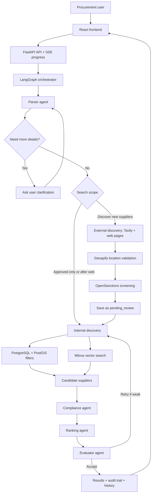
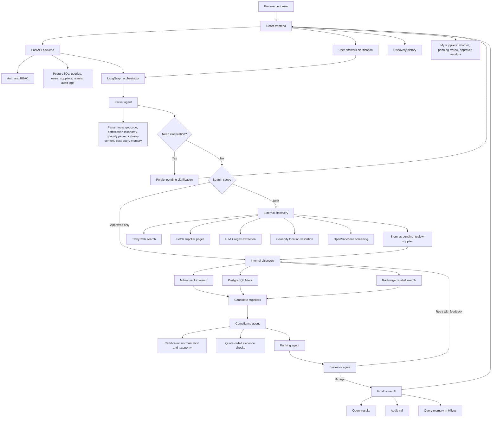
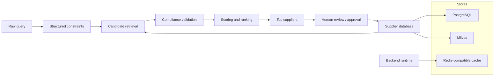
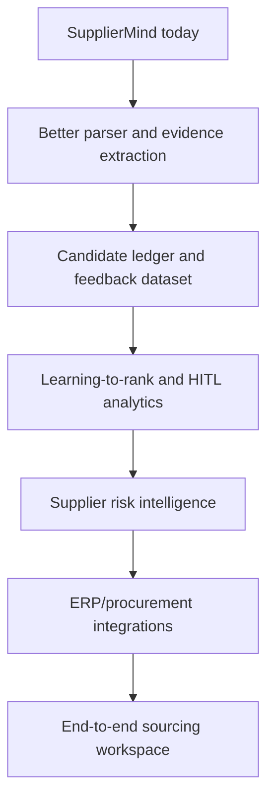

# SupplierMind Interview Preparation Guide

This document answers the key interview questions about SupplierMind in a simple, professional, mid-senior/senior-friendly way. It is written so you can revise it before Data Engineering, AI Engineering, Software Engineering, or Applied AI interviews.

SupplierMind is a web application for AI-assisted supplier discovery. It accepts natural-language procurement queries, retrieves and validates supplier candidates, ranks them, explains why they match, and keeps human approval in the loop for newly discovered suppliers.

Useful repo references:

- [README](../README.md)
- [Architecture](../ARCHITECTURE.md)
- [Detailed Supplier Discovery System](supplier-discovery-system.md)
- [Benchmark Findings](../results/run_20260710/findings.md)

External context used for market comparison, verified on 2026-07-21:

- [Supplier.io supplier intelligence platform](https://supplier.io/)
- [Scoutbee](https://www.scoutbee.com/)
- [Craft.co supplier intelligence](https://global.craft.co/)
- [Levelpath AI procurement agents](https://www.levelpath.com/)
- [SAP Ariba Supplier Management](https://www.sap.com/products/spend-management/supplier-management.html)
- [Coupa AI for total spend management](https://coupa.co.jp/en/platform/ai)
- [Ivalua Supplier Management](https://www.ivalua.com/solutions/process/strategic-sourcing/supplier-management/)
- [JAGGAER Supplier Management & Performance](https://www.jaggaer.com/solutions/supplier-management)
- [Supplier Recommendation in Online Procurement](https://arxiv.org/abs/2403.01301)
- [Coverage-Aware Supplier Discovery Research](https://arxiv.org/abs/2602.24262)

---

## Interview-Ready Direct Answers To The 10 Questions

Use this section for quick revision before an interview. The longer sections below give deeper follow-up answers.

### 1. What Is The Functioning Of The Web Application?

SupplierMind is an AI-powered supplier discovery web application. A procurement user enters a natural-language sourcing request, such as:

```text
Find ISO 9001 certified office furniture suppliers in Germany that can deliver within 30 days.
```

The system converts that sentence into structured procurement constraints, searches internal approved suppliers, optionally discovers new suppliers from the web, validates evidence, ranks suppliers, and shows an auditable result list. New web suppliers are visible in the originating results, but they stay in `pending_review` until a human approves or rejects them.



### 2. What Business Problem Does It Solve And What Business Value Does It Create?

Supplier discovery is usually slow, manual, and hard to audit. Buyers search Google, check supplier pages, compare certifications, ask whether a supplier is approved, and record decisions in spreadsheets. This creates delays, inconsistent supplier shortlists, weak evidence, and supplier-risk exposure.

SupplierMind creates value by:

- Reducing sourcing time through natural-language search.
- Improving supplier quality through hybrid search and constraint validation.
- Reducing risk through sanctions checks, certification normalization, and evidence checks.
- Improving governance through pending review, RBAC, and approval justifications.
- Improving auditability through agent-level logs, reasoning snapshots, and result history.
- Reusing knowledge through query history and user-scoped semantic memory.

Interview summary:

> SupplierMind turns supplier discovery from a manual search process into an auditable AI-assisted workflow. It helps procurement teams find better supplier shortlists faster while keeping compliance, evidence, and human approval in the loop.

### 3. What Tech Stack Has Been Used?

| Layer | Current Stack | Why It Is Used |
|---|---|---|
| Frontend | React 19, TypeScript, Vite, Tailwind CSS, Radix/shadcn UI | Fast interactive UI, type safety, reusable components, production build. |
| API | FastAPI, Uvicorn, Pydantic | Async APIs, OpenAPI docs, typed request/response contracts. |
| Database | PostgreSQL + PostGIS | Supplier source of truth, transactions, relational modeling, radius search. |
| Vector search | Milvus | Semantic search over supplier profiles and query memory. |
| Cache/runtime support | Redis with in-memory fallback | Fast shared cache abstraction and runtime support. |
| Agent orchestration | LangGraph | Stateful multi-agent workflow, pause/resume, retries, conditional routing. |
| LLM | OpenAI GPT-4o-mini pinned snapshot | Structured reasoning/extraction with reproducible behavior. |
| Embeddings | Voyage AI `voyage-3-lite` | Semantic matching for natural-language queries and suppliers. |
| Web discovery | Tavily, HTTP page fetching, BeautifulSoup/lxml | Finds new supplier candidates beyond the internal database. |
| Location validation | Geoapify Geocoding + Places | Mandatory city/country/coordinate validation for web suppliers. |
| Compliance signal | OpenSanctions | Sanctions-screening metadata for discovered suppliers. |
| Auth | OAuth2, JWT, RBAC | Secure user sessions and controlled approval permissions. |
| Infra | Docker Compose, Nginx, optional Kubernetes manifests | Local services, reverse proxy, and production-style deployment templates. |
| Evaluation | Pytest, benchmark runner, SupplierBench-25, P1/P2/P3 baselines | Reproducible thesis and engineering validation. |

### 4. What Data Engineering, Software Engineering, And AI/ML Concepts Are Used?

| Area | Concept | Justification | Alternative |
|---|---|---|---|
| Data Engineering | Relational modeling | Suppliers, users, queries, results, audit logs need strong relationships and transactions. | MongoDB, DynamoDB. |
| Data Engineering | PostGIS geospatial search | Procurement often cares about city/radius proximity. | Elasticsearch geo queries, Google Maps distance API. |
| Data Engineering | Vector indexing | Natural-language supplier search needs semantic similarity. | pgvector, Qdrant, Weaviate, Pinecone, Elasticsearch vector search. |
| Data Engineering | Hybrid retrieval | Combines semantic recall with structured filters for better practical results. | Pure SQL search, pure RAG, BM25 only. |
| Data Engineering | Data quality gates | Web suppliers without verified location/evidence should not pollute approved data. | Allow all web results and only score confidence later. |
| Data Engineering | Audit logs and lineage | Procurement decisions need traceability. | Plain app logs only. |
| Software Engineering | Modular backend layers | API, services, agents, repositories, schemas, and core utilities are separated. | One large service/controller layer. |
| Software Engineering | Async API design | LLM, web, database, and external API calls are I/O-heavy. | Sync Flask/Django plus worker queue. |
| Software Engineering | SSE progress streaming | The UI can show agent progress during long-running discovery. | Polling or WebSockets. |
| Software Engineering | RBAC and HITL | Supplier approval is a governed business action. | Everyone can approve, or fully automatic onboarding. |
| Software Engineering | Deterministic tests and lint/build gates | AI systems still need stable software guardrails. | Manual demo-only validation. |
| AI/ML | Agentic workflow | Multiple agents decompose parsing, discovery, compliance, ranking, and evaluation. | Single prompt or simple RAG chain. |
| AI/ML | ReAct tool use | Parser can call geocoding, memory, quantity parsing, and taxonomy tools. | LLM-only extraction. |
| AI/ML | RAG and embeddings | Retrieves supplier candidates before validation/ranking. | Fine-tuning, keyword search. |
| AI/ML | Quote-or-fail evidence | Reduces hallucinated compliance claims. | Trust LLM confidence without citations. |
| AI/ML | Deterministic ranking | Makes scores explainable and repeatable. | LLM ranking, learning-to-rank. |
| AI/ML | Benchmarking P1/P2/P3 | Shows the trade-off between simple RAG and governed agentic workflows. | No benchmark, only screenshots. |

### 5. Is This Web Application Agentic?

Yes. SupplierMind is agentic because it has a goal-directed, stateful workflow that uses multiple specialized agents and tools instead of one static LLM prompt.

It is agentic because:

- The parser reasons over the query and uses tools.
- The system can ask clarification questions and resume execution.
- LangGraph routes state between agents.
- External discovery, internal discovery, compliance, ranking, and evaluation have separate responsibilities.
- The evaluator can trigger bounded retries.
- The system has memory for accepted past queries.
- New suppliers require human approval before becoming approved.

It is not a fully autonomous self-learning system because it does not silently onboard suppliers, self-train on its own, or run open-ended business actions. It is better described as a governed agentic workflow.

### 6. What Makes It Special For Data Engineering / AI Engineering Interviews?

SupplierMind is interview-worthy because it is not just a chatbot. It demonstrates full-stack ownership and production-style AI engineering:

- Natural-language procurement interface.
- Structured supplier data modeling.
- Hybrid SQL, vector, and geospatial retrieval.
- Web data extraction and enrichment.
- Evidence-based compliance checks.
- Multi-agent orchestration with LangGraph.
- Human-in-the-loop supplier governance.
- Audit logs and operational metrics.
- P1/P2/P3 benchmark comparison.
- Honest trade-off analysis where simple RAG can outperform agentic retrieval on some metrics, while the agentic system gives stronger governance and explainability.

For Data Engineering roles, emphasize data modeling, enrichment, vector indexing, geospatial search, data quality gates, and reproducible benchmark corpora.

For AI Engineering roles, emphasize agents, RAG, embeddings, tool use, model pinning, hallucination control, evaluation metrics, and HITL governance.

For Software Engineering roles, emphasize APIs, auth/RBAC, async background execution, SSE, frontend UX, tests, Docker, and deployment structure.

### 7. Do Other Platforms Do Similar Work?

Yes, there are commercial platforms in adjacent spaces:

| Platform | Similarity | Difference From SupplierMind |
|---|---|---|
| Supplier.io | Supplier intelligence, supplier discovery, supplier data enrichment, diversity and sustainability sourcing. | Commercial proprietary supplier-data platform; SupplierMind is a transparent thesis/product system with visible agent steps and benchmarked architecture. |
| Scoutbee | AI-powered buyer-supplier network and supplier discovery marketplace. | Broader marketplace/network play; SupplierMind is focused on query-driven discovery, evidence, and internal approval workflow. |
| Coupa | Enterprise spend-management platform with AI capabilities across procurement workflows. | Broader source-to-pay suite; SupplierMind is narrower but more transparent for agentic supplier discovery. |
| Craft.co | Supplier intelligence, risk evaluation, monitoring, and supplier data fabric. | More risk-intelligence focused; SupplierMind focuses on discovery plus compliance-ranked recommendations. |
| Levelpath | AI procurement agents across sourcing, contracts, and supplier risk. | Broader procurement-agent suite; SupplierMind is a focused supplier discovery and thesis benchmark system. |
| SAP Ariba / Coupa / Ivalua / Jaggaer | Enterprise procurement and supplier management suites. | Mature suites with broad workflows; SupplierMind showcases a transparent agentic discovery architecture. |

The key differentiator is not that SupplierMind has more data than enterprise vendors. The differentiator is that it is transparent, auditable, benchmarked, and built end-to-end.

### 8. What Difficulties Were Faced During Development?

The main difficulties were:

- Natural-language procurement parsing was messy because users can omit product, location, lead time, certification, or quantity.
- Clarification had to be agentic without becoming annoying or looping forever.
- Web discovery returned noisy suppliers, directories, distributors, and incomplete pages.
- Location quality was a real issue, so suppliers without verified city/country/coordinates had to be rejected.
- Certification extraction required normalization because real sites use many variants like `ISO 9001:2015`, `DIN EN ISO 9001`, `AS9100D`, and `IATF 16949-2016`.
- LLMs can claim a supplier matches without proof, so evidence checks were needed.
- Ranking had to balance recall with strict product, location, certification, lead-time, and capacity constraints.
- Pending-review suppliers had to appear in the current result list without becoming approved vendors automatically.
- The thesis benchmark had to avoid contamination from the 10k product-scale synthetic corpus.
- External APIs introduced latency, credentials, rate limits, and partial-failure behavior.
- Debugging agents required structured audit trails because failures can happen at parser, discovery, compliance, ranking, or evaluator stages.

### 9. What Are The Trade-Offs?

| Trade-Off | Benefit | Cost |
|---|---|---|
| Multi-agent workflow vs simple RAG | Better governance, clarification, auditability, and evidence handling. | More latency and more moving parts. |
| Strict evidence checks vs broad recall | Higher trust in returned suppliers. | Some good suppliers may be missed if evidence is incomplete. |
| Human review vs automatic onboarding | Safer supplier governance. | Slower approval flow. |
| Web discovery vs internal-only search | Finds new suppliers beyond the database. | Web search is noisy and slower. |
| Milvus vs pgvector | Stronger standalone vector-search infrastructure. | More operational complexity because Milvus needs etcd/MinIO. |
| Pinned OpenAI model vs always-latest model | Reproducible benchmark and stable behavior. | May miss newer model improvements. |
| One LLM provider vs fallback providers | Avoids silent benchmark contamination. | Provider outage becomes more visible. |
| Deterministic ranking vs LLM ranking | Explainable and repeatable scores. | Less adaptive than learned ranking. |
| Docker Compose plus optional Kubernetes manifests | Easy local demo and production-style templates. | Real production would still need managed secrets, observability, and deployment hardening. |

The most important trade-off:

> SupplierMind prioritizes procurement governance, auditability, and evidence over raw retrieval speed. That makes it more production-aligned, but also more complex than a simple RAG demo.

### 10. What Planned Add-On Features Can Be Implemented In Future?

These are future improvements, not claims about the current implementation:

1. Supplier comparison view for side-by-side capacity, lead time, certifications, location, and evidence.
2. Certificate expiry tracking and document upload for supplier certificates.
3. Candidate ledger storing every web candidate, rejected result, and rejection reason.
4. Learning from approval/rejection feedback to tune ranking and parsing rules.
5. ERP/procurement integrations with SAP Ariba, Coupa, Ivalua, Jaggaer, or Mercanis workflows.
6. RFQ/RFP generation and controlled supplier outreach drafts.
7. Advanced supplier risk scoring using ESG, financial, cyber, adverse media, and geopolitical signals.
8. Better crawler pipeline with supplier homepage detection and page-level citations.
9. Cost and latency dashboard per query, agent, and external API.
10. Knowledge graph for supplier relationships, parent companies, categories, locations, and risk links.
11. Multi-document RAG over certificates, brochures, quality manuals, and audit reports.
12. Learning-to-rank model trained from historical procurement outcomes, once real company feedback data exists.

---

## 1. Functioning Of The Web Application

### Simple Explanation

SupplierMind works like an AI procurement assistant.

A user writes a sourcing request in plain English, for example:

```text
Find ISO 9001 certified packaging manufacturers near Berlin with 100,000+ units/month capacity.
```

The application then:

1. Understands the product, location, certifications, capacity, and lead-time constraints.
2. Searches internal supplier records using semantic search and structured filters.
3. Optionally searches the web for new suppliers.
4. Validates whether each supplier really satisfies the constraints.
5. Ranks the best suppliers.
6. Shows evidence, explanations, and an audit trail.
7. Sends newly discovered suppliers to human review before they become approved vendors.

### End-To-End Architecture Diagram



### Main Runtime Flow

1. **Frontend submission**
   - User logs in.
   - User enters a procurement query.
   - Frontend submits the query to the FastAPI backend.
   - The backend creates a query record and starts the pipeline in the background.
   - Frontend listens through Server-Sent Events for progress updates.

2. **Parser agent**
   - Converts natural language into structured constraints.
   - Extracts product, location, certifications, quantity, capacity, lead time, and ranking preference.
   - Uses tools such as geocoding, certification normalization, quantity parsing, and query memory.
   - Can pause the pipeline and ask a clarification question.

3. **External discovery agent**
   - Runs only when the search scope allows web discovery.
   - Searches the web for suppliers.
   - Fetches pages.
   - Extracts supplier details.
   - Validates city/country/coordinates.
   - Screens sanctions status.
   - Stores new suppliers as `pending_review`.

4. **Internal discovery agent**
   - Searches existing supplier data.
   - Combines semantic vector search, SQL filters, and geospatial filters.
   - Produces candidate suppliers.

5. **Compliance agent**
   - Checks every candidate against the parsed constraints.
   - Uses deterministic checks where possible.
   - Uses LLM only where ambiguity exists.
   - Uses quote-or-fail discipline for evidence.

6. **Ranking agent**
   - Scores suppliers based on constraint match, semantic fit, location, profile completeness, and supplier tier.
   - Deduplicates similar supplier names.
   - Returns the best ranked suppliers.

7. **Evaluator agent**
   - Checks whether the result quality is good enough.
   - Can trigger a bounded retry.
   - Prevents unlimited loops.

8. **Persistence and UI**
   - Saves results, audit logs, and query history.
   - Shows result cards with scores and evidence.
   - Allows saving to shortlist.
   - Allows managers to approve or reject pending-review suppliers.

### Data Flow Diagram



---

## 2. Business Problem And Business Value

### Business Problem

Procurement teams often need to find suppliers under many constraints:

- Product or service category.
- Location or radius.
- Certifications such as ISO 9001, AS9100, IATF 16949, TISAX, BIFMA, DIN standards.
- Capacity.
- Lead time.
- Sanctions or risk status.
- Internal approval status.

In many companies, this process is manual:

- Buyers search Google.
- They copy supplier names into spreadsheets.
- They manually check certificates.
- They compare suppliers using incomplete information.
- They repeatedly ask colleagues whether a supplier is approved.
- They lose discovery context after a search is completed.

This creates wasted time, inconsistent decisions, weak auditability, and higher supplier risk.

### Business Value Created

| Business Value | How SupplierMind Creates It |
|---|---|
| Faster sourcing | Natural-language search reduces manual browsing and filtering. |
| Better supplier shortlists | Hybrid retrieval combines semantic similarity, structured constraints, and location search. |
| Lower risk | Compliance checks, sanctions status, and human review reduce blind supplier onboarding. |
| Auditability | Every agent step, constraint decision, and evidence source is stored. |
| Procurement governance | New suppliers are not silently trusted; they go through pending review. |
| Knowledge reuse | Query history and semantic memory help future sourcing tasks. |
| Reduced dependency on tribal knowledge | Approved vendors, pending suppliers, justifications, and evidence are visible in the system. |
| Better decision quality | Buyers can see why a supplier matched, not only who matched. |
| Thesis/research value | The system supports benchmarking against P1 single-prompt and P2 RAG baselines. |

### Interview Pitch

> SupplierMind solves the problem of slow and poorly auditable supplier discovery. It converts natural-language procurement requirements into structured constraints, searches approved and web-discovered suppliers, validates compliance evidence, ranks suppliers, and keeps humans in the approval loop. The business value is faster sourcing, better governance, lower risk, and a reusable audit trail for procurement decisions.

---

## 3. Technology Stack Used

### Frontend

| Technology | Purpose |
|---|---|
| React 19 | Component-based UI. |
| TypeScript | Type-safe frontend development. |
| Vite | Fast local development and production build. |
| Tailwind CSS | Utility-first styling. |
| shadcn/Radix UI | Accessible UI primitives and consistent components. |
| React Query | API state management and caching. |
| Zustand | Lightweight local/global frontend state. |
| React Router | Client-side routing. |
| Leaflet/OpenStreetMap | Map and geospatial visualization. |
| i18next | Internationalization support. |
| Lucide React | Icons. |
| Recharts | Dashboard charts. |

### Backend

| Technology | Purpose |
|---|---|
| Python 3.11 | Backend and AI pipeline language. |
| FastAPI | REST API, async endpoints, OpenAPI documentation. |
| Uvicorn | ASGI server. |
| Pydantic | Request/response validation and settings. |
| SQLAlchemy async | ORM and database access. |
| Alembic | Database migrations. |
| PostgreSQL | Relational source of truth. |
| PostGIS | Geospatial/radius search support. |
| Redis | Shared async cache abstraction and lightweight runtime support. |
| LangGraph | Stateful multi-agent orchestration. |
| OpenAI GPT-4o-mini pinned snapshot | LLM reasoning, extraction, and evaluation. |
| Voyage AI embeddings | Semantic embeddings. |
| Milvus | Vector database for supplier and query-memory search. |
| ChromaDB | Local vector DB fallback option. |
| Tavily | Web search for external supplier discovery. |
| Geoapify | Location validation and geocoding. |
| OpenSanctions | Sanctions screening. |
| BeautifulSoup/lxml | Web page parsing. |
| Tenacity | Retry/backoff handling. |
| python-jose/passlib | JWT and password/auth utilities. |
| Pytest | Automated tests. |
| Ruff/mypy | Linting and static quality checks. |

### Infrastructure

| Technology | Purpose |
|---|---|
| Docker Compose | Local infrastructure orchestration. |
| PostGIS Docker image | Local PostgreSQL + geospatial extension. |
| Milvus standalone | Local vector database. |
| etcd + MinIO | Milvus dependencies. |
| Redis Docker image | Cache service. |
| Nginx | Production reverse proxy/static frontend serving. |
| Kubernetes manifests | Production-style deployment descriptors. |

### Evaluation And Research Stack

| Component | Purpose |
|---|---|
| SupplierBench-25 | Benchmark query set. |
| P1 single-prompt baseline | Tests pure LLM parametric behavior. |
| P2 RAG baseline | Tests simple retrieve-then-read approach. |
| P3 SupplierMind | Tests full agentic system. |
| Metrics: P@5, MRR, CSR | Measures retrieval relevance, ranking quality, and constraint satisfaction. |
| Bootstrap CIs | Gives uncertainty ranges for benchmark metrics. |
| Output gallery | Side-by-side qualitative comparison. |

### Product And Thesis Branch Intent

SupplierMind is maintained for two related use cases:

| Use Case | What It Optimizes For | Data Mode |
|---|---|---|
| Production/product branch | Product-quality supplier discovery, human review, approval workflow, and 10k+ supplier search | Full active supplier database plus eligible pending-review web discoveries |
| Master's thesis branch | Reproducible P1/P2/P3 evaluation and reporting | Frozen curated SupplierBench supplier IDs |

The evaluation code now explicitly filters benchmark retrieval to the curated
SupplierBench IDs, so product-scale data does not contaminate thesis metrics.

---

## 4. Data Engineering, Software Engineering, And AI/ML Concepts Used

### Data Engineering Concepts

| Concept | Where It Is Used | Why It Was Chosen | Alternative |
|---|---|---|---|
| Relational data modeling | Suppliers, users, queries, results, audit logs in PostgreSQL | Supplier data has strong entities and relationships. SQL gives reliability, joins, indexes, constraints, and transactions. | MongoDB, DynamoDB, document store. |
| Geospatial data | Supplier coordinates and radius search | Procurement often depends on distance from a city/plant. Geospatial queries are more reliable than string matching locations. | Elasticsearch geo queries, external geospatial APIs only. |
| Vector indexing | Milvus stores supplier/query embeddings | Semantic search handles natural-language similarity better than keyword search. | Pinecone, Weaviate, Qdrant, pgvector, Elasticsearch vector search. |
| Hybrid retrieval | Combines Milvus, SQL filters, and geospatial search | Semantic search alone can drift; SQL alone misses natural-language matches. Combining both improves practical retrieval. | Pure keyword SQL, pure vector RAG, Elasticsearch hybrid search. |
| Data validation | Pydantic schemas and database constraints | Prevents invalid input/output and keeps API contracts clear. | Marshmallow, dataclasses, manual validation. |
| Data enrichment | Web extraction, geocoding, certification normalization, sanctions lookup | Raw supplier names are not enough; procurement needs trusted metadata. | Buy a supplier-data API, manual enrichment, third-party MDM platform. |
| Data quality gates | Reject web suppliers without verified city/country/coordinates | Prevents dirty supplier records from polluting search results. | Allow all extracted suppliers and mark confidence later. |
| Data lineage and audit logs | Every agent stores reasoning, input/output snapshots, duration | Procurement decisions need explainability and traceability. | Application logs only, no structured audit table. |
| Human-in-the-loop curation | Pending-review suppliers need approval/rejection | Prevents unverified web data from becoming company-approved supplier data. | Fully automatic ingestion, admin-only manual CSV import. |
| Benchmark data control | Curated-100 allowlist for thesis evaluation; 10k scale set for product search | Makes thesis evaluation reproducible while preserving product-scale discovery. | Evaluate on full dynamic production data, but less reproducible. |
| Soft delete / active flag | `is_active` controls benchmark and search eligibility | Keeps data reversible and auditable. | Hard delete rows, separate archive database. |

### Software Engineering Concepts

| Concept | Where It Is Used | Why It Was Chosen | Alternative |
|---|---|---|---|
| Modular monorepo | `apps/backend`, `apps/frontend`, `infra`, `docs`, `results` | Keeps full-stack work organized in one project. | Separate repos for frontend/backend/infra. |
| Clean backend layering | API, schemas, agents, services, repositories, core utilities | Makes the system easier to test, extend, and reason about. | Single service file or tightly coupled controller logic. |
| Async API design | FastAPI async endpoints, async SQLAlchemy | Query execution and web/LLM calls are I/O-heavy. Async improves concurrency. | Sync Django/Flask app with workers. |
| Background processing | Query starts in background and frontend streams progress | Long agent runs should not block HTTP requests. | Celery/RQ worker queue, Temporal workflows. |
| SSE streaming | Frontend receives query progress updates | Simpler than WebSockets for one-way progress updates. | WebSockets, polling, message queue events. |
| RBAC | Admin, procurement manager, analyst permissions | Procurement actions like approval/rejection require governance. | Simple auth-only model, external IAM only. |
| Repository pattern | Query/supplier/user repositories | Encapsulates database access and improves testability. | Direct ORM calls in API routes. |
| Structured errors and validation | 422 for validation, 404 for cross-user access | Improves security and frontend behavior. | Generic 500 errors, exposed 403 for object existence. |
| Deterministic tests | Unit tests for parser, ranking, compliance, auth, benchmarks | AI systems need deterministic guardrails around fragile logic. | Manual testing only. |
| CI-friendly tooling | pytest, ruff, mypy, frontend build | Supports maintainability and confidence. | No lint/type/build gates. |
| Provider abstraction | LLM provider protocol retained | Allows future provider swap while keeping one pinned provider for reproducibility. | Hard-code OpenAI everywhere, or multiple silent fallbacks. |
| Model pinning | GPT-4o-mini dated snapshot | Makes benchmark runs reproducible. | Floating model alias, but results may change over time. |
| Graceful degradation | Missing memory/web/sanctions can fail closed or continue where safe | Production systems need partial failure handling. | Fail the whole request for every dependency issue. |

### AI/ML Concepts

| Concept | Where It Is Used | Why It Was Chosen | Alternative |
|---|---|---|---|
| Multi-agent architecture | Parser, external discovery, internal discovery, compliance, ranking, evaluator | Each step has a clear responsibility, reducing one-prompt complexity. | Single large prompt, traditional rule engine, microservices without LLM agents. |
| ReAct prompting | Parser uses Thought-Action-Observation tool loop | Useful when the model must call tools like geocoding, taxonomy lookup, quantity parsing, and memory. | Function calling only, JSON extraction prompt only, deterministic parser. |
| Tool use | Geocoder, certification taxonomy, quantity parser, past query memory | Gives the LLM access to reliable external/deterministic operations. | Ask LLM to infer everything from text. |
| RAG | P2 baseline and P3 internal discovery | Retrieves relevant supplier records before LLM/compliance reasoning. | Fine-tuned model with all suppliers in training data, keyword search. |
| Embeddings | Voyage vectors for suppliers and query memory | Handles semantic similarity across natural-language queries and supplier descriptions. | BM25, TF-IDF, domain-specific embedding model. |
| Vector database | Milvus | Designed for scalable approximate nearest-neighbor search. | pgvector for simpler stack, Pinecone/Weaviate/Qdrant managed/vector DB. |
| Certification normalization | Taxonomy maps variants like ISO 9001:2015, DIN EN ISO 9001, AS9100D | Procurement users write certifications in different forms; normalization improves recall and correctness. | LLM-only normalization, external standards database. |
| Quote-or-fail evidence | Compliance agent should not pass constraints without evidence | Reduces hallucinated compliance claims. | Trust LLM judgment without citations. |
| Deterministic ranking | Ranking uses weighted rules instead of free-form LLM ranking | Improves explainability and repeatability. | LLM-only ranking, learning-to-rank model. |
| Human-in-the-loop AI | Pending-review supplier approval/rejection | Balances automation with procurement accountability. | Full automation, manual-only workflow. |
| Benchmarking | P1 vs P2 vs P3 | Shows whether agentic architecture helps compared with simpler baselines. | Only demo screenshots, no quantitative evaluation. |
| Metrics | P@5, MRR, CSR | Measures top-k relevance, rank quality, and constraint satisfaction. | NDCG, recall@k, F1, MAP, human preference evaluation. |
| Bootstrap confidence intervals | Benchmark result uncertainty | Avoids overclaiming from only 25 queries. | Single point estimates only. |

### Key Technology Choices, Justifications, And Alternatives

| Technology | Why It Fits SupplierMind | Main Trade-Off | Alternative |
|---|---|---|---|
| FastAPI | Fast async APIs, strong typing with Pydantic, built-in OpenAPI docs. | Requires Python async discipline. | Django REST Framework, Flask, Node/Express, NestJS. |
| React + TypeScript | Strong ecosystem for interactive dashboards and typed frontend code. | More frontend complexity than server-rendered pages. | Next.js, Vue, Angular, Svelte. |
| PostgreSQL + PostGIS | Reliable transactional store plus geospatial support. | Needs schema design and migrations. | MySQL, MongoDB, Elasticsearch, BigQuery for analytics-heavy use. |
| Milvus | Strong vector search for semantic retrieval at scale. | More infrastructure complexity: etcd and MinIO. | pgvector for simpler deployment, Pinecone/Weaviate/Qdrant for managed/vector-native alternatives. |
| Redis | Fast cache and runtime support. | Another service to operate. | In-memory cache, Memcached, database-backed cache. |
| LangGraph | Explicit state machine for agent workflows and retries. | More orchestration complexity than a simple chain. | LangChain chains, CrewAI, AutoGen, Temporal + custom agents. |
| OpenAI GPT-4o-mini pinned | Good balance of cost, speed, structured output capability, reproducibility. | External API dependency and model behavior limits. | GPT-4.1, Claude, Gemini, Azure OpenAI, local Llama models. |
| Voyage embeddings | Strong embedding model with 512-dim vectors. | Rate limits affected benchmark runtime. | OpenAI embeddings, Cohere embeddings, bge/e5 local embeddings. |
| Tavily | Search API optimized for AI workflows. | External search dependency and cost/latency. | SerpAPI, Bing Search API, Google Custom Search, Common Crawl/custom crawler. |
| Geoapify | Geocoding and place validation. | External API dependency. | Google Maps API, Mapbox, Nominatim, OpenCage. |
| OpenSanctions | Compliance screening signal. | Requires valid credentials and can return pending/failed status. | OFAC/EU sanctions APIs, ComplyAdvantage, Dow Jones Risk & Compliance. |
| Docker Compose | Easy local infra setup for Postgres, Redis, Milvus. | Less robust than production orchestration. | Kubernetes, ECS, Nomad, managed cloud services. |

---

## 5. Is The Web Application Agentic?

### Short Answer

Yes, SupplierMind is agentic in nature, but it is not a fully autonomous self-learning agent.

### Why It Is Agentic

It is agentic because it does more than call a single LLM prompt. It has:

1. **Goal-directed behavior**
   - Goal: answer a procurement sourcing query with ranked suppliers.

2. **Task decomposition**
   - Parser, discovery, compliance, ranking, and evaluator each handle a separate reasoning step.

3. **Tool use**
   - Parser can call geocoding, certification taxonomy, quantity parser, industry context, and memory tools.

4. **Stateful orchestration**
   - LangGraph maintains pipeline state across agents.

5. **Conditional routing**
   - The pipeline can pause for clarification, skip external discovery, expand search scope, retry discovery, or finalize.

6. **Reflection/evaluation**
   - Evaluator checks result quality and can trigger bounded retries.

7. **Human-in-the-loop control**
   - New suppliers require human approval before becoming approved vendors.

8. **Memory**
   - Accepted queries can be written to user-scoped semantic memory for future query interpretation.

### Why It Is Not Fully Autonomous

It is not a fully autonomous agent because:

- It does not independently decide business strategy.
- It does not automatically onboard suppliers without human review.
- It does not self-train from HITL feedback yet.
- It has bounded retries, not open-ended planning.
- It runs inside a clear procurement workflow with API permissions and guardrails.

### Interview Answer

> Yes, SupplierMind is agentic because it decomposes a procurement goal into specialized agents, uses tools, maintains state, can ask clarifying questions, evaluates its own output, and routes execution based on intermediate results. However, it is not fully autonomous or self-learning. It is a governed agentic workflow where humans still approve new suppliers and the system operates within bounded procurement rules.

---

## 6. Why This Is Special For Data Engineering / AI Engineering Interviews

SupplierMind is strong interview material because it is not just a chatbot. It is a full-stack, data-backed, agentic AI application with measurable evaluation.

### Why It Stands Out

1. **It solves a real business problem**
   - Supplier discovery is a real procurement workflow with business value.

2. **It combines structured and unstructured data**
   - Supplier profiles, certifications, geolocation, web pages, sanctions data, audit logs, and vector embeddings.

3. **It uses hybrid retrieval**
   - SQL + vector search + geospatial filtering.

4. **It has a real agentic pipeline**
   - Parser, discovery, compliance, ranking, evaluator, and HITL approval.

5. **It includes governance**
   - Pending review, approval justification, audit logs, RBAC.

6. **It has production-style infrastructure**
   - FastAPI, React, PostgreSQL, Milvus, Redis, Docker Compose, Nginx, Kubernetes manifests.

7. **It has benchmarking**
   - P1 single-prompt, P2 RAG, P3 agentic system.
   - Metrics: P@5, MRR, CSR.
   - Confidence intervals and output gallery.

8. **It exposes honest trade-offs**
   - The benchmark showed P2 beating P3 on retrieval metrics.
   - This is good interview material because it shows engineering maturity, not marketing.

9. **It has data quality controls**
   - Certification normalization, dedupe, location validation, soft deletion, pending-review quarantine.

10. **It demonstrates end-to-end ownership**
    - Frontend, backend, data model, AI pipeline, evaluation, infra, and documentation.

### Interview Positioning

For a **Data Engineering** role:

- Emphasize data modeling, enrichment, quality gates, retrieval indexes, geospatial data, vector data, benchmark contamination cleanup, and reproducible evaluation.

For an **AI Engineering** role:

- Emphasize multi-agent orchestration, RAG, tool use, prompt design, structured output, evaluation metrics, model pinning, and hallucination control.

For a **Software Engineering** role:

- Emphasize API design, auth/RBAC, async background jobs, SSE streaming, tests, modular architecture, frontend UX, and deployment setup.

For a **Senior-level interview**:

- Emphasize architectural trade-offs, governance, failure modes, benchmark honesty, observability, and why simpler RAG outperformed the more complex agent in some cases.

---

## 7. Do Other Platforms Do Similar Work?

### Short Answer

Yes, there are commercial platforms in adjacent spaces, but SupplierMind is different in scope and transparency.

### Similar Platforms

| Platform | What It Does | Similarity To SupplierMind | Difference |
|---|---|---|---|
| Supplier.io | Supplier intelligence, supplier data enrichment, diversity/sustainability sourcing, supplier explorer. | Similar supplier discovery and supplier intelligence objective. | Commercial data platform with huge proprietary data; not a transparent thesis-grade agent pipeline. |
| Scoutbee | AI-powered procurement network connecting buyers and suppliers. | Similar supplier discovery/sourcing domain. | More enterprise marketplace/network oriented. SupplierMind is an auditable custom pipeline. |
| Craft.co | AI-powered supplier evaluation, monitoring, and risk management. | Similar supplier intelligence and risk focus. | More focused on supplier risk/monitoring; SupplierMind focuses on query-driven discovery and compliance-ranked results. |
| Levelpath | AI agents for sourcing, contracts, supplier risk, and procurement workflows. | Similar agentic procurement positioning. | Broader enterprise procurement suite; SupplierMind is a focused supplier discovery research system. |
| Coupa / SAP Ariba / Ivalua / Jaggaer | Enterprise procurement, sourcing, supplier management, spend management. | Similar procurement ecosystem. | Larger suites, not necessarily transparent multi-agent retrieval/evidence system. |

### Research Similarity

Academic work exists on:

- Supplier recommendation in online procurement.
- Web crawling for domain-specific supplier discovery.
- Agentic supply-chain workflows.

SupplierMind sits at the intersection of these ideas:

- supplier recommendation,
- RAG,
- multi-agent orchestration,
- compliance evidence,
- HITL procurement governance.

### What Makes SupplierMind Different

SupplierMind is not trying to beat enterprise platforms on proprietary data size. Its differentiation is:

- Transparent architecture.
- Explainable agent flow.
- Reproducible benchmark.
- Evidence-gated compliance.
- Human approval workflow.
- Open thesis comparison against simpler baselines.

### Interview Answer

> Yes, similar platforms exist, especially Supplier.io, Scoutbee, Craft.co, Coupa, SAP Ariba, Ivalua, Jaggaer, and newer AI procurement platforms such as Levelpath. The difference is that SupplierMind is a focused, transparent, benchmarked supplier discovery system. It shows exactly how the query is parsed, how suppliers are retrieved, how constraints are checked, how ranking is done, and how human approval controls new supplier ingestion.

---

## 8. Difficulties Faced During Development

### Technical Difficulties

1. **Natural-language parsing was harder than expected**
   - Constraint-heavy queries confused product extraction.
   - Examples: product text could become polluted with words like "days", "certification", or location phrases.
   - This affected downstream retrieval.

2. **Certification normalization was complex**
   - Real suppliers write certifications in many forms.
   - Examples: `ISO 9001:2015`, `DIN EN ISO 9001`, `AS9100D`, `IATF 16949-2016`, `BIFMA/ANSI`.
   - A taxonomy was needed instead of exact string matching.

3. **Web discovery was noisy**
   - Search results could drift geographically.
   - Search results could return distributors, directories, or irrelevant companies.
   - Web pages often lacked clean addresses or certificates.

4. **Location validation was necessary**
   - Without validation, suppliers could appear with missing or wrong locations.
   - Geoapify geocoding and places validation introduced latency and failure cases.

5. **Compliance evidence was difficult**
   - It is easy for an LLM to say a supplier matches.
   - It is harder to prove the supplier matches with source evidence.
   - Quote-or-fail behavior was added to reduce hallucinated passes.

6. **Ranking required strict filtering**
   - Early versions allowed weak product-fit results.
   - Stronger ranking improved trust but reduced recall.

7. **Deduplication was non-trivial**
   - Similar suppliers or repeated web results could appear multiple times.
   - Normalized name/country dedupe was needed.

8. **HITL visibility was initially missing**
   - Web-discovered suppliers were being stored as pending review but were not visible in the UI.
   - A Pending Review tab was needed.

9. **History initially reran queries**
   - Opening a past query could trigger a new run instead of showing saved results.
   - This was fixed by making history read-only.

10. **Benchmark contamination happened**
    - A 10k synthetic supplier scale set polluted the retrieval pool.
    - The benchmark had to be locked to the curated 100 active suppliers.
    - Pending and inactive suppliers had to be excluded.

11. **External API issues**
    - OpenSanctions can return 401 if credentials are missing.
    - Voyage rate limits slowed benchmark runs.
    - Web search latency made some queries slow.

12. **Agentic systems are harder to debug**
    - Failures can happen in parser, discovery, compliance, ranking, or evaluator.
    - Audit logs and output galleries were needed to understand behavior.

### Product Difficulties

1. Balancing automation with human trust.
2. Deciding when to ask clarification versus continue.
3. Preventing unapproved web suppliers from looking official.
4. Showing enough evidence without overwhelming the user.
5. Designing UI surfaces for approved vendors, shortlist, pending review, and history.

### Research Difficulties

1. Designing fair baselines.
2. Avoiding benchmark contamination.
3. Choosing metrics that capture both retrieval and compliance.
4. Reporting negative results honestly.
5. Explaining why P3 is valuable even when P2 has better retrieval metrics.

---

## 9. Trade-Offs

### Major Trade-Offs

| Trade-Off | Benefit | Cost |
|---|---|---|
| Multi-agent system vs simple RAG | Better auditability, modular reasoning, clarification, compliance gates. | More latency, more failure points, harder debugging. |
| Strict compliance filtering vs recall | Higher trust in returned suppliers. | Can return zero results even when near-matches exist. |
| Human-in-the-loop approval vs automation | Safer supplier governance. | Slower supplier onboarding. |
| Web discovery vs internal-only search | Can find new suppliers beyond approved database. | Web noise, latency, extraction errors, sanctions/location validation complexity. |
| Model pinning vs latest model | Reproducible benchmark. | May miss improvements from newer models. |
| One LLM provider vs fallback provider | Avoids silent cross-model benchmark contamination. | OpenAI outage becomes a single point of failure. |
| Milvus vs pgvector | Better vector-search scalability. | More infrastructure complexity. |
| SSE vs polling/WebSocket | Simple real-time progress updates. | One-way communication; token-in-URL workaround for browser EventSource. |
| Deterministic ranking vs LLM ranking | Explainable and repeatable. | Less adaptive than learned ranking. |
| Synthetic/curated benchmark vs real enterprise data | Safe and reproducible for thesis. | Less representative than live enterprise procurement data. |
| Quote-or-fail evidence vs LLM confidence | Reduces hallucination. | More false negatives when evidence text is incomplete. |
| External APIs vs self-hosted services | Faster development and better capabilities. | Cost, latency, rate limits, credential failures. |

### Most Important Trade-Off To Explain

The biggest trade-off is:

> SupplierMind prioritizes auditability and governance over raw retrieval recall.

This is why P2 RAG performed better in P@5 during the benchmark, while P3 remains more suitable for procurement workflows that need evidence, approval, and traceability.

### Interview Answer

> The key trade-off is complexity versus governance. A simple RAG system can be faster and may retrieve more relevant suppliers, but it does not explain every compliance decision or manage supplier approval. SupplierMind adds agentic parsing, evidence checking, human review, and audit logs. That makes it slower and sometimes stricter, but more aligned with real procurement accountability.

---

## 10. Planned Add-On Features For Future

### High-Priority Improvements

1. **Improve parser robustness**
   - Use a stricter structured-output parser.
   - Add domain-specific grammar or constrained JSON schema.
   - Better separate product terms from constraints like days, radius, and certifications.

2. **Clarification policy improvement**
   - Ask clarification only when truly needed.
   - Avoid over-clarifying broad but valid procurement queries.
   - Add confidence thresholds.

3. **Candidate ledger**
   - Store every discovered candidate, rejected web result, extraction attempt, and reason for rejection.
   - This would make history more complete and audit-ready.

4. **Learning from HITL feedback**
   - Use approvals/rejections to improve ranking weights, taxonomy rules, and parser examples.
   - Keep it controlled and auditable rather than silently self-training.

5. **Supplier verification dashboard**
   - Show evidence completeness, sanctions status, missing fields, stale data, and confidence score.

6. **Better web discovery**
   - Add domain-specific crawling.
   - Use supplier homepage detection.
   - Better city/region query propagation.
   - Add page-level source citations.

7. **Enterprise integrations**
   - ERP/procurement tools: SAP Ariba, Coupa, Ivalua, Jaggaer.
   - CRM/MDM: Salesforce, master supplier databases.
   - Communication: Slack/Teams notifications.

8. **Better supplier risk scoring**
   - Financial risk.
   - ESG risk.
   - Cyber/security risk.
   - News/adverse media monitoring.
   - Country/geopolitical risk.

9. **Advanced ranking**
   - Learning-to-rank from historical sourcing outcomes.
   - Category-specific ranking weights.
   - Buyer preference personalization.

10. **Procurement workflow features**
    - RFQ/RFP creation.
    - Supplier outreach email drafting.
    - Quote comparison.
    - Contract and document upload.
    - Negotiation notes.

### Medium-Term Features

| Feature | Value |
|---|---|
| Supplier comparison view | Helps compare capacity, certs, lead time, distance, and evidence side by side. |
| Saved search alerts | Notify buyer when new supplier appears for a category/location. |
| Certificate expiry tracking | Prevents using expired certifications. |
| Multi-language supplier discovery | Useful for EU supplier sourcing. |
| Document ingestion | Extract certificates, brochures, datasheets, and audit reports. |
| Knowledge graph | Model supplier relationships, parent companies, categories, locations, and risk events. |
| Analytics dashboard | Track sourcing cycle time, supplier approval rate, category gaps, and search success rate. |
| Bulk import/export | Support CSV/Excel supplier upload and procurement reporting. |
| Role-specific dashboards | Different views for analyst, procurement manager, admin, compliance officer. |
| Cost controls | Per-query API cost visibility and budget limits. |

### Advanced AI Features

1. **Controlled feedback learning**
   - Use HITL decisions to update ranking and extraction rules.

2. **Agent evaluation loop**
   - Automatically tag failures by type: parser, retrieval, compliance, ranking, external data.

3. **Model comparison dashboard**
   - Compare GPT, Claude, Gemini, local models, and embedding models.

4. **Active learning**
   - Ask humans only for the cases that would most improve the system.

5. **RAG over supplier documents**
   - Retrieve from supplier PDFs, certificates, quality manuals, and product catalogs.

6. **Explainability scoring**
   - Score every recommendation by evidence completeness and uncertainty.

7. **Autonomous but bounded sourcing workflows**
   - Draft outreach messages or RFPs, but require human approval before sending.

### Future Architecture Direction



---

## Strong Interview Summary

### 60-Second Version

> SupplierMind is an AI-assisted supplier discovery web application for procurement teams. A buyer enters a natural-language sourcing request, and the system parses constraints such as product, location, certifications, capacity, and lead time. It then performs hybrid retrieval over PostgreSQL and Milvus, optionally discovers suppliers from the web, validates evidence with a compliance agent, ranks suppliers deterministically, and stores an audit trail. New web suppliers go into pending review before becoming approved vendors. The system is agentic because it uses a LangGraph multi-agent workflow with tools, memory, clarification, conditional routing, and bounded retries. I also benchmarked it against a single-prompt LLM and a simple RAG baseline. The honest result was that RAG performed better on retrieval metrics, while SupplierMind provided stronger governance, evidence, auditability, and human-in-the-loop control.

### 30-Second Version

> SupplierMind is a full-stack AI procurement assistant for supplier discovery. It combines React, FastAPI, PostgreSQL/PostGIS, Milvus, Redis, OpenAI, Voyage embeddings, and LangGraph agents. It turns sourcing queries into structured constraints, retrieves suppliers, validates compliance evidence, ranks results, and supports human approval for new suppliers. The most important engineering contribution is not just RAG, but an auditable agentic workflow with data quality gates and benchmarked results.

### One-Line Version

> SupplierMind is an auditable agentic supplier discovery system that combines RAG, structured procurement data, web discovery, compliance validation, and human-in-the-loop governance.

---

## Interview Questions You Should Be Ready For

1. Why did P2 RAG beat P3 SupplierMind on P@5?
2. Why is P3 still valuable if P2 performed better?
3. How did you prevent hallucinated supplier recommendations?
4. How did you handle certifications written in different formats?
5. Why did you choose Milvus instead of pgvector?
6. How would you scale this system for production enterprise data?
7. What would you change if you had access to real procurement data?
8. How would HITL feedback become machine learning data?
9. How would you reduce latency and API cost?
10. How would you improve parser reliability?
11. What are the biggest production risks?
12. How would you monitor this system in production?

---

## Best Honest Closing Statement

> The most important lesson from this project is that agentic AI is not automatically better than RAG on every metric. Simpler RAG can be stronger for raw retrieval, while agentic systems can be stronger for governance, explainability, evidence validation, and workflow control. SupplierMind demonstrates that difference clearly, which makes it a good AI engineering and data engineering project rather than just a demo.
