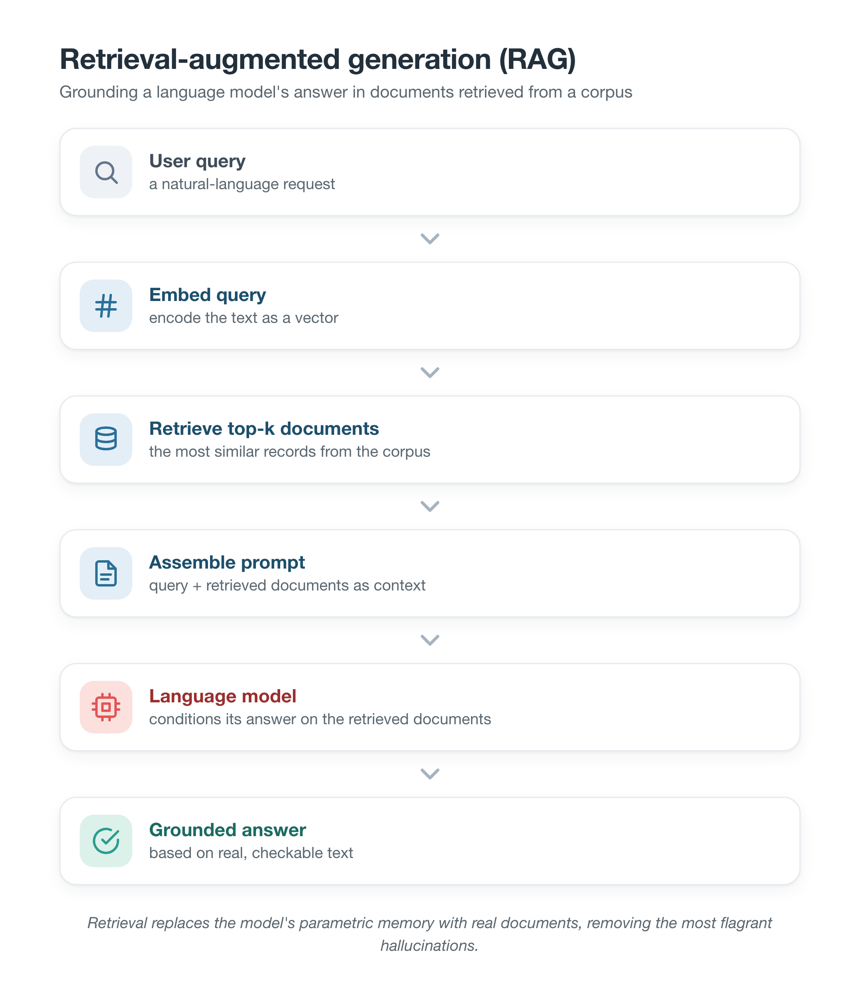
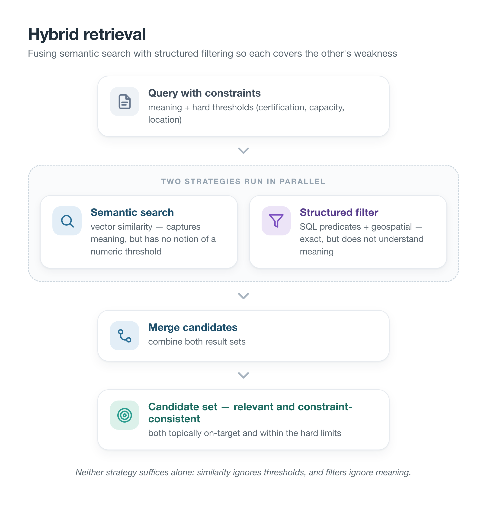
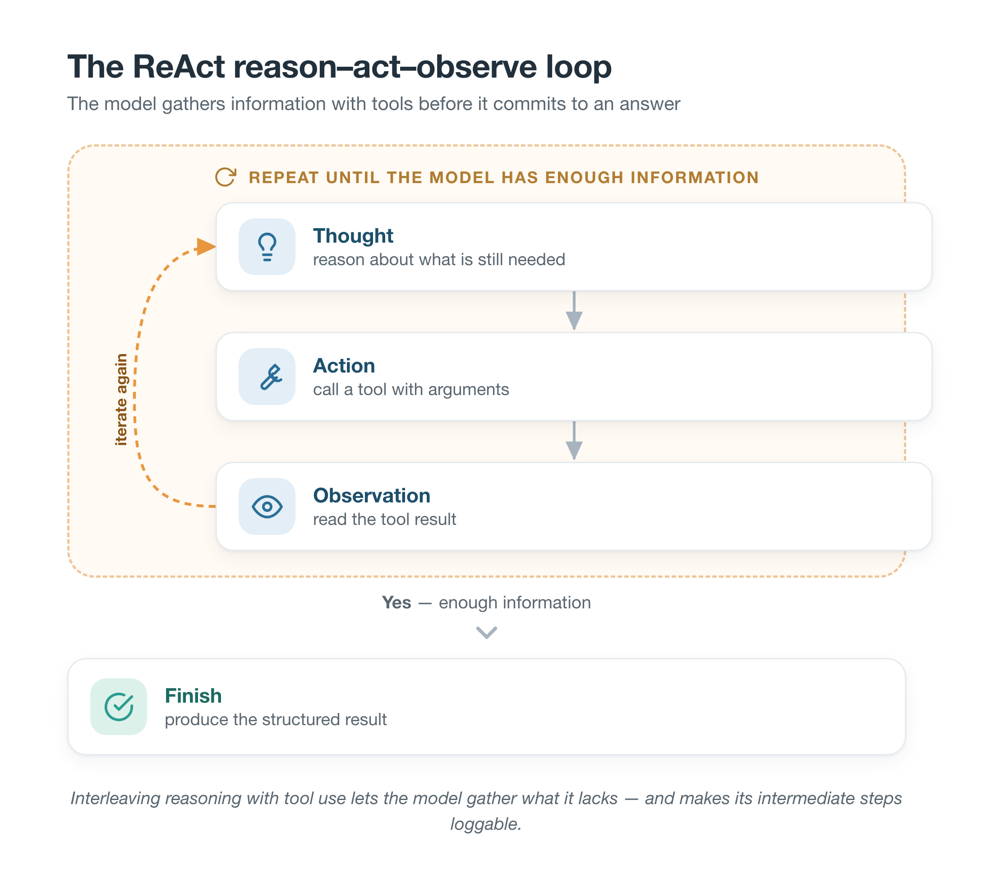

# Chapter 2: Foundations

This chapter introduces the concepts a reader needs in order to follow the rest of
the dissertation. It is deliberately foundational: it explains *what* the relevant
business and technical ideas are, rather than reviewing the research literature
around them, which is the task of Chapter 3. The chapter first sketches the
procurement domain and the idea of an auditable decision, then builds up the
technical stack from language models and embeddings to retrieval-augmented
generation, agents, and finally the metrics and statistics used to evaluate them.

## 2.1 The procurement domain

### 2.1.1 Sourcing and supplier discovery

Procurement is the function through which an organisation acquires the goods and
services it needs, and *sourcing* is the part of procurement concerned with
finding and selecting the suppliers who will provide them. Within sourcing it is
useful to separate two related tasks. *Supplier discovery* is the task of
identifying candidate suppliers who could plausibly meet a requirement — the focus
of this dissertation. *Supplier selection*, which has a long history in operations
research, is the subsequent task of choosing among a known set of candidates using
weighted criteria. The distinction matters because discovery begins from a
natural-language requirement and an open or semi-open field of suppliers, whereas
selection typically assumes the candidates and their attributes are already
tabulated. The account of the domain given in this section reflects the practice of
procurement teams as encountered through this project's collaboration with the
industry partner, Mercanis (Cdc3 GmbH), a procurement-technology startup based in
Berlin, Germany, which informed the framing of the problem.

### 2.1.2 Multi-constraint requirements

The defining feature of a real sourcing requirement is that it stacks several
independent constraints into a single request. The running example used
throughout this dissertation — *"an ISO 9001 certified packaging supplier in
Germany with capacity above 10,000 units per month and lead time under 30 days"* —
contains a product category (packaging), a certification (ISO 9001), a location
(Germany), a capacity threshold (a numeric minimum with a unit), and a lead-time
ceiling. These constraints are of different kinds. Some are categorical and are
satisfied by exact match (category, country, certification). Others are numeric
and require a comparison against a threshold (capacity, lead time). Others still
are geospatial, such as a radius around a city. A supplier is a good answer only
if it satisfies *all* of the constraints at once, and it is this conjunction of
heterogeneous constraints — rather than any single one of them — that makes the
task difficult, both for a human analyst and for an automated system.

### 2.1.3 Auditability and governance in decision-making

A procurement decision is not only a retrieval result; it is a record that may
later have to be justified. If a chosen supplier turns out not to hold a claimed
certification, or to be subject to trade sanctions, the buyer needs to be able to
show what evidence the decision was based on. *Auditability*, in the sense used in
this dissertation, is the property that every claim in a system's output can be
traced back to a specific piece of supporting evidence, and that the reasoning
which produced the output is recorded and can be inspected. This is increasingly a
regulatory expectation as well as good practice: the European Union's AI Act
(Regulation (EU) 2024/1689) requires high-risk AI systems to keep records that
make their operation traceable, with these obligations phasing in from 2026. An
answer that is correct but unverifiable is therefore of limited value in a governed
workflow, which is why this dissertation treats auditability as a first-class
property to be measured, alongside whether the answer is correct.

### 2.1.4 The supplier lifecycle and governance

Discovery does not happen in a vacuum; it sits inside a governed supplier
lifecycle. In a mature procurement function, suppliers are not a flat list but are
organised by trust status. Some are *approved* — vetted at the organisation level
and cleared for use. Some are personal or team-level shortlists that an individual
buyer has saved. And some are newly encountered candidates that have not yet been
vetted and must not be treated as approved until they have been. This governance
distinction matters for an automated system, because a discovery tool that can
reach beyond the approved list — for example, by searching the open web — must not
allow an unvetted supplier to silently become part of the trusted set. A supplier
entering from outside should be quarantined pending checks — that it exists at a
verifiable address, and that it is not subject to sanctions — and a human approval
step. The general principle, that trust status is part of the data model rather
than an afterthought, is foundational for understanding the design decisions taken
later in the dissertation.

## 2.2 Large language models

### 2.2.1 What a language model is

A large language model (LLM) is a neural network, typically based on the
transformer architecture, trained on very large quantities of text to predict the
next token in a sequence. A *token* is a sub-word unit of text; the model reads a
sequence of tokens and produces a probability distribution over the next token,
and text is generated by sampling from these distributions repeatedly. The
knowledge the model appears to have is *parametric*: it is encoded implicitly in
the network's weights during training, rather than stored as retrievable records.
The transformer architecture at the core of these models relies on a mechanism
called self-attention, which lets the model weigh the relevance of every other
token in the current context when producing each new token. It is this ability to
condition on long, structured context — rather than only on the immediately
preceding words — that makes the models able to follow instructions, read
retrieved documents, and use tools, and thus underpins the retrieval-augmented and
agentic patterns introduced later in this chapter.
A parameter that controls generation is the *temperature*, which scales how
sharply the model commits to its most likely tokens; a temperature near zero makes
generation nearly deterministic and is preferred when reproducibility and
consistency matter, whereas higher temperatures introduce variability. Because the
model's knowledge is frozen at the time of training, it has no awareness of
information that is private, that changed after training, or that was simply never
in its training data.

### 2.2.2 Hallucination

Because a language model generates fluent text from parametric knowledge, it can
produce statements that are plausible and confidently worded but factually
unfounded. This phenomenon is commonly called *hallucination*. It is important to
recognise that hallucination is not a bug that occurs occasionally; it is a direct
consequence of how the model works, and it takes more than one form. A model may
invent an entity that does not exist (for example, a supplier name), or it may
attribute a false property to a real entity (for example, a certification a real
company does not hold). For a procurement system, both forms are damaging: the
first returns a supplier that cannot be contacted, and the second returns a
supplier that does not actually qualify. The general strategy for controlling
hallucination, developed in the sections that follow, is to stop the model from
relying on parametric knowledge for facts and instead to ground every factual
claim in retrieved, checkable evidence.

### 2.2.3 Prompting and structured output

An LLM is directed by a *prompt*, the input text that frames the task. Beyond
free-form answers, models can be asked to return *structured output* such as JSON
that conforms to a fixed schema, which allows the surrounding software to parse and
act on the result programmatically. Extracting structured constraints from a
natural-language query — turning the running example into fields for category,
certification, capacity, and lead time — is exactly this kind of task. In
practice, structured extraction must be defensive, because a model can return
malformed output; a robust system validates the returned structure and falls back
gracefully when validation fails.

## 2.3 Embeddings and semantic retrieval

### 2.3.1 Vector embeddings and similarity

An *embedding* is a fixed-length vector of real numbers that represents a piece of
text in a way that captures its meaning: texts with similar meaning are mapped to
vectors that are close together in the vector space. Embeddings are produced by a
separate model trained for this purpose, and their dimensionality (for example,
512 numbers per vector) is a design choice trading off representational richness
against memory and speed. The closeness of two embeddings is usually measured by
*cosine similarity*, the cosine of the angle between the two vectors, which ranges
from -1 to 1 and is 1 when the vectors point in the same direction. Semantic
retrieval uses this property: a query is embedded, and the stored items whose
embeddings are most similar to the query's are returned. This is what allows a
search for "metal fabrication" to surface a supplier described as a "steel
components manufacturer" even though the two phrases share no keywords.

### 2.3.2 Vector databases and approximate nearest-neighbour search

Finding the most similar embeddings by comparing a query against every stored
vector is exact but becomes slow as the collection grows. A *vector database*
stores embeddings and indexes them so that the nearest neighbours can be found
quickly, at the cost of a small, controlled amount of approximation. A widely used
index is the Hierarchical Navigable Small World (HNSW) graph, which organises
vectors into a navigable graph so that search follows edges toward closer
neighbours rather than scanning the whole set. Such an index has parameters that
trade recall for speed — how densely the graph is connected and how widely the
search explores at query time — and it is these approximate-nearest-neighbour
methods that make semantic search over tens of thousands to millions of items
practical.

## 2.4 Retrieval-augmented generation

Retrieval-augmented generation (RAG), introduced by Lewis et al. (2020), addresses
the hallucination problem by grounding a language model's output in retrieved
documents rather than in its parametric memory alone. The pattern, shown in Figure
2.1, is simple: the user's query is used to retrieve relevant documents from a
corpus, and those documents are supplied to the model as context, so that the
model's answer is conditioned on real, current, checkable text.

*Figure 2.1 — The retrieval-augmented generation pattern.*

RAG is the dominant pattern in current AI-assisted retrieval products because it
is the simplest way to move beyond a raw prompt while grounding the answer in a
real corpus. Its main limitation, for the purposes of this dissertation, is that
retrieval by semantic similarity has no notion of a numeric threshold or a hard
constraint: it can find suppliers that are *about* the right thing, but it cannot,
on its own, guarantee that a returned supplier's capacity actually exceeds a stated
minimum, nor does the basic pattern verify each individual claim or record why a
supplier qualifies.

## 2.5 Structured and hybrid retrieval

The complement to semantic retrieval is *structured retrieval*, in which items are
selected by exact predicates over structured fields — the kind of filtering a
relational database performs with a SQL query. Structured retrieval is precise
where semantic retrieval is not: it can enforce that a supplier's country equals
Germany, that its capacity is at least ten thousand units per month, and, with
geospatial extensions, that it lies within a given radius of a city. What it
cannot do is understand meaning: it does not know that "bronze" is a kind of metal
unless that relationship is encoded explicitly.

*Hybrid retrieval* combines the two so that each covers the other's weakness: a
semantic search proposes candidates that are meaningfully related to the query,
while structured filters enforce the hard constraints exactly. Figure 2.2 shows
the idea. This combination is central to the agentic system studied in this
dissertation, because a multi-constraint procurement query needs both meaning
(what kind of supplier) and exact thresholds (how much capacity, how fast).

*Figure 2.2 — Hybrid retrieval fuses semantic and structured search.*

## 2.6 Language-model agents and tool use

### 2.6.1 The agent paradigm

An *agent*, in the sense used here, is a system in which a language model does more
than answer a prompt in one pass: it reasons over several steps, decides what to do
next, and interacts with external tools or data before producing a result. The
shift from a single call to a multi-step, tool-using process is what distinguishes
an "agentic" system from a plain prompt or a basic RAG pipeline, and it is the
subject of a fast-growing body of work surveyed by Wang et al. (2024).

### 2.6.2 The ReAct pattern

A foundational way to structure an agent's behaviour is the ReAct pattern of Yao
et al. (2023), which interleaves *reasoning* and *acting*. The model alternates
between producing a Thought (a reasoning step in natural language), an Action
(calling a tool with some arguments), and reading the resulting Observation, and it
repeats this loop until it decides it has enough information to finish. Figure 2.3
illustrates the loop. The value of the pattern is that the model can gather
information it does not have — by calling a tool — before committing to an answer,
and that its intermediate reasoning is made explicit and can be logged.

*Figure 2.3 — The ReAct reason–act–observe loop.*

### 2.6.3 Tools, multi-agent systems, and self-reflection

Three further ideas build on the agent paradigm and recur in this dissertation.
*Tool use* is the ability of a model to call external functions — a geocoder, a
lookup table, a search API — and incorporate their results; models can be taught
to do this (Schick et al., 2023; Qin et al., 2024). *Multi-agent systems*
decompose a task across several specialised agents that each handle one part of the
problem, rather than asking a single model to do everything (Hong et al., 2024; Wu
et al., 2024). *Self-reflection* is the ability of an agent to judge the quality of
its own intermediate result and revise it, for example by retrying with adjusted
inputs (Shinn et al., 2023). The system studied here uses all three: a tool-using
parser, a division of labour across five agents, and a self-checking step that can
send the pipeline back for another attempt.

## 2.7 Evaluating retrieval systems

To compare systems fairly, the evaluation relies on standard information-retrieval
metrics. Throughout, a query has a set of *relevant* (correct) items, and a system
returns a ranked list of results; the metrics score that ranked list against the
relevant set. Let $\mathrm{rel}_i \in \{0,1\}$ indicate whether the item at rank
$i$ is relevant, let $R$ be the total number of relevant items for the query, and
let $k$ be a cut-off (this dissertation uses $k=5$, reflecting that a procurement
user looks at a short list).

**Precision@k** is the fraction of the top $k$ results that are relevant:

$$\text{Precision@}k = \frac{1}{k}\sum_{i=1}^{k}\mathrm{rel}_i .$$

**Recall@k** is the fraction of all relevant items that appear in the top $k$:

$$\text{Recall@}k = \frac{1}{R}\sum_{i=1}^{k}\mathrm{rel}_i .$$

**Mean Reciprocal Rank (MRR)** rewards placing a relevant item near the top. For a
single query, the reciprocal rank is $1/\text{rank}$ of the first relevant result
(or 0 if none appears); the MRR is the mean of this over all queries $Q$:

$$\text{MRR} = \frac{1}{|Q|}\sum_{q \in Q}\frac{1}{\text{rank}_q} .$$

**Normalised Discounted Cumulative Gain (nDCG@k)** rewards putting relevant items
higher up, discounting gains logarithmically by rank (Järvelin and Kekäläinen,
2002). With discounted cumulative gain
$\text{DCG@}k = \sum_{i=1}^{k}\mathrm{rel}_i / \log_2(i+1)$ and $\text{IDCG@}k$ the
DCG of the ideal ranking, $\text{nDCG@}k = \text{DCG@}k / \text{IDCG@}k$.

**Mean Average Precision (MAP)** rewards both finding many relevant items and
finding them early. The average precision for a query is the mean of the
precision values taken at each rank where a relevant item occurs, and the MAP is
the mean of average precision over all queries.

These metrics are complementary: precision measures how many of the shown results
are correct, recall how many of the correct ones are found, and MRR, nDCG, and MAP
add sensitivity to *where* in the ranking the correct results appear. Reporting
several of them, rather than one, guards against a conclusion that depends on a
single measure.

A small worked example makes the differences concrete. Suppose a query has four
relevant suppliers ($R=4$) and a system returns five results whose relevance is,
in rank order, $(1,0,1,1,0)$ — that is, the first, third, and fourth are correct.
Then $\text{Precision@}5 = 3/5 = 0.60$ and $\text{Recall@}5 = 3/4 = 0.75$. The
first correct result is at rank 1, so the reciprocal rank is $1/1 = 1.0$. The
discounted cumulative gain is
$\text{DCG@}5 = 1/\log_2 2 + 1/\log_2 4 + 1/\log_2 5 = 1.0 + 0.5 + 0.431 = 1.931$,
while the ideal ranking $(1,1,1,1,0)$ has
$\text{IDCG@}5 = 1.0 + 0.631 + 0.5 + 0.431 = 2.562$, giving
$\text{nDCG@}5 = 1.931/2.562 = 0.754$. The average precision is the mean of the
precision values at the ranks where a relevant item occurs — at ranks 1, 3, and 4
the running precisions are $1/1$, $2/3$, and $3/4$ — so
$\text{AP} = (1.0 + 0.667 + 0.75)/4 = 0.604$. The same list therefore yields quite
different numbers under different metrics, which is precisely why the evaluation
reports several of them rather than relying on any one.

## 2.8 Statistical foundations for small benchmarks

When a benchmark is small, a difference between two systems could arise by chance,
and two tools are used in this dissertation to guard against over-reading the
numbers. A *bootstrap confidence interval* is produced by repeatedly resampling
the set of queries with replacement and recomputing the mean each time; the middle
95% of these recomputed means gives a 95% confidence interval, which indicates how
stable the estimate is without assuming the scores follow any particular
distribution. A *paired significance test* asks whether one system genuinely
outperforms another rather than doing so by luck: because both systems answer the
same queries, the per-query differences are compared directly, which removes query
difficulty as a confounding factor. Smucker, Allan and Carterette (2007) compared significance
tests for information retrieval and found the randomisation and bootstrap tests to
be sound choices, and this dissertation follows that guidance by using a paired
bootstrap test. The general problem of evaluating retrieval with a limited or
incomplete set of relevance judgements was analysed by Buckley and Voorhees
(2004), whose work underpins the care taken here in constructing and reasoning
about ground truth on a small, curated benchmark.

## 2.9 Summary

This chapter has assembled the foundations the dissertation builds on: the
procurement notion of a multi-constraint, auditable sourcing decision; language
models and their tendency to hallucinate; embeddings and vector search; the
retrieval-augmented and hybrid-retrieval patterns; the agent paradigm with its
ReAct loop, tool use, multi-agent decomposition, and self-reflection; the
information-retrieval metrics used to score results; and the statistical treatment
appropriate to a small benchmark. With these concepts in place, the next chapter
turns from *what these ideas are* to *what has already been done with them*,
reviewing the research literature and locating the gap this dissertation fills.
