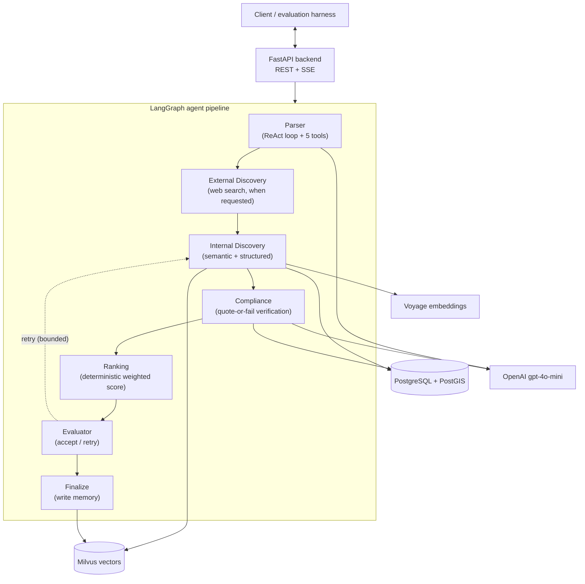
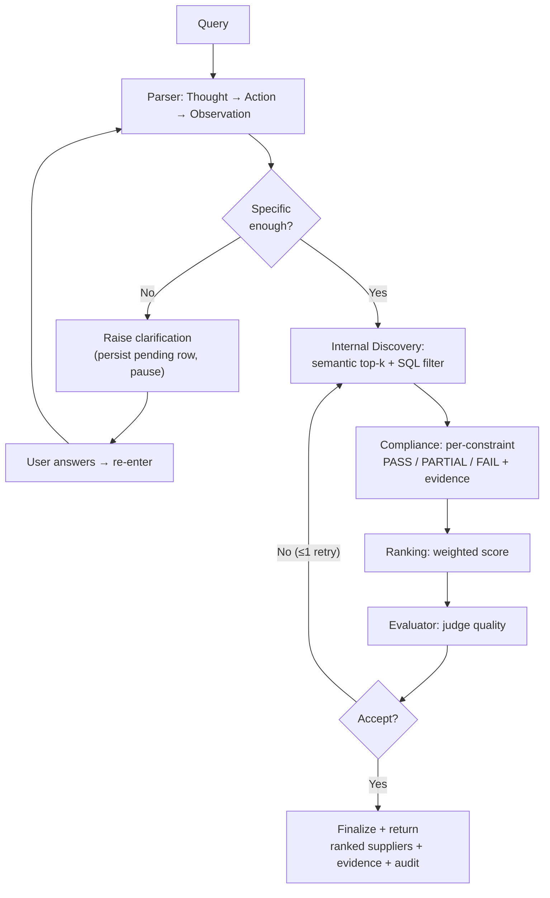

# Chapter 4: Approach

This chapter describes how the study was designed and built. It begins with the
overall research approach and the rationale behind it, then specifies the three
architectural paradigms and, in detail, the agentic system that is the most
complex of them. It sets out the benchmark and how its ground truth was
constructed, the metrics and how they are computed, and the design choices and
assumptions behind these decisions. It closes with the tools, frameworks, and
environment used, the reproducibility measures, and the technical hurdles
encountered and how they were resolved.

## 4.1 Overall research approach

The research is a **controlled benchmarking study**. The core methodological idea
is that three architectures are run on the same input queries, the same supplier
corpus, the same language model, the same ground-truth labels, and the same
scoring code, so that any difference in the results can be attributed to the
architecture rather than to the model or the data. This is the standard way to
isolate an architectural effect, and it is the reason the study can make a claim
about paradigms rather than merely about one system.

Three principles guided the design. The first is *fairness*: the baselines are
implemented as faithful, minimal versions of their paradigm, they use the same
embedding model and vector index as the agentic system where applicable, and they
are scored by the identical code. The second is *reproducibility*: the language
model is pinned to a dated snapshot, the corpus is generated from a fixed random
seed, and every reported number is produced by a committed script. The third is
*honesty*: negative results are reported rather than omitted, small differences are
treated as inconclusive, and the statistical treatment is chosen to be appropriate
for a small benchmark rather than to flatter the outcome.

## 4.2 The three paradigms

### 4.2.1 Paradigm 1 — single-prompt LLM

The single-prompt baseline sends the query directly to the language model with a
short instruction to return a ranked list of suppliers, and parses the response.
It has no corpus, no retrieval, and no tools; it answers from the model's
parametric knowledge alone. Because it never sees the corpus, it cannot return
corpus identifiers, so it is scored by matching the supplier *names* it emits
against the corpus names after normalisation. This is deliberately the weakest
paradigm; its role is to establish what a raw prompt achieves and to make visible
the hallucination behaviour that grounding is meant to remove.

### 4.2.2 Paradigm 2 — retrieval-augmented generation

The RAG baseline embeds the query with the same embedding model used by the
agentic system, retrieves the ten most similar suppliers from the same vector
index, and passes those candidates to the language model in a single prompt that
asks it to select and rank five. It has no compliance gate, no verification loop,
no clarification dialogue, and no ranking heuristics beyond the model's own
judgement. This minimality is intentional: because P2 shares the retrieval stack
with the agentic system, any quality difference between them is attributable to
the agentic machinery rather than to a different retriever.

### 4.2.3 Paradigm 3 — SupplierMind

The agentic system, SupplierMind, is a pipeline of five specialised agents that
parse the query, retrieve candidates, verify each constraint against evidence,
rank the survivors deterministically, and judge the result, while recording an
audit trail throughout. Its architecture is shown in Figure 4.1, and each agent is
described in Section 4.3. The key point of contrast with P2 is that P3 does not
simply retrieve and let the model pick; it filters on hard constraints, checks
each claim against quoted evidence, and ranks by an explicit, deterministic score.


*Figure 4.1 — The SupplierMind (P3) architecture.*

## 4.3 The SupplierMind agent pipeline

The pipeline is a stateful graph in which a single typed state object is passed
between agents. The control flow is deterministic — the order of the agents is
fixed — while the reasoning inside individual agents is autonomous. This is a
deliberate trade-off: reliable audit trails require predictable orchestration, so
the system is agentic in its reasoning components and deterministic in its overall
control flow. Figure 4.2 shows the query workflow, including the clarification
pause and the evaluator retry.


*Figure 4.2 — The P3 query workflow.*

### 4.3.1 Parser

The Parser converts the natural-language query into a structured constraint object.
It uses the ReAct pattern (Yao et al., 2023): the model alternates Thought, Action,
and Observation for up to six iterations, choosing from a registry of five domain
tools before finishing. The tools are `geocode_location` (resolving a place name to
coordinates), `canonicalize_certification` (mapping certificate strings to a
canonical form via a taxonomy), `infer_industry_context` (a small model call that
infers a category from vague wording), `parse_quantity_unit` (a deterministic
regular-expression parser for capacity values and units), and `lookup_past_query`
(a per-user semantic-memory lookup). Algorithm 4.1 sketches the loop.

```
Algorithm 4.1 — Parser ReAct loop
input:  raw query q, tool registry T
if q is contentless and no memory context:
    raise clarification and stop
state ← {}
for iteration = 1 .. MAX_ITERATIONS (6):
    (thought, action, args) ← LLM(q, history, T)         # temperature 0.2
    if action = FINISH:
        constraints ← parse(args); break
    if per-tool budget for action exhausted (>2) or (action,args) repeated:
        observation ← "budget/duplicate"; continue
    observation ← T[action](args)
    append (thought, action, observation) to history
if loop did not finish cleanly:
    constraints ← fallback extraction from history
decide whether a clarification is required (Algorithm 4.2)
return constraints, clarification?
```

Several guards make the loop robust, each added after a failure observed in live
runs: stop-sequences prevent the model from hallucinating its own Observations; a
per-tool execution budget of two prevents loops; a force-finish instruction is
issued on the final iteration; and a trace-aware fallback extractor recovers a
usable parse if the loop breaks. A pre-loop gate raises a clarification for
contentless queries instead of spending the whole budget on them.

The Parser also decides whether the query is specified well enough to proceed or
whether it should ask the user a narrowing question. The decision rule (Algorithm
4.2) reflects a procurement judgement: a request that names a product but neither a
location nor any narrowing constraint, or a location but nothing to discriminate
on, is treated as under-specified.

```
Algorithm 4.2 — Clarification decision (simplified)
if no product/service identified:                 → ask (product)
else if product present but no location and
        no operational constraint/preference:      → ask (location or requirements)
else if product + country but no certification,
        capacity, lead time, precise location,
        or ranking preference:                     → ask (operational preference)
else if confidence < 0.4 and #constraints < 2:     → ask (multiple)
else:                                              → proceed
```

In an automated benchmark there is no user to answer a clarification, so P3 is
evaluated in a *non-interactive* mode in which it proceeds with its best-effort
parse and records separately whether it *would* have asked. This measures its
retrieval quality on the same footing as the other paradigms while still reporting
its questioning behaviour (see Section 4.8).

> **📷 Figure 4.3 — [screenshot placeholder]**
> **Attach:** the clarification card in the user interface, where the system pauses
> and asks a narrowing question for an under-specified query.
> **Relevance:** shows the agentic clarification behaviour described above (and the
> ask-rate reported in Chapter 5) as the user actually experiences it.
> **Priority:** High.

### 4.3.2 Discovery

Discovery produces the candidate set. External Discovery is used only when the user
explicitly requests web search. It searches the open web through the Tavily API,
fetches and extracts supplier details from the resulting pages, validates each
candidate's location with the Geoapify Geocoding and Geoapify Places APIs, screens
it against the OpenSanctions sanctions list — and, where useful, corroborates it
against the OpenCorporates company registry — before storing it for human approval.
It is not exercised by the benchmark, which runs against the fixed corpus, and so is
described here for completeness rather than evaluated.

Internal Discovery is the retrieval used in the benchmark, and it is *hybrid*. Two
strategies run and their results are merged. Semantic search embeds the query with
Voyage and finds the most similar supplier vectors in Milvus by cosine similarity,
capturing meaning. Structured filtering applies the parsed hard constraints as SQL
predicates over the relational store — category and country by equality, capacity
and lead time by numeric comparison, and, where a radius is given, a PostGIS
geospatial filter. The two are combined so that the candidate set is both
topically relevant and constraint-consistent, which neither strategy achieves
alone: semantic similarity has no notion of a numeric threshold, and structured
filtering has no notion of meaning.

> **📷 Figure 4.4 — [screenshot placeholder]**
> **Attach:** the map view showing returned suppliers plotted around a queried
> location with its search radius.
> **Relevance:** illustrates the geospatial (radius) constraint handling of hybrid
> discovery.
> **Priority:** Optional.

### 4.3.3 Compliance

The Compliance agent is the component that the evaluation later identifies as the
source of the agentic system's advantage. For every candidate supplier and every
constraint, it produces an explicit verdict — PASS, PARTIAL, or FAIL — together
with evidence. Most verdicts are produced deterministically: category, country,
capacity, lead time, and radius are exact comparisons, and certificates are
resolved through a taxonomy that encodes supersession relationships (for example,
that ISO 45001 supersedes OHSAS 18001) with a confidence of 0.95. Only genuinely
ambiguous certificate equivalences trigger a language-model call, which in
practice is a small fraction of suppliers per query.

Where the model is used, its output is subject to a **quote-or-fail** rule that is
the system's core hallucination control. Any PASS or PARTIAL verdict must cite a
verbatim phrase from the supplier's record; the backend then checks that the quote
actually exists in the evidence text. If the quote is missing, too short to be
meaningful (fewer than twelve characters after normalisation), or not found in the
source — the signature of fabrication — the verdict is downgraded and the reason is
logged. A PASS whose stated confidence is below a floor of 0.75 is likewise
downgraded to PARTIAL as hedging. Algorithm 4.3 states the rule, and Listing 4.1
gives the verification function from the implementation.

```
Algorithm 4.3 — Quote-or-fail verdict
input: status, confidence, evidence_quote, evidence_pool
if status ∈ {PASS, PARTIAL}:
    if evidence_quote is empty                         → downgrade, flag "unverifiable"
    else if len(normalise(evidence_quote)) < 12         → downgrade, flag "too_short"
    else if normalise(quote) ∉ normalise(evidence_pool) → downgrade, flag "not_in_source"
    else if status = PASS and confidence < 0.75         → downgrade to PARTIAL, flag "hedging"
return adjusted status, flag
```

```python
# Listing 4.1 — evidence-quote verification (app/agents/compliance_agent.py)
def verify_evidence_quote(evidence_quote, evidence_pool):
    if not evidence_quote or not str(evidence_quote).strip():
        return {"ok": False, "flag": "equivalence_unverifiable"}
    norm_quote = _normalize_for_match(evidence_quote)
    if len(norm_quote) < MIN_QUOTE_LEN:            # MIN_QUOTE_LEN = 12
        return {"ok": False, "flag": "quote_too_short"}
    if norm_quote not in _normalize_for_match(evidence_pool):
        return {"ok": False, "flag": "quote_not_in_source"}
    return {"ok": True, "flag": None}
```

Because the check lives in the backend rather than in the prompt, the rule is
*enforced* rather than merely requested: no matter how confident the model sounds,
a claim without a verifiable quote cannot pass.

> **📷 Figure 4.5 — [screenshot placeholder]**
> **Attach:** a returned supplier card showing each constraint's PASS / PARTIAL /
> FAIL verdict together with the verbatim quoted evidence that supports it.
> **Relevance:** the single most important visual in the dissertation — it is the
> concrete illustration of the quote-or-fail evidence linking that underpins
> verifiability (RQ2).
> **Priority:** Essential.

### 4.3.4 Ranking

Ranking orders the survivors, and it is deliberately deterministic so that the
result is reproducible and explainable — no language model decides the order. Each
supplier receives a weighted score that combines constraint satisfaction (the
fraction of constraints it passes, taken from the compliance matrix), semantic
similarity to the query, geographic proximity where a location is given, and data
completeness, with an additional term when the query expresses a ranking
preference. The weighted total is

$$\text{score} = w_c\,s_c + w_s\,s_s + w_p\,s_p + w_o\,s_o + w_r\,s_r ,$$

where $s_c, s_s, s_p, s_o, s_r \in [0,1]$ are the constraint, semantic, proximity,
completeness, and preference sub-scores and $w_\bullet$ are their weights. The
weights adapt to the query type. The default weighting favours constraint
satisfaction ($w_c=0.40$, $w_s=0.25$, $w_p=0.25$, $w_o=0.10$); for a
compliance-critical query the constraint weight rises to 0.50; and for a
location-driven query the proximity weight rises to 0.40. A supplier carrying a
high-confidence FAIL on any constraint is additionally multiplied by a penalty
factor, so that a genuine failure cannot be masked by strong scores elsewhere.
Each returned supplier is accompanied by a human-readable explanation built from
its actual compliance verdicts.

> **📷 Figure 4.6 — [screenshot placeholder]**
> **Attach:** the results page showing the ranked shortlist of suppliers with their
> scores and human-readable explanations.
> **Relevance:** shows the end-to-end output of the agentic pipeline as delivered to
> the user.
> **Priority:** High.

### 4.3.5 Evaluator and orchestration

The Evaluator judges whether the ranked result is good enough and, if not, sends
the pipeline back to Discovery with feedback (for example, to relax a constraint),
bounded to a single retry. This bounded cycle is what makes the pipeline a graph
rather than a linear chain, and it is implemented in LangGraph as a conditional
edge from the evaluator node back to the discovery node. The whole pipeline is a
`StateGraph` whose nodes are the agents and whose conditional edges implement the
clarification exit, the internal-versus-external routing, and the evaluator retry.

### 4.3.6 Semantic memory, governance, and audit

Three cross-cutting mechanisms complete the system. Accepted queries are written to
a separate per-user semantic-memory collection, read back through a closure bound
to the requesting user so that one user cannot query another's history. Suppliers
are governed by a three-tier scheme — approved, personally saved, and pending
review — so that a web-discovered supplier cannot silently enter the trusted corpus
without location validation, sanctions screening, and human approval. Finally,
every agent step writes an audit-log row recording the agent, the action, the
reasoning, and the duration, which is the substrate of the auditability the study
measures.

> **📷 Figure 4.7 — [screenshot placeholder]**
> **Attach:** the audit-trail view for a completed query, listing each agent's
> action, reasoning, and duration.
> **Relevance:** the visual evidence for the auditability contribution — it shows
> the queryable reasoning chain that earns the top auditability-rubric score (RQ2).
> **Priority:** Essential.

## 4.4 The benchmark: SupplierBench-25 and Abstention-5

### 4.4.1 The synthetic corpus

The supplier corpus is ten thousand records generated procedurally by a
deterministic script seeded with `random.seed(42)` and using no language-model
calls, so the corpus content is fully reproducible. Each supplier has a category
(one of twelve), a country and city with coordinates, a set of certifications with
issuing bodies and validity dates, a capacity value and unit, a lead time in days,
and free-text descriptive fields. The generator also injects deliberately "tricky"
adversarial records so that retrieval is not trivial. Synthetic data is used
because it yields exact, uncontestable ground truth — whether a supplier satisfies
a constraint is a fact about its generated fields — and because it avoids using any
real company data; this follows the accepted practice of synthetic benchmarking
when no labelled dataset exists. This choice also reflects the ethical framing of
the project. Although the research was carried out in collaboration with Mercanis
(Cdc3 GmbH), a procurement-technology startup based in Berlin, Germany, which
provided the problem framing and domain context, no Mercanis data — and no real
company or customer data of any kind — was used; the corpus is entirely synthetic
and generated from scratch, so the work raises no confidentiality or data-protection
concerns.

### 4.4.2 Query construction and ground truth

SupplierBench-25 consists of twenty-five queries across three difficulty tiers,
grouped by how many constraints are stacked: eight simple queries (one to two
constraints), ten medium queries (three to four), and seven hard queries (five to
six). Ground truth for each query is the set of supplier identifiers that satisfy
all of the query's constraints, determined by exact matching against the structured
corpus fields *before* any system is run, and stored in a versioned file.

A key methodological requirement is that every scored query must have a non-empty,
non-trivial answer set, because a metric that is zero by construction measures
nothing. The queries were therefore constructed on the ten-thousand-supplier corpus
with a deterministic builder that reads each category's actual capacity unit from
the corpus and tunes the numeric thresholds so that the number of matching suppliers
lands in a useful band, then verifies that at least three suppliers match. Algorithm
4.4 summarises the construction, which pairs the human-authored query intents with
machine-verified ground truth.

```
Algorithm 4.4 — Benchmark ground-truth construction (per query)
input: corpus, query intent (category, optional country, certs, tier)
pool ← suppliers matching category (and country, and certs)
if certs make |pool| too small: drop the rarest cert (log it)
choose capacity floor and lead-time cap by searching round values
    to land |ground_truth| near the tier target while keeping |gt| ≥ 3
ground_truth ← suppliers in pool satisfying all thresholds
assert |ground_truth| ≥ 3        # fail loudly otherwise
store full ground-truth ID set (not truncated) so recall is well defined
```

### 4.4.3 The abstention set

Alongside the twenty-five satisfiable queries, a five-query **abstention set**
contains requests that have no correct answer by construction — for example, an
aerospace certification requested of a logistics provider, or an impossible
capacity threshold — each verified to match zero suppliers. Following the
unanswerable-question methodology of Rajpurkar et al. (2018), these queries are not
scored on precision; they test whether a system correctly returns nothing rather
than inventing a match.

## 4.5 Evaluation metrics and their computation

The metrics defined in Chapter 2 are computed by a single module used by all
systems, so scoring is identical across paradigms. Precision@5, reciprocal rank,
recall, nDCG@5, mean average precision, and Success@1 are computed from the
returned identifiers against the ground-truth set. Listing 4.2 shows the core
scoring functions, which are deliberately small and shared.

```python
# Listing 4.2 — shared scoring (app/evaluation/metrics.py)
def precision_at_k(retrieved, relevant, k=5):
    if not retrieved: return 0.0
    hits = sum(1 for r in retrieved[:k] if r in relevant)
    return hits / k

def reciprocal_rank(retrieved, relevant):
    for i, item in enumerate(retrieved[:5]):
        if item in relevant:
            return 1.0 / (i + 1)
    return 0.0
```

Constraint satisfaction (CSR) is measured two ways. The agentic system's native CSR
is read from its own compliance verdicts, counting a PASS as 1, a PARTIAL as 0.5,
and a FAIL as 0, averaged over the returned suppliers. Because the baselines have
no such verdicts, a *harmonised* CSR re-scores every system — including the agentic
one — with an identical field-comparison scorer, so that the CSR comparison is
like-for-like. Auditability is scored on a four-point rubric (0 for unstructured
prose up to 3 for evidence-linked suggestions with a recorded reasoning chain), and
verifiability as the fraction of claims that are linked to quoted evidence. Two
further trust measures are computed: an entity-hallucination rate (the fraction of
returned suppliers that do not exist in the corpus) and a compliance-gate accuracy
(the fraction of the agentic system's own PASS/FAIL verdicts that are true against
the corpus). Results are reported with 95% bootstrap confidence intervals over the
queries and, for the headline comparison, a paired bootstrap significance test on
the per-query Precision@5 differences, following the guidance of Smucker et al.
(2007).

## 4.6 Design choices and assumptions

Several choices are worth making explicit, with their rationale. The language model
is pinned to a dated snapshot so that results are reproducible; there is
deliberately no runtime fallback to a second model, because a silent switch
mid-benchmark would corrupt the comparison, so failures surface loudly instead.
Temperatures are kept low (zero for extraction and compliance, 0.2 in the parser
loop) to favour consistency. Chunking uses one document per supplier, because
supplier records are short and atomic, which keeps citations unambiguous. Ranking
is deterministic rather than model-based to make it reproducible, auditable, and
free. The baselines share the retrieval stack with the agentic system so that
differences are attributable to the agentic machinery. The principal assumptions
are that the synthetic corpus is a fair proxy for the structure of a real supplier
database, and that a single annotator's twenty-five queries, curated across three
tiers, constitute a defensible seed benchmark; both assumptions are revisited in
the limitations.

## 4.7 Tools, frameworks, and environment

The agentic system and the baselines are implemented in Python 3.11 within a
FastAPI backend, with the agent pipeline built on LangGraph. The language model is
OpenAI's `gpt-4o-mini-2024-07-18`, accessed through a provider abstraction, and the
embeddings are Voyage AI's `voyage-3-lite` at 512 dimensions. Vectors are stored and
searched in Milvus 2.4 using an HNSW index under cosine similarity; supplier
records, constraints, and audit logs are stored in PostgreSQL 16 with the PostGIS
extension for geospatial queries; and Redis provides a caching layer with an
in-memory fallback. The frontend is a React and TypeScript application, though it is
not exercised by the benchmark. The infrastructure services run in Docker
containers, and the experiments were run from a local development machine on Apple
Silicon (macOS). Dependencies are pinned with the `uv` package manager, database
schema is versioned with Alembic migrations, and the code base includes an
extensive suite of deterministic unit tests that require no live language model.

Beyond the model and the databases, the system integrates a number of external
APIs, listed in Table 4.1. It is important to distinguish those exercised by the
benchmark from those that support the full deployed product. Because the benchmark
runs against the fixed corpus with internal-only discovery (Section 4.3.2), it
exercises the language-model, embedding, and geocoding APIs; the web-discovery,
sanctions-screening, corporate-registry, and authentication APIs are integrated
components of the deployed system but are not invoked during evaluation, and this
is stated openly so that no claim rests on an un-evaluated capability.

| Service / API | Role in the system | Exercised by benchmark? |
|---|---|---|
| OpenAI (`gpt-4o-mini`) | Agent reasoning, structured extraction, compliance verdicts | Yes |
| Voyage AI (`voyage-3-lite`) | Text embeddings for semantic search and memory | Yes |
| Nominatim / OpenStreetMap | Geocoding place names to coordinates (parser `geocode_location` tool) | Yes |
| Tavily | Web search for suppliers not in the corpus (external discovery) | No — web discovery |
| Geoapify Geocoding | Validating a web-discovered supplier's stated address | No — web discovery |
| Geoapify Places | Locating a supplier when its page has no usable address | No — web discovery |
| OpenSanctions | Screening web-discovered suppliers against sanctions lists | No — web discovery |
| OpenCorporates | Corporate-registry corroboration of discovered suppliers | No — web discovery |
| Google / GitHub OAuth | User authentication for the product interface | No — product only |

*Table 4.1 — External services and APIs integrated by the system, and whether each
is invoked by the benchmark.*

## 4.8 Reproducibility

Reproducibility was treated as a first-class requirement. The corpus is generated
from a fixed seed; the benchmark queries and their ground truth are stored in
versioned files; the model is pinned; and every reported number is produced by a
committed script — a benchmark runner that executes the paradigms, a builder that
constructs and verifies the benchmark, and a set of analysis scripts that compute
the metrics, the diagnostics, and the ablation. Because the parser is mildly
stochastic (its loop runs at temperature 0.2), the full benchmark is run five times
and the run-to-run spread is reported. The evaluation runs the agentic system in the
non-interactive "proceed anyway" mode described in Section 4.3.1, and it records the
would-have-clarified rate separately. The component ablation is implemented as a
switch on the pipeline that replaces the compliance stage with a trivial all-pass
result, leaving the rest of the system unchanged, so that the effect of the
verification gate can be measured in isolation.

> **📷 Figure 4.8 — [screenshot placeholder]**
> **Attach:** a terminal capture of a benchmark run in progress, showing per-query
> Precision@5 and constraint-satisfaction output and the rate-limiter pacing
> messages.
> **Relevance:** documents the harness actually running and the free-tier pacing
> behaviour described in Section 4.8 and Section 4.9.
> **Priority:** Medium.

## 4.9 Technical hurdles and how they were addressed

Three hurdles are worth recording because their solutions affect the results. The
first was **provider rate limiting**: the embedding provider's free tier permits
only three requests per minute, and a naive reactive retry on rejection produced
long exponential back-offs and eventual timeouts. The solution was a proactive
sliding-window rate limiter that tracks requests and tokens per model over a rolling
sixty-second window with a safety margin and sleeps just long enough to stay under
the cap; this made long runs slow but completely stable, and — because the limiter
records how long it sleeps — it also allowed latency to be reported net of provider
pacing. The second was an **index-duplication issue**: because the vector store
appends rather than upserts, an interrupted re-ingestion left duplicate vectors that
consumed retrieval slots; a de-duplication utility that removes the surplus vectors
per supplier resolved it. The third was **benchmark validity**: an earlier version
of the benchmark on a small corpus contained hard queries with no satisfying
supplier, which made their precision zero by construction; rebuilding the benchmark
on the ten-thousand-supplier corpus with the verified-minimum construction of
Algorithm 4.4 removed this artefact. Each of these is a data-engineering rather than
a modelling problem, and each had to be solved for the comparison to be trustworthy.
