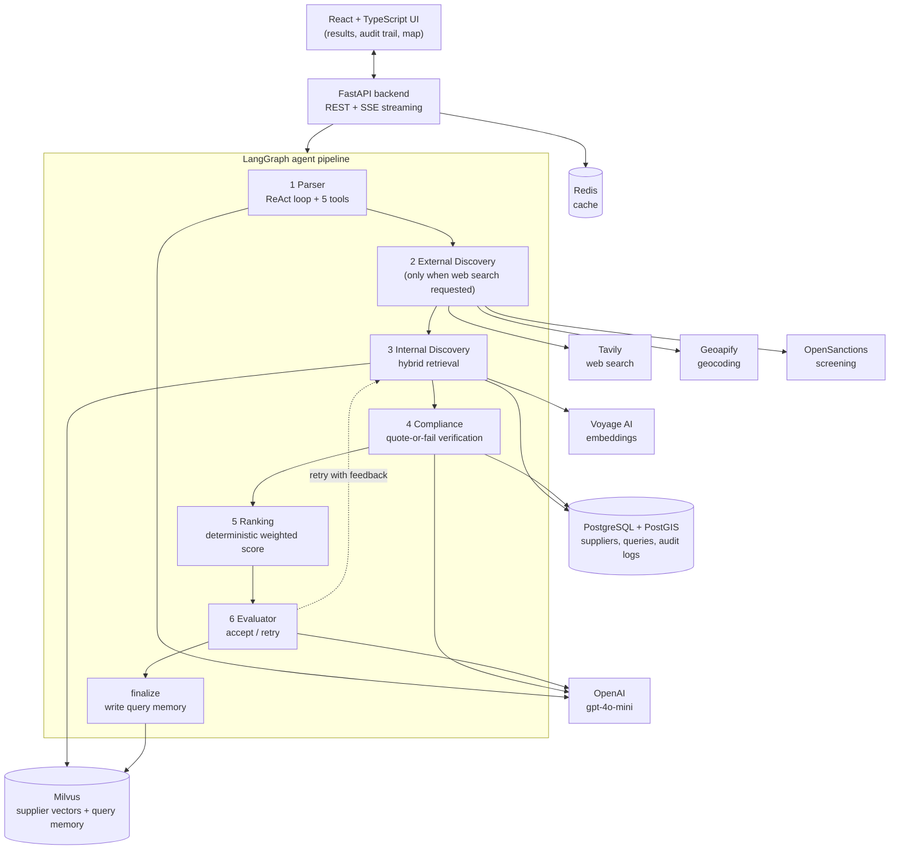
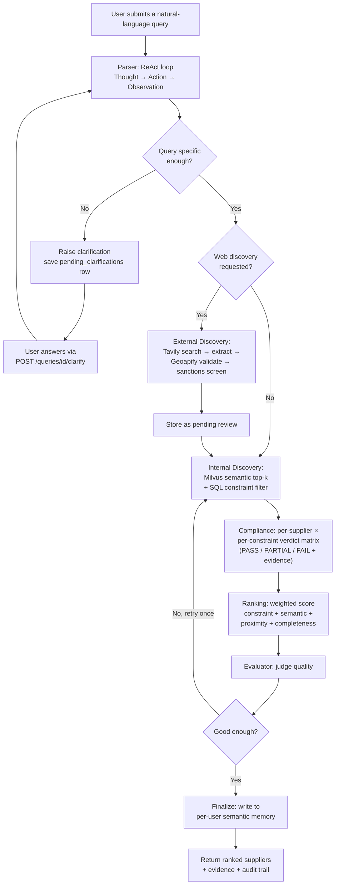

# SupplierMind — Complete Project Walkthrough

A single document that explains this project end to end: the problem, the
architecture, every agent, every technology and concept used, how it is
evaluated, what the results say, and a deep-dive Q&A covering the design
decisions and their trade-offs.

---

## 1. What this project is

**SupplierMind is an AI-assisted supplier discovery system for procurement teams
who need auditable results under multiple hard constraints.**

A procurement buyer rarely asks a simple question. A real request looks like:

> *"ISO 9001 certified bronze supplier within 25 km of Bremen, capacity above
> 5,000 kg/month, lead time under 21 days."*

That single sentence carries five constraints at once — a certification, a
geography with a radius, a capacity floor, a lead-time ceiling, and a product
category. The buyer then has to be able to **justify** the choice: which supplier
was picked, why it qualifies, and what evidence supports each claim. A wrong or
unverifiable answer is not merely unhelpful; onboarding an unqualified or
sanctioned supplier is a legal and financial problem.

The system searches an organisation's approved suppliers first, can discover new
suppliers from the web when asked, verifies each constraint against evidence, and
keeps a full audit trail of how it reached its answer.

### The research question behind it

The project is also a controlled study. It asks: **for this task, does an agentic
architecture actually beat simpler approaches, and if so, which part of it is
responsible?** Three paradigms answer the same queries under identical
conditions:

| Paradigm | What it is |
|---|---|
| **P1 — Single-prompt LLM** | The query goes straight to the model. No corpus, no retrieval, no tools. Pure parametric knowledge. |
| **P2 — RAG** | Embed the query, retrieve the top-10 most similar suppliers from the vector index, one prompt picks five. |
| **P3 — SupplierMind** | A five-agent pipeline with tool use, hybrid retrieval, evidence-checked compliance, deterministic ranking, and an audit trail. |

All three run on the **same model, same corpus, same ground truth, and same
scoring code**, so any difference is attributable to the architecture rather than
the model or the data.

---

## 2. Technology stack

| Layer | Technology | Why it is used |
|---|---|---|
| LLM | OpenAI `gpt-4o-mini-2024-07-18` (pinned snapshot) | Agent reasoning and structured JSON extraction. Pinned so benchmark results stay reproducible. |
| Embeddings | Voyage AI `voyage-3-lite` (512-dim) | Semantic vectors for supplier documents and queries. |
| Vector database | Milvus 2.4 (HNSW, cosine) | Approximate nearest-neighbour semantic search at 10k+ scale. |
| Relational database | PostgreSQL 16 + PostGIS | Supplier records, structured constraint filtering, geospatial queries, audit logs. |
| Agent orchestration | LangGraph 0.2 | A stateful graph with conditional edges and cycles (the retry loop). |
| Backend | FastAPI + Python 3.11 | Async REST API plus Server-Sent Events for progress streaming. |
| Frontend | React 19 + TypeScript + Vite | UI, results, audit trail, map view. |
| Styling / UI | Tailwind CSS + shadcn/ui | Component system. |
| Maps | Leaflet + OpenStreetMap | Geospatial visualisation of supplier locations. |
| Web discovery | Tavily | Live web search for suppliers not in the database. |
| Location validation | Geoapify Geocoding + Places | Converts place names to coordinates; validates a discovered supplier's real address. |
| Sanctions screening | OpenSanctions | Blocks sanctioned entities before they can enter results. |
| Cache | Redis 7 (in-memory fallback) | Shared async cache abstraction. |
| Auth | OAuth2 (Google/GitHub) + JWT | Stateless authentication, RBAC. |
| Migrations | Alembic | Versioned schema evolution. |
| Packaging | uv (locked dependencies) | Reproducible Python environments. |
| Testing | pytest (315 unit tests) | Deterministic tests that need no live LLM. |
| Infrastructure | Docker Compose, Kubernetes manifests | Local development and deployment. |
| i18n | react-i18next | English and German UI; the parser accepts multilingual input. |

---

## 3. System architecture



### Three-tier supplier governance

Every supplier sits in exactly one tier, and this governs what a search may
return:

1. **Approved** — organisation-level, admin-curated. The default search scope.
2. **My suppliers** — a user's personal saves, scoped to that user.
3. **Pending review** — web-discovered suppliers with a verified city, country,
   and coordinates plus sanctions screening metadata. They are visible in the
   query that discovered them, but **quarantined** from the approved corpus until
   a human approves them with a written justification (rejected with HTTP 422 if
   the justification is too thin).

---

## 4. Query workflow



The **clarification loop** is a genuine system-level pause, not chat history. The
pipeline stops, persists a `pending_clarifications` row (maximum three turns,
enforced by a database CHECK constraint), streams the question to the UI, and
resumes with the enriched query when the user answers.

---

## 5. The five agents

### 5.1 Parser — turning language into structured constraints

**Job.** Convert *"ISO 9001 bronze supplier within 25 km of Bremen, 5,000+
kg/month, under 21 days"* into a machine-usable object: category, certifications,
capacity value and unit, lead-time ceiling, coordinates and radius.

**Concept used: the ReAct pattern** (Reason + Act). Instead of one prompt, the
model runs a loop — **Thought → Action → Observation** — for up to six
iterations, choosing tools as it goes. It can geocode a city, then canonicalise a
certificate name, then parse a quantity, and only then finish.

**Its five tools:**

| Tool | What it does | Deterministic? |
|---|---|---|
| `geocode_location` | Turns "Bremen" into coordinates | Yes (external API) |
| `canonicalize_certification` | Maps "ISO9001", "ISO 9001:2015" to a canonical certificate via a taxonomy | Yes (lookup table) |
| `infer_industry_context` | Infers likely industry/category from vague product wording | No (small LLM call) |
| `parse_quantity_unit` | Extracts "5,000 kg/month" into value + unit | Yes (regex) |
| `lookup_past_query` | Retrieves this user's similar past queries from semantic memory | Yes (vector search) |

**Loop hygiene** — each guard was added after observing a real failure:
stop-sequences so the model cannot hallucinate its own Observations; same-argument
de-duplication; a per-tool budget of two executions; a force-finish instruction on
the final iteration; trace-aware fallback extraction if the loop breaks; and a
pre-loop gate that raises a clarification for contentless queries rather than
burning the whole budget.

**Clarification gate.** The parser refuses to guess. If a query has a product but
no location and no narrowing constraint, or a location but nothing to
discriminate on, it asks a question instead of inventing an interpretation.

### 5.2 External Discovery — finding genuinely new suppliers

**Job.** When the user asks for web discovery, find suppliers that are *not* in
the database, and make them safe to show.

**Pipeline:** Tavily web search → page fetch → LLM extraction of supplier details
→ **Geoapify location validation** (a supplier without a verifiable city, country
and coordinates is rejected outright) → **OpenSanctions screening** → stored as
*pending review* for human approval.

This is the step that separates "an LLM said a company name" from "here is a real
company, at a verified address, screened against sanctions, with a source."

### 5.3 Internal Discovery — hybrid retrieval

**Job.** Produce a candidate set from the trusted corpus.

**Concept used: hybrid retrieval.** Two different retrieval strategies run and
their results are merged:

- **Semantic search (Milvus):** the query is embedded with Voyage and matched by
  cosine similarity against supplier vectors. This catches meaning — "metal
  fabrication" finds a steel supplier even without an exact keyword.
- **Structured SQL filtering (PostgreSQL):** hard constraints — category,
  country, capacity ≥ X, lead time ≤ Y — are applied as exact predicates, and
  PostGIS handles radius queries.

Why both? Semantics alone cannot enforce "capacity above 5,000 kg/month" (vector
similarity has no notion of numeric thresholds). SQL alone cannot understand that
"bronze" relates to metals. Together they cover each other's blind spot.

### 5.4 Compliance — verification with evidence

**Job.** For every candidate supplier and every constraint, produce an explicit
verdict: **PASS**, **PARTIAL**, or **FAIL**, with evidence.

**Concept used: quote-or-fail grounding.** When the LLM is used (for semantic
certificate equivalence), it must copy a **verbatim phrase from the supplier
record** that justifies its verdict. The backend then checks that the quote
actually exists in the source text. If the quote is missing, too short to be
meaningful (under 12 characters), or **not found in the source** — the tell-tale
sign of fabrication — the verdict is downgraded and the reason is logged. A
confident-sounding claim with no verifiable quote cannot pass.

**Cost control through a deterministic short-circuit.** Most checks never reach
the LLM at all. Category, country, capacity, lead time and radius are exact
comparisons. Certificates are resolved through a **taxonomy** that knows, for
example, that ISO 45001 supersedes OHSAS 18001. Only genuinely ambiguous
certificate equivalences trigger an LLM call — typically 0–1 suppliers out of 25.

This is the component the ablation later proves is responsible for the system's
accuracy advantage.

### 5.5 Ranking — deterministic and explainable

**Job.** Order the survivors and explain the order.

**Concept used: deterministic weighted scoring.** No LLM decides the ranking —
which makes it reproducible and auditable. Four signals are combined, and the
weights adapt to the query type:

| Signal | Default weight | What it measures |
|---|---|---|
| Constraint satisfaction | 0.40 | Fraction of constraints passed (from the compliance matrix) |
| Semantic similarity | 0.25 | Vector closeness to the query |
| Proximity | 0.25 | Distance from the requested location |
| Data completeness | 0.10 | How fully the supplier record is populated |

For a **compliance-critical** query the constraint weight rises to 0.50; for a
**location-driven** query proximity rises to 0.40. Each returned supplier carries
a human-readable explanation built from its actual compliance verdicts.

### 5.6 Evaluator — the self-check loop

**Job.** Judge whether the result set is good enough; if not, send the pipeline
back to Discovery with feedback (for example, relax a constraint), **bounded to
one retry**. This is the cycle in the LangGraph graph, and it is what makes the
system a graph rather than a linear chain.

### 5.7 Finalize — cross-session memory

Accepted queries are written to a **separate Milvus collection** (`query_memory`)
as embeddings, scalar-indexed by user. The `lookup_past_query` tool reads it
through a **closure bound to the requesting user**, so the model physically
cannot query another user's history. A `DELETE /users/me/memory` endpoint
implements right-to-be-forgotten.

---

## 6. Concepts used, by discipline

### AI / ML

- **Retrieval-Augmented Generation (RAG)** — grounding generation in retrieved
  documents rather than parametric memory.
- **The ReAct agent pattern** — interleaved reasoning and tool use.
- **Tool use / function calling** — a registry of typed tools the model selects
  from at run time.
- **Vector embeddings and semantic search** — 512-dimensional Voyage vectors,
  cosine similarity, HNSW approximate nearest-neighbour index (M = 16,
  efConstruction = 256, ef = 128 at query time).
- **Hybrid retrieval** — dense vector search fused with structured SQL predicates.
- **Chunking strategy** — one document per supplier. Supplier records are short
  and atomic, so per-supplier chunks keep citations unambiguous.
- **Hallucination mitigation** — quote-or-fail evidence checking, corpus-ID
  grounding (the system can only return IDs that exist), and a confidence floor.
- **Structured output extraction** — constrained JSON with schema validation and
  fallback parsing.
- **Prompt engineering as control** — stop sequences, force-finish instructions,
  tool budgets, temperature pinned low (0.0–0.2) for reproducibility.
- **Stateful multi-agent orchestration** — a graph with conditional edges and a
  bounded cycle.
- **Semantic memory** — per-user vector memory for cross-session personalisation.
- **Agentic clarification** — the system asks rather than assumes when a query is
  under-specified.
- **Model pinning** — a dated snapshot so results do not drift.

### Data engineering

- **Synthetic corpus generation** — 10,000 supplier records generated
  procedurally from a fixed seed, with documented parameter ranges and
  deliberately "tricky" adversarial records.
- **Batch ingestion with checkpoint/resume** — embeddings are generated in
  batches with a checkpoint file, so an interrupted 10k ingest resumes instead of
  restarting.
- **Idempotent loading** — re-running the ingest skips existing rows rather than
  duplicating them.
- **Vector index management** — collection schema, HNSW index construction,
  entity counts, and a de-duplication utility (Milvus appends rather than
  upserts, so an interrupted re-ingest can leave duplicate vectors).
- **Rate limiting** — a per-model sliding-window limiter tracking both requests
  per minute and tokens per minute, with a safety margin, that *sleeps
  proactively* rather than reacting to 429 errors.
- **Caching** — a shared async cache abstraction (Redis with an in-memory
  fallback) so the system runs without Redis.
- **Schema migrations** — Alembic revisions for every schema change.
- **Geospatial data engineering** — PostGIS for radius queries; haversine for
  scoring.
- **Audit logging as a data product** — every agent decision is a queryable row.

### Software engineering

- **Layered architecture** — `api/` (transport), `agents/` (domain logic),
  `core/` (infrastructure clients), `db/` (persistence), `services/` (external
  integrations), `evaluation/` (the benchmark harness).
- **Repository pattern** — data access isolated behind repository classes.
- **Protocol-based abstraction** — an `LLMProvider` protocol so a different
  OpenAI-compatible backend can be swapped in without touching agent code.
- **Dependency injection via cached singletons** — clients are constructed once
  and injected, which also makes them trivially mockable in tests.
- **Typed state** — the agent state is a `TypedDict`, so every field is declared.
- **Async throughout** — async FastAPI handlers, async SQLAlchemy sessions,
  blocking work pushed to threads.
- **Resilience** — retry with exponential backoff (tenacity) on transient
  provider errors, but *never* on authentication or quota errors, which should
  fail loudly.
- **Streaming** — Server-Sent Events for live pipeline progress.
- **Security** — OAuth2 + JWT, role-based access control, per-user memory
  isolation, and cross-user access answered with **404 rather than 403** so the
  existence of another user's resource cannot be probed.
- **Human-in-the-loop governance** — web-discovered suppliers require written
  justification before approval.
- **Testing** — 315 deterministic unit tests that require no live LLM;
  provider clients are mocked and agent logic is tested in isolation.
- **Architecture Decision Records** — decisions such as model pinning and
  single-provider deployment are documented with their rationale.
- **Containerisation** — Docker Compose for local development, Kubernetes
  manifests for deployment.

---

## 7. Evaluation

### The benchmark

**SupplierBench-25** — 25 procurement queries over the 10,000-supplier corpus,
across three difficulty tiers (simple = 1–2 constraints, medium = 3–4, hard =
5–6). Ground truth is computed by exact matching against the structured corpus
fields, and **every query is verified to have at least three correct answers**, so
no metric is ever zero by construction.

**Abstention-5** — five queries that have *no* correct answer on purpose (for
example, an aerospace certification requested for a logistics provider). These
test whether a system correctly says "nothing qualifies" instead of inventing a
match. They are never scored on precision.

### Metrics and what each one is for

| Metric | Question it answers |
|---|---|
| **Precision@5** | Of the five returned, how many are correct? (primary headline; identical scoring for all systems) |
| **Recall@5 / @10** | Of all correct suppliers, how many were found? |
| **MRR** | How near the top is the first correct supplier? |
| **nDCG@5 / MAP@5 / Success@1** | Rank-weighted quality; average precision; was the very top pick correct? |
| **Answer rate** | How often does it return anything at all? |
| **Constraint Satisfaction Rate (CSR)** | Do returned suppliers actually meet the query's constraints? |
| **Harmonized CSR** | The same, re-scored so every system uses one identical scorer (removes self-scoring bias) |
| **Compliance-gate accuracy** | Are the system's own PASS/FAIL verdicts actually true against the corpus? |
| **Entity hallucination rate** | Did it return suppliers that do not exist? |
| **Correct-abstention rate** | On impossible queries, does it correctly return nothing? |
| **Clarification (ask) rate** | How often does it want to ask a narrowing question? |
| **Intent-resolution accuracy** | How correctly does the parser extract each constraint type? |
| **Error taxonomy** | Which specific failure modes occur, and how often? |
| **Tool-access analysis** | Which tools fire, and does usage match query type? |
| **Prompt efficiency** | LLM calls and tokens per query |
| **Clean latency** | Compute time with provider rate-limit sleeps subtracted |
| **Cost per query / per correct supplier** | Money spent, and money per useful result |
| **Run-to-run variance** | How reproducible is each number across repeats? |

### Statistical treatment

- **Bootstrap 95% confidence intervals** — resample the 25 queries thousands of
  times and recompute the mean, to show how stable each estimate is.
- **Paired bootstrap significance test** — take the per-query difference between
  two systems on the same queries and bootstrap the average difference. If the
  whole interval sits above zero, the advantage is significant.
- **Repeated runs** — the benchmark is run five times because the parser is
  slightly stochastic; the standard deviation across runs is reported.
- **Component ablation** — a component is switched off and the benchmark re-run,
  to attribute the result to a specific part of the system.

### Headline results (five runs, 10k corpus)

| Metric | P3 SupplierMind | P2 RAG | P1 single-prompt |
|---|---|---|---|
| Precision@5 | **0.731** [0.619, 0.838] | 0.504 [0.352, 0.664] | 0.000 |
| MRR | **0.984** | 0.793 | 0.000 |
| nDCG@5 | **0.795** | 0.559 | 0.000 |
| Success@1 | **0.984** | 0.760 | 0.000 |
| Harmonized CSR | **0.934** | 0.917 | 0.000 |
| Task success rate | **0.984** | 0.840 | 0.000 |
| Cost / query | $0.00140 | $0.00030 | $0.00020 |
| Clean latency | 13.2 s | 2.8 s | 3.5 s |

**Is the gap real?** Paired bootstrap on per-query Precision@5: mean difference
**+0.227**, 95% CI **[0.126, 0.330]**, p ≈ 0.000 — statistically significant, and
reproducible (run-to-run standard deviation ≈ 0.03).

**The gap widens with difficulty** (Precision@5):

| Tier | P3 | P2 |
|---|---|---|
| Simple | 0.950 | 0.950 |
| Medium | 0.664 | 0.340 |
| Hard | 0.577 | 0.229 |

### The most interesting findings

1. **The compliance gate is what makes it work.** The ablation ladder:
   P2 RAG **0.504** → P3 with the compliance gate removed **0.427** → P3 full
   **0.731**. Structured retrieval *without* verification is actually *worse*
   than plain RAG; the gate adds **+0.305** and is concentrated on hard queries.
2. **The parser is far more reliable than it looks.** Intent-resolution accuracy
   is **99.3%** across all constraint fields. Messy-looking output is confined to
   a free-text field that retrieval does not use.
3. **The single-prompt baseline hallucinates 100% of the time — and clearer
   queries do not help.** Even a fully-specified query asking for "exact, real
   company names" returns 0/5 corpus matches. It recalls *real* companies
   (Thyssenkrupp, BASF) that simply are not in the target database. The failure
   is structural, not a prompting problem.
4. **An honest negative result: the agentic system refuses badly.** On impossible
   queries, correct-abstention is P2 **0.80** versus P3 **0.40** — the ranking
   layer surfaces near-misses instead of returning nothing. The near-misses are
   auditable (their failing constraints are shown), but measured strictly as
   refusal, this is a real weakness with a clear fix: a hard-abstain threshold.

---

## 8. Repository layout and running it

```
apps/backend/app/
  agents/          Parser, Discovery, Compliance, Ranking, Evaluator + tools
  api/v1/          REST + SSE endpoints (queries, suppliers, auth, metrics, users)
  core/            LLM client, embeddings, vector store, rate limiter, cache
  db/              SQLAlchemy models, repositories, Alembic migrations
  evaluation/      Benchmark harness, metrics, report
  services/        Web search, extraction, geocoding, sanctions, query memory
apps/backend/experiments/    P1 and P2 baseline paradigms
apps/frontend/               React UI
thesis/                      Benchmark, experiment scripts, results, findings
infra/                       Docker Compose and Kubernetes manifests
```

```bash
# infrastructure
docker compose -f infra/docker/docker-compose.yml up -d

# backend
cd apps/backend
uv sync
uv run alembic upgrade head
uv run python scripts/bulk_ingest_synthetic.py --force-pg --skip-milvus
uv run python scripts/bulk_ingest_synthetic.py --skip-pg --resume
uv run uvicorn app.main:app --reload --port 8000

# frontend
cd apps/frontend && npm install && npm run dev

# benchmark
uv run python ../../thesis/scripts/run_10k_benchmark.py --p1 --p2 --p3 --runs 5
python thesis/scripts/compute_all_metrics.py
```

---

## 9. Deep-dive Q&A

### Architecture and agent design

**Q: Why did you build a multi-agent system instead of one large prompt?**
I split the work for separation of concerns and verifiability. Each agent has one
job with a typed input and output, so I can test, replace, and audit each one
independently. More importantly, splitting it lets me give the deterministic
components the work they are better at: my ranking is pure arithmetic, most of my
compliance checks are exact comparisons, and only genuinely ambiguous reasoning
reaches the LLM. If I had written one mega-prompt, every one of those steps would
have become probabilistic and unverifiable.

**Q: Why did you choose LangGraph rather than a simple function chain or LangChain?**
Because my pipeline is not a chain — it has a **cycle**. My Evaluator can send the
pipeline back to Discovery with feedback. LangGraph models that natively as a
state graph with conditional edges, and it gives me a single typed state object
passed between nodes. With a plain chain I would have had to hand-roll the loop
control and thread the state manually.

**Q: Your pipeline order is fixed. Is it really "agentic"?**
This was a deliberate trade-off I made. The **reasoning components** are agentic:
my Parser autonomously decides which tools to call and whether to ask the user a
question, and my Evaluator decides whether to accept or retry. The
**orchestration** I kept deterministic, because reliable audit trails require
predictable control flow. So I made it agentic where autonomy adds value and
deterministic where predictability matters more. My measured tool use supports
this: the parser averages 3.1 tool calls per query and selects them according to
what the query actually contains.

**Q: Why is your ranking deterministic instead of LLM-based?**
For reproducibility and auditability. My weighted formula produces the same
ordering for the same inputs, I can explain it to an auditor line by line, it
costs nothing, and it runs in microseconds. If I asked an LLM to rank, I would add
cost, latency, and non-determinism for no measurable benefit — the constraint
verdicts that drive my ranking have already been computed by that point.

**Q: What happens when your Parser is uncertain?**
It asks rather than guesses. If a query has a product but no location and no
narrowing constraint, I pause the pipeline, write a `pending_clarifications` row
(maximum three turns, enforced by a database constraint), and stream the question
to the UI. I measure this behaviour separately as the clarification rate: it wants
to ask on 38 of 40 simple (under-specified) queries and on 0 of 35 hard
(fully-specified) ones — which is exactly the behaviour I wanted.

### Retrieval design

**Q: Why did you use hybrid retrieval rather than pure vector search?**
Because vector similarity cannot express a threshold. "Capacity above 5,000
kg/month" is a numeric predicate, and embeddings have no notion of greater-than —
a supplier with capacity 400 can look semantically near-identical to one with
40,000. I use SQL to handle thresholds exactly. Conversely, SQL cannot know that
"bronze" implies the metals category, which is what the vector side gives me. Each
covers the other's blind spot, so I run both and merge.

**Q: How did you choose your chunking strategy?**
I use one document per supplier. Supplier records are short and self-contained, so
splitting them would fragment a single entity across chunks and make citations
ambiguous. It also keeps the granularity the LLM sees identical to the unit my
system reasons about — a supplier.

**Q: Why Milvus and HNSW, and what do the parameters mean?**
I chose Milvus because it is a purpose-built vector database that handles
indexing, persistence and filtered search at scale. I use HNSW, a graph-based
approximate nearest-neighbour index, because it gives the best recall/latency
trade-off at this size. I set `M = 16` for graph connectivity,
`efConstruction = 256` for build-time quality, and `ef = 128` at query time,
deliberately above the requested top-k for better recall. I use cosine similarity
because the embeddings are direction-normalised.

**Q: Why 512-dimensional embeddings?**
`voyage-3-lite` produces 512 dimensions, and I treated that as a deliberate
cost/quality choice: smaller vectors mean less memory, a faster index, and cheaper
embedding calls, and for short, structured supplier documents I found the
retrieval quality sufficient. The bottleneck I actually measured was never
embedding dimensionality.

**Q: What happens when your corpus grows to a million suppliers?**
Semantic search scales well — HNSW is sub-linear and Milvus shards. The parts I
would need to work on are the SQL constraint filter (it would need composite
indexes on category, country, capacity and lead time), the compliance stage (I
currently check up to 25 candidates per query, which is a tunable cap), and the
ingest pipeline (embedding a million documents becomes an offline batch job
needing parallelism and a real rate-limit budget).

### LLM behaviour, grounding and hallucination

**Q: How do you prevent hallucination?**
I use three layers. **Structurally**, my system can only return supplier IDs that
exist in the database, so it cannot invent an entity — I measured
entity-hallucination as effectively zero, against 100% for the single-prompt
baseline. **Evidentially**, my quote-or-fail rule requires any positive claim to
cite a verbatim phrase from the supplier record, and my backend verifies that the
quote really exists; unverifiable quotes get downgraded. **Statistically**, I
measured my compliance-gate accuracy against the corpus at **99.5%**, so I can
show the verdicts are actually true and not merely well-formatted.

**Q: Isn't "quote-or-fail" just prompting? What if the model ignores it?**
That is exactly why I put the check in the **backend, not the prompt**. My prompt
asks for a verbatim quote, but my code then normalises whatever comes back and
searches for it in the supplier's evidence text. If it is absent — the signature
of fabrication — I downgrade the verdict regardless of how confident the model
sounded. I enforce it rather than request it.

**Q: Why did you pin the model to a dated snapshot?**
For reproducibility. Provider model aliases silently change behind the same name,
so a benchmark run months apart would not be comparable. By pinning
`gpt-4o-mini-2024-07-18` I can regenerate my reported numbers. I documented this
as an architecture decision record.

**Q: How do you handle non-determinism in evaluation?**
I pin temperature low (0.0 for extraction and compliance, 0.2 in the parser loop),
and I run the entire benchmark five times and report the standard deviation across
runs. Precision@5 varies by about 0.03 between runs, which is small relative to
the 0.227 gap I am measuring — so I can say the finding is not an artifact of a
lucky run.

**Q: Why didn't you fine-tune a model for this?**
Because fine-tuning would fix the wrong problem. My failure mode is not that the
model writes badly — it is that the model has **no access to the buyer's supplier
database** and no way to verify claims. A fine-tuned model still cannot know which
suppliers exist in a private, changing corpus. Retrieval plus verification
addresses the actual gap, whereas fine-tuning would add training cost, staleness
and maintenance for no benefit here.

### Evaluation methodology

**Q: Why did you use Precision@5 as your headline metric rather than accuracy or recall?**
Because procurement users look at a short list, so precision within the top five
is what they actually experience. Accuracy is meaningless for ranked retrieval. I
do report recall, but it is structurally misleading on this benchmark: a broad
query like "metals suppliers in Germany" has more than a hundred correct answers,
so five slots can never cover many of them.

**Q: How do you know the advantage comes from the architecture and not the model?**
I built in two safeguards. First, all three paradigms use the **same model,
corpus, ground truth and scoring code**, so the model is held constant by
construction. Second, my **ablation** removes a single component from the same
system and the score collapses from 0.731 to 0.427, which isolates the cause
inside the architecture itself. The honest gap that remains is a cross-model
check, which I state as future work.

**Q: Why a bootstrap confidence interval and a paired test rather than a t-test?**
Because my sample is 25 queries and the per-query scores are not normally
distributed — many are 0 or 1. Bootstrapping makes no distributional assumption. I
made the test *paired* because both systems answer the identical queries, so
comparing per-query differences removes query difficulty as a confounder and is
far more sensitive than comparing two independent means.

**Q: What is "harmonized CSR" and why did you need it?**
My agentic system produces its own per-constraint verdicts, so I could read its
constraint satisfaction straight from its output — but the baselines have no such
verdicts, so theirs is computed by comparing fields. Those are two different
scorers, which is not a fair comparison. So I re-score **every** system, including
my own, with one identical field-comparison scorer. Doing that narrows the gap
(0.934 versus 0.917), which is exactly why I report it: my durable advantage is in
precision and ranking, not raw constraint counting.

**Q: Why did you include queries that have no correct answer?**
Because knowing when to say "nothing qualifies" is a real capability, and it
follows established practice in question answering, where unanswerable questions
are deliberately included. It also surfaced my system's clearest weakness: it
refuses correctly only 40% of the time against 80% for plain RAG, because my
ranking layer surfaces near-misses instead of returning an empty list.

**Q: Your corpus is synthetic. Doesn't that invalidate the results?**
It constrains them, and I state that openly. The benefit is exact, uncontestable
ground truth: because I generate the supplier attributes, whether a supplier
satisfies a constraint is a fact rather than a judgement call, which makes my
scoring objective and fully reproducible. The cost is external validity — real
supplier data is messier. That is why I present this as a **seed benchmark** and a
rigorous case study, not a universal claim.

### Data and infrastructure engineering

**Q: How do you handle provider rate limits?**
With a **sliding-window limiter that sleeps proactively** instead of reacting to
errors. I track both requests per minute and tokens per minute per model over a
rolling 60-second window with a safety margin, and block the caller just long
enough to stay under the cap. This mattered concretely: my embedding provider's
free tier allows only three requests per minute, and reacting to 429s produced
long exponential backoffs and eventual timeouts. Once I paced proactively, long
runs became slow but completely stable.

**Q: How do you ingest 10,000 suppliers reliably?**
I embed in batches with a checkpoint file so an interrupted run resumes instead of
restarting, I make the PostgreSQL load idempotent so re-runs skip existing rows,
and I verify by comparing PostgreSQL row counts against Milvus entity counts. One
lesson I learned the hard way: Milvus **appends** rather than upserts, so an
interrupted re-ingest left me with duplicate vectors that quietly consumed top-k
slots — which is why I wrote a de-duplication utility.

**Q: How do you measure latency given the rate limiting?**
Wall-clock time is misleading when the limiter is inserting 40-second sleeps, so I
made the limiter record how long it slept and I subtract that per query to get
true compute time. I report it honestly: my system takes about 13.2 seconds of
compute against 2.8 for RAG, which is consistent with making about five LLM calls
instead of one.

**Q: Why keep a provider abstraction if there is only one provider?**
My `LLMProvider` protocol keeps agent code independent of the vendor SDK, which
makes the agents trivially mockable in tests and would let me swap in an
OpenAI-compatible backend later. But I deliberately did **not** add a runtime
fallback — a silent switch to a different model mid-benchmark would corrupt my
results, so I let failures surface loudly instead. I recorded that trade-off as an
ADR.

### Security, privacy and governance

**Q: How is one user's data isolated from another's?**
I keep semantic memory in a separate collection indexed by user, and I bind the
memory tool to the requesting user **by closure**, so the model has no parameter
with which to request someone else's history — the isolation is structural, not
prompt-enforced. I also answer cross-user resource access with **404 rather than
403**, so the existence of another user's data cannot be probed, and I expose an
endpoint to delete a user's memory entirely.

**Q: How do you stop a bad supplier entering the approved corpus?**
I quarantine web-discovered suppliers as *pending review*. To be stored at all
they must have a verified city, country and coordinates (via geocoding) and pass
sanctions screening, and then a human must approve them with a written
justification — I reject thin justifications. They stay visible in the query that
found them but cannot silently become part of the trusted corpus.

**Q: What is your exposure to prompt injection from web content?**
It is real, and I mitigate it with structure rather than trust. Extracted web
content never directly decides a result: it must pass my deterministic location
validation and sanctions screening, I store it only as *pending review*, and it
requires human approval. Compliance claims must still cite verbatim evidence. So
injected text cannot promote a supplier into my trusted corpus on its own.
Hardening the extraction step further is on my future-work list.

### Trade-offs and reflection

**Q: When is your system the wrong choice?**
When queries are simple and cost matters. On simple queries my system and plain
RAG are level (0.950 versus 0.950) while mine costs about 4.7× more and runs
roughly 4.7× slower. My advantage shows up on multi-constraint queries — 0.664
versus 0.340 on medium and 0.577 versus 0.229 on hard — and wherever auditability
is required. If I were deploying cost-consciously, I would route easy queries to
the cheap path.

**Q: What is the biggest weakness?**
Refusal. On impossible queries my system returns near-misses instead of nothing,
scoring worse than RAG on correct abstention (0.40 versus 0.80). The near-misses
are auditable, so they are not deceptive, but the fix is clear and I have
specified it: a hard-abstain threshold in ranking when no candidate passes all the
hard constraints.

**Q: What would you do with more time?**
In order of value: a cross-model check to prove the finding is architectural
rather than model-specific; a purpose-built experiment for the web-discovery path,
which is my system's most distinctive capability and the one my current benchmark
does not measure; a larger, multi-annotator, real-world corpus; the hard-abstain
fix; and routing easy queries to a cheaper path.

**Q: What surprised you most?**
Two results overturned my working assumptions. First, structured retrieval
*without* the compliance gate scored **below** plain RAG — which told me the value
was never the retrieval machinery but the verification I wrapped around it.
Second, my parser looked fragile in the logs but measured at **99.3%**
constraint-extraction accuracy; the mess was confined to a free-text field that
retrieval never uses. I only found both because I measured the components
individually instead of judging the system by its end-to-end score.

## 10. Limitations

- **Seed benchmark scale** — 25 scored queries and a single annotator. Results
  are reported as observed values with confidence intervals, not population-scale
  claims.
- **Synthetic corpus** — exact ground truth, but not real-world messiness.
- **Single model** — a cross-model check would confirm the finding is
  architectural.
- **Web discovery is not benchmarked** — it is implemented and described, but the
  reproducible benchmark runs internal-only, so its advantages are argued
  architecturally rather than measured.
- **Refusal behaviour** — the system surfaces near-misses instead of abstaining
  on impossible queries.
- **Latency measured under a free-tier rate limit** — compute time is separated
  out, but a paid tier would give a cleaner measurement.
